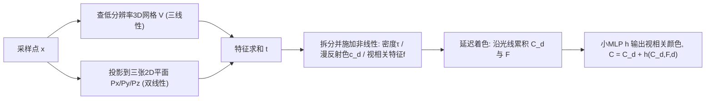

## 一句话总结

MERF 用"低分辨率 3D 稀疏体素网格 + 高分辨率 2D 三平面"的混合参数化，配合一个能保持直线的分段投影收缩函数，把大规模无界场景的辐射场压缩到几百 MB 并在浏览器里实时渲染，同时几乎无损地保留了体渲染的画质。

## 研究背景

- 领域现状：NeRF 类神经体渲染能给出照片级新视角合成，后续工作用离散化的体素/哈希网格大幅加速了训练与渲染。
- 核心痛点：现有实时表示要么算力吃紧（每条光线要多次查询昂贵的 MLP），要么显存爆炸（稠密 3D 数据结构在大场景下动辄数 GB），因此难以扩展到无界大场景并在普通设备上实时跑。这背后是两个根本权衡：体积 vs. 表面、显存受限 vs. 算力受限。
- 本文 idea：设计一个"训练友好、渲染又快"的统一辐射场表示。训练时用可微、可稀疏化的哈希网格参数化，训练后无损地"烘焙"成同一个辐射场函数的紧凑离散格式，保证训练画质完整迁移到实时渲染。

## 方法

整体框架：场景被表示为一个密度 + 漫反射色 + 视相关特征的体场，采用 SNeRG 的延迟着色模型（每条光线只算一次视相关颜色）。该体场由一个低分辨率 3D 体素网格与三个高分辨率 2D 平面共同定义;训练阶段这些网格由带多分辨率哈希编码的 MLP 压缩表示，训练后被烘焙成离散网格 + 二值占用网格用于实时光线步进。

关键设计：

1. **混合体参数化（3D 网格 + 三平面）**。任一 3D 位置的特征向量是低分辨率 3D 网格三线性插值结果与三张高分辨率 2D 平面双线性插值结果之和:
   $$\boldsymbol{t}(x,y,z) = \boldsymbol{V}(x,y,z) + \boldsymbol{P}_x(y,z) + \boldsymbol{P}_y(x,z) + \boldsymbol{P}_z(x,y)$$
   三平面用低成本存下高分辨率细节，稀疏 3D 网格补上纯平面表示难以刻画的立体结构。插值求和后再施加非线性（密度用 exp、颜色与特征用 sigmoid），这种"后激活"能显著提升网格表达力。相比 TensoRF 的向量-矩阵外积，这里免去了昂贵的矩阵乘，查询更快、显存带宽减半。

2. **分段投影收缩函数**。无界场景需要把远处空间压进有限体积。mip-NeRF 360 的球面收缩会把直线弯成曲线，导致实时渲染必需的空跳（empty space skipping）难以做光线-包围盒求交。本文提出的收缩按 $$L_\infty$$ 范数把空间划成七个区域，每个区域内是一个保持直线的投影变换：
   $$\text{contract}_\pi(\boldsymbol{x})_j = \begin{cases} x_j & \lVert \boldsymbol{x} \rVert_\infty \le 1 \\ \dfrac{x_j}{\lVert \boldsymbol{x} \rVert_\infty} & x_j \ne \lVert \boldsymbol{x} \rVert_\infty > 1 \\ \left(2 - \dfrac{1}{\lvert x_j \rvert}\right)\dfrac{x_j}{\lvert x_j \rvert} & x_j = \lVert \boldsymbol{x} \rVert_\infty > 1 \end{cases}$$
   直线经分段投影后仍是分段直线，于是可以直接用标准光线-AABB 求交做空跳，画质与球面收缩相当。

3. **量化感知训练**。为把每个通道压到单字节，若训练后再量化会造成训练/渲染失配掉画质。本文在优化过程中就对网格值做量化：经 sigmoid 映射到 [0,1]、量化到一个字节、再仿射映射回 $$[-m,m]$$，并用直通估计器（stop-gradient 使反向时把量化当恒等）让不可导的取整可训练。

4. **Proposal-MLP 感知的烘焙**。训练用 proposal-MLP 做层级采样把样本聚到表面附近;烘焙时只保留被 proposal-MLP 判为占用、且体渲染权重与不透明度都超过阈值（0.005）的体素，并按实时渲染器的步长计算不透明度以更激进地剔除。这样避免了传统烘焙用均匀采样带来的雾状伪影和漂浮块，几乎无损。最终体素以块稀疏格式存储、纹理编码为 PNG，并构建多分辨率占用网格加速空跳。

## 实验结果

在 mip-NeRF 360 数据集"户外"场景上的综合性能对比（实时方法之间最能体现 MERF 的显存-画质-速度权衡）：

| 方法 | PSNR↑ | 显存(MB)↓ | 磁盘(MB)↓ | FPS↑ | 设备 |
|------|-------|-----------|-----------|------|------|
| Mobile-NeRF | 21.95 | 1162 | 345 | 65.7 | M1 MacBook Pro |
| SNeRG++ | 23.64 | 4571 | 3785 | 18.7 | M1 MacBook Pro |
| MERF (本文) | 23.19 | 524 | 188 | 28.3 | M1 MacBook Pro |
| Instant-NGP | 22.90 | — | 107 | 4 | RTX 3090 |
| MERF (本文) | 23.19 | 524 | 188 | 119 | RTX 3090 |

MERF 以约五分之一于 SNeRG++ 的显存获得接近的画质并且更快;相比前一代实时最优 Mobile-NeRF，户外场景 MSE 意义上画质高 31.6% 且显存不到其一半。消融显示：烘焙前后画质几乎不变（proposal-MLP 感知烘焙近乎无损）;去掉量化感知训练 PSNR 从 23.19 掉到 22.64;分段投影收缩与球面收缩画质持平但支持高效求交;去掉低分辨率 3D 网格画质会明显饱和下降。质量对比中 MERF 在户外场景甚至超过 Instant-NGP、NeRF、NeRF++ 等离线方法，室内场景因视相关效应更强、浅层解码 MLP 表达力有限而略逊。

## 亮点与局限

- 亮点：
  - 统一表示同时服务优化与实时渲染，烘焙前后描述同一辐射场函数，从根上避免了以往烘焙掉画质的问题。
  - 分段投影收缩巧妙地在保留无界场景压缩能力的同时让光线-AABB 求交平凡可算，直接惠及空跳效率。
  - 端到端跑在浏览器（three.js + 单个 GLSL 片段着色器）里，仅需带位姿的图像作输入，普通笔记本即可实时。
- 局限：
  - 沿用 SNeRG 每条光线只算一次视相关颜色，无法很好处理半透明物体的视相关外观，浅层 MLP 也难以扩展到更大场景或复杂反射。
  - 仍是体渲染，依赖较强 GPU;要跑到手机/头显这类受限设备还需进一步压缩显存与运行时。

## 延伸思考

MERF 与同期的 BakedSDF、Mobile-NeRF 同属"离线高质量表示烘焙成实时格式"的思路，差异在于它坚持体渲染而非退化到表面/多边形，因此在无界背景上更锐利。其分段投影收缩是个通用组件，凡是需要在收缩空间里做几何求交（空跳、包围盒剔除）的实时体渲染系统都可复用。往后看，3D Gaussian Splatting 用点基元的显式表示从另一条路解决了同一批实时+大场景问题，对比 MERF 的"网格+三平面+空跳"体渲染路线，两者在显存-画质-可编辑性上的取舍值得进一步追问;此外把视相关模型从"每光线一次"升级为更强的表达，或把量化/剪枝推到移动端，都是自然的延伸方向。
