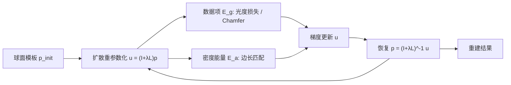

## 一句话总结

在基于模板网格形变的三维形状重建中，作者提出一种"网格密度自适应"正则项，通过形变（而非重新划分网格）把顶点主动"吸"向高曲率的复杂结构，从而在固定顶点预算下更准确地重建形状细节。

## 研究背景

- 领域现状：模板网格形变是三维重建的经典范式——用一个球面模板去拟合多视图图像（逆向渲染）或目标网格（非刚性配准）。为对抗重建的欠约束性，通常会加平滑性正则（Laplacian 能量），近期工作如 Nicolet 等人的扩散重参数化则用来把稀疏的轮廓梯度平滑地传播到整个网格。
- 核心痛点：现有正则项几乎只关注表面的"平滑度"，却忽略了一个关键属性——顶点密度。当模板顶点数固定时，兔子耳朵这类高曲率、强凸出的区域会因顶点欠采样而丢失细节。已有的解决办法是周期性重新划分网格（remeshing），但这会改变初始网格连通性，破坏非刚性配准所依赖的顶点对应关系。
- 本文 idea：设计一个基于顶点邻域边长的密度自适应能量，与平滑正则协同工作。它在迭代过程中动态计算"期望边长"，让顶点在保持原始网格连通性的前提下向复杂结构迁移，从根上解决欠采样问题。

## 方法

整体框架：把"密度控制"表述成一个关于边长的能量项 $$E_a$$，附加到原有的数据项（逆向渲染的光度损失或配准的 Chamfer 距离）上一起优化；优化不直接作用在顶点位置 $$\boldsymbol{p}$$ 上，而是作用在扩散重参数化坐标 $$\boldsymbol{u}$$ 上，以保证形变平滑、避免自相交。

关键设计：

1. **边长驱动的密度能量**。用每个顶点 1-环邻域的平均边长 $$l(\boldsymbol{p}_i) = \frac{1}{\lvert N_i \rvert}\sum_{j \in N_i}\lVert \boldsymbol{p}_i - \boldsymbol{p}_j\rVert_2$$ 来度量局部密度——边越短，顶点越密。密度自适应就是让实际边长逼近目标边长 $$\boldsymbol{l}'$$：$$E_a(\boldsymbol{p}, \boldsymbol{l}') = \frac{1}{N}\lVert l(\boldsymbol{p}) - \boldsymbol{l}'\rVert^2$$。相比用三角形面积定义密度，边长能唯一确定顶点间距（细长三角形和小等边三角形面积相同却密度不同），且无需全局参数化。

2. **扩散重参数化做平滑**。直接最小化 $$E_a$$ 会产生自相交等瑕疵。作者借用 Nicolet 等人的扩散重参数化 $$\boldsymbol{u} = (I + \lambda L)\boldsymbol{p}$$，把更新施加在 $$\boldsymbol{u}$$ 上再反解回 $$\boldsymbol{p}$$，从而把密度能量产生的高频、稠密梯度全局平滑传播。作者特别指出 Laplacian 正则会与密度自适应目标冲突（它把顶点拉向邻居的加权平均，会抹平想要的密度差异），因此不采用。

3. **均匀项 + 自适应项的双目标**。目标边长由两部分构成：均匀密度 $$\boldsymbol{l}'_u$$（所有顶点期望边长取全局平均）和自适应密度 $$\boldsymbol{l}'_k$$。后者用 Laplacian 幅值 $$K_i = \frac{1}{l_m}\lVert (L\boldsymbol{p}')_i\rVert_2$$ 度量结构复杂度（近似平均曲率），经一步后向欧拉扩散去噪得到 $$\boldsymbol{S}$$，再按 $$\boldsymbol{l}'_k = l(\boldsymbol{p}') \odot \mathrm{clamp}(\bar{S} \oslash \boldsymbol{S})$$ 缩短高曲率处的目标边长，使这些区域顶点变密。

4. **权重调度**。逆向渲染中按迭代阶段调度两项权重：前 1/4 只用均匀项（此时形状还只是粗轮廓，避免无意义的密度调整）；第 2 阶段只用自适应项把顶点推向复杂结构；后半程两项都关闭、专注降低数据损失。

5. **扩展到非刚性配准**。把光度损失换成 Chamfer + 法向损失即可复用整套框架。为得到有意义的点对应，作者进一步在球面模板上以数据驱动方式重采样地标：对所有输入网格做带密度自适应的拟合，用 SVD 对齐各自地标集并取平均，得到的球面地标间距会自然反映区域形状复杂度，再据此加地标损失做最终配准。

## 实验结果

逆向渲染在 Nicolet 等人的五个场景（T-shirt、Suzanne、Plank、Bob、Bunny）上评测，与不带 remeshing 的扩散重参数化基线比较 Chamfer 距离与法向 MSE。密度自适应在几乎所有场景、尤其在显著顶点（top 20% / 5%）上都取得更低误差。

| 配置 | Chamfer（均值）↓ | 法向 MSE（均值）↓ |
|------|------------------|-------------------|
| Nicolet et al. 2021 | 0.0087 | 0.0120 |
| 本文（全体） | 0.0085 | 0.0106 |
| 本文（top 20% 显著） | 0.0087 | 0.0205 |
| 本文（top 5% 显著） | 0.0089 | 0.0375 |

非刚性配准在 3DCaricShop 卡通脸数据集上评测：本文方法在 10K 顶点预算下相较不带密度自适应的扩散重参数化基线、以及原始 NICP 结果（11K 顶点）都取得更低误差，并额外提供了稠密对应关系（可用于形状移植与纹理迁移）。作者也指出密度自适应在顶点数充足时（10K）收益显著，2.5K 时提升有限。

## 亮点与局限

- 亮点：
  - 指出并填补了模板重建正则化中长期被忽视的"密度控制"这块拼图，视角新颖。
  - 用形变而非 remeshing 实现密度调整，完整保留初始网格连通性，因此天然适配需要共享网格的非刚性配准与纹理迁移等应用；也省去了每次 remeshing 重算 $$(I+\lambda L)^{-1}$$ 的开销。
  - 方法是对已有优化框架的"轻量插件"，只加一个基于边长的正则项即可接入。
- 局限：
  - 只能吸引顶点到早期就显现的大凸出结构（如耳朵），无法处理宽平区域上的精细细节——因为这些细节要到优化后期才浮现，作者将其列为未来工作。
  - 定量增益整体偏小（逆向渲染均值提升有限），密度自适应的收益依赖足够的顶点预算。

## 延伸思考

- 密度自适应本质上把"顶点该放哪"从固定连通性里解放出来，思路上与可微 remeshing、各向异性重网格化相通，但坚持不改连通性这一约束使它更适合建立形变基与形状关键帧。
- 用 Laplacian 幅值近似曲率来驱动密度是简洁的代理，但对"平坦区域上的高频细节"失灵——若能引入基于图像残差或多尺度曲率的复杂度度量，或许能突破当前局限。
- 数据驱动地在球面上重采样地标是一个有意思的副产品：它把"模板该长什么样"也交给数据决定，值得在人体、动物等更大形变域中进一步验证。
