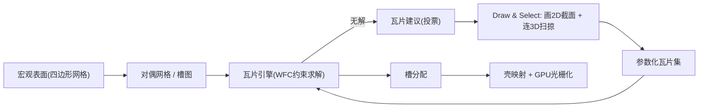

## 一句话总结

MesoGen 提出一套以"瓦片接口"为中心的交互式建模方法，让用户通过在瓦片界面上画 2D 截面并连成 3D 扫掠面，就能实时设计出连续无缝、紧凑且对 GPU 友好的三维中尺度结构（mesostructure），尤其擅长藤编、管网这类丝状连通结构。

## 研究背景

- 领域现状：给粗糙宏观表面（macrosurface）添加次多边形级细节通常靠位移贴图、壳映射（shell mapping）或元素散布（scattering）。位移贴图只能表达圆盘拓扑，无法做隧道、把手这类复杂拓扑；壳映射能承载任意拓扑，但内容制作繁琐。
- 核心痛点：交互式中尺度合成多用"在表面上散布图元"实现，擅长密集堆叠但不适合丝状结构（管状网络、散乱骨架）。同时，基于瓦片的建模要求内容在任意相邻瓦片间都保持无缝连续，手工制作瓦片内容极易在界面处出现拼接裂缝，且现有方法多为数据/示例驱动，难以给用户细粒度控制。
- 本文 idea：把问题反过来——不让用户直接摆图元，而是先在瓦片的四条边界（界面）上绘制 2D 截面，再选择成对截面连成 3D 扫掠面。这样"界面处的连续性由构造保证"。同时用一个可交互的瓦片求解引擎实时铺满宏观表面，并在无解时主动建议新瓦片。

## 方法

整体框架：系统输入一个四边形网格表示的宏观表面，从其对偶图得到"槽图"（slot graph）。用户渐进式地设计一套瓦片（几何内容 + 邻接规则），瓦片引擎则实时地把瓦片一致地铺到槽图上并渲染，形成"绘制—求解—反馈"的闭环；最后通过壳映射把瓦片内容变形进宏观表面的壳空间。

关键设计：

1. **接口中心的瓦片模型（连续性由构造保证）**。瓦片集是一个元组 $$(T, I, M, A)$$：界面集合 $$I$$ 存放 2D 截面，瓦片列表 $$T$$ 中每个瓦片沿四个方向 $$d \in D=\{N,S,E,W\}$$ 引用一个界面（沿用 Wang 瓦片，并加一个"翻转标志"，记翻转界面为 $$i_k^{\leftrightarrow}$$）。瓦片的几何内容就是若干 3D 扫掠面，每个扫掠沿一条三次 Bézier 曲线在一对 2D 截面间插值。因为内容完全由界面截面定义，只要相邻瓦片共享同一（镜像）界面标签就自动连续，从根本上消除了拼接裂缝。

2. **基于 Wave Function Collapse 的瓦片引擎**。给定瓦片集与槽图，引擎输出合法的槽分配 $$A: S \to T \times P$$（瓦片索引 + 表示旋转/翻转的角点置换 $$p$$）。算法交替执行两步：观察（observe，把某个槽的可能集随机塌缩为单个瓦片，优先选可能集最小的槽以减少信息损失）与塌缩（collapse，沿槽图深度优先传播约束）。相比常规 WFC，本文的改动是：把规则网格换成任意槽图遍历，并在死路时记录邻居配置以驱动瓦片建议。合法性要求：一条半边所分配界面必须是其对向半边界面的翻转版本。

3. **瓦片建议机制（投票法）**。因瓦片问题 NP 难、用户又可自由设计瓦片集，求解常失败。每当某槽可能集变空、引擎回溯时，就对所有与邻居可能集相容的候选边界配置投一票（在所有旋转/翻转变换下检查相容性），最后建议得票最高的配置作为新瓦片，并告诉用户"补上它就能铺满"。还支持 boundary exempt / boundary only 两种界面标志，作为可能空间的预处理约束，用来控制边界处是否允许开口。

4. **保形壳映射与 GPU 光栅化**。把瓦片内容映射进宏观表面的六面体壳空间时，若直接变形合成后的扫掠面会产生明显畸变；本文改为先变形扫掠面底层的 Bézier 轨迹曲线、再执行扫掠，从而保住 2D 截面形状（圆截面得到正圆管而非椭圆管）。控制点放置兼顾界面处的切向连续与"尽量贴近圆弧段"，切线幅度按 $$m_i = m \dfrac{\alpha_i}{\alpha_i + \alpha_{3-i}}$$ 设定。渲染端把每个扫掠面存为规则网格 VAO，用 compute shader 按实例填 Bézier 控制点，再靠硬件实例化一次 draw call 完成，单卡可达每秒数亿多边形。

## 实验结果

核心评估是瓦片建议策略的消融：在 140 个场景（20 组随机瓦片集 × 7 个宏观表面，各跑 100 次，共约 14k 次运行）上，比较"完全随机""引导随机（用失败信息但随机抽）"和"投票（本文）"三种策略完成铺覆所需的成功率 $$R$$ 与新增瓦片数 $$N$$（$$N$$ 截断到 10，超出视为失败）。$$b$$ 表示某策略在该场景为最优的比例，$$B$$ 为独占最优比例。

| 建议策略 | 成功率 $$R$$↑ | 新增瓦片数 $$N$$↓ | 最优占比 $$b$$↑ | 独占最优 $$B$$↑ |
|------|------|------|------|------|
| 完全随机 | 5.3% ± 14.9% | 6.7 ± 0.2 | 7.1% | 0.0% |
| 引导随机 | 75.9% ± 34.3% | 4.1 ± 1.3 | 34.9% | 23.0% |
| 投票（本文） | 85.3% ± 30.9% | 3.7 ± 0.7 | 77.0% | 65.1% |

可见"感知失败情形"比纯随机有巨大提升，而投票机制进一步提高成功率、降低所需新增瓦片数，还显著减小方差，使结果对用户更可预测。此外，性能与紧凑性方面：C++/OpenGL 原型在消费级 GPU 上，单个复杂示例合成数千万至上亿三角形，渲染仅数毫秒、GPU 内存占用几 MB 级；作为对比，某示例导出为二进制 PLY 需 1.75 GB，凸显了该过程化表示的压缩优势。同一套瓦片字典还能复用到不同宏观表面，只需为未见拓扑补少量新瓦片。

## 亮点与局限

- 亮点：
  - "先定界面截面、再连扫掠"的反向工作流，让中尺度结构的连续性由构造直接保证，省去了传统瓦片建模反复对齐消缝的繁琐。
  - 把 WFC 从规则网格推广到任意四边形网格的槽图，并新增可交互的瓦片建议机制，把 NP 难求解的失败转化为对用户有用的引导。
  - 表示紧凑、GPU 友好，实时反馈；对散布法难以覆盖的丝状/藤编结构尤其擅长。
  - 轨迹先变形再扫掠的壳映射，有效保持截面形状、减小畸变。
- 局限：
  - 缺乏面向制造的结构性约束，不能直接用于可加工设计。
  - 轨迹的切向连续构造过于局部，难以在更大尺度上跟随对齐；直线保持要求宏观表面面片接近矩形。
  - 先变形轨迹可能在单位瓦片中本不存在的位置产生自交；合成结果有时不够美观。
  - 瓦片建议仍是启发式，未必最优。

## 延伸思考

论文指出的未来方向很有想象空间：把瓦片锚定到宏观表面特定位置、反转求解让引擎在界面而非瓦片层面推理、融合建议与求解、引入数据驱动方案，以及用隐式扫掠平滑高曲率区域的自交。另一个自然的结合点是把四边形重划分（remeshing）纳入 MesoGen——当铺覆失败时，除了建议新瓦片，也可建议局部重划分；配合表面方向场做初始配置偏置，可给用户更宏观的走向控制。整体上，这项工作把"游戏领域流行的 WFC"与"图形学的壳映射/扫掠建模"结合得很自然，为过程化几何纹理提供了一个交互性强、表示紧凑的新范式。
