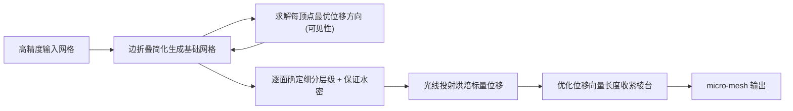

## 一句话总结

提出一套自动化流程，把千万级三角形的高精度网格转换成新一代 GPU 硬件原生支持的紧凑图元——微网格（micro-mesh，$$\mu$$-mesh），即"粗基础网格 + 标量位移图"，在保持几何保真度的同时大幅压缩显存与光追加速结构开销。

## 研究背景

- 领域现状：微网格是一种为高效 GPU 光线追踪设计的位移映射图元，由一张粗糙的基础三角网格（base mesh）加上一组标量位移值构成。渲染时每个基础三角形被细分成大量 $$\mu$$-triangle，各 $$\mu$$-vertex 沿插值方向按标量位移偏移。新一代 GPU 已提供原生硬件支持，能按需展开 $$\mu$$-triangle，显著减小加速结构（BVH）的体积与构建时间。
- 核心痛点：如何"构造"高质量微网格几乎是一片空白。传统高精度网格可以靠雕刻、扫描、细分曲面等成熟手段生成，但微网格对基础网格提出了苛刻且相互冲突的要求，直接拼接现有的网格简化 + 位移图烘焙工具很难得到满意结果。
- 本文 idea：将问题拆成"生成基础网格 → 确定位移方向 → 分配细分层级 → 烘焙标量位移 → 优化位移长度"几个阶段，并针对微网格的特殊目标——基础网格的粗糙度、可重投影性（reprojectability）、各向同性、以及最小化包围棱台（prismoid）体积——定制每一步的算法。

## 方法

整体框架：以经典的二次误差（quadric error）边折叠简化为骨架，把微网格特有的目标编码进折叠代价函数，边简化边维护"每个顶点都存在有效位移方向"这一关键约束；得到基础网格后再逐面定层级、光线投射烘焙位移、最后压缩位移长度以收紧包围体。

关键设计：

1. **可见性驱动的位移方向**：位移方向必须让插值射线能命中输入表面且尽量正交，否则会出现几何伪影。作者对每个基础顶点 $$v$$ 求一个方向 $$\boldsymbol{d}$$，最大化它与所有相邻面法线的最小正交性，定义"可见性"

   $$V(v) = \max_{\boldsymbol{d}\in\Omega}\ \min_{\boldsymbol{n}\in\mathcal{N}} (\boldsymbol{d}\cdot\boldsymbol{n})$$

   其中 $$\mathcal{N}$$ 是相邻面法线集合。这是一个类似最小包围圆的问题，作者设计了一个仿 Welzl 的迭代算法：始终维护 2~3 个"活跃约束"，用它们解出试探方向，若违反其它约束则替换活跃集。算法可检测无正可见性解（失败）的退化情形，实测迭代次数几乎不超过 $$\lvert\mathcal{N}\rvert$$，远快于此前用二次规划求解的做法。

2. **面向微网格目标的边折叠简化**：在标准二次误差基础上，折叠产生的顶点位置额外叠加一个"平滑二次项" $$Q_s(\boldsymbol{x}) = \lVert \boldsymbol{x}-\boldsymbol{p}\rVert^2$$（$$\boldsymbol{p}$$ 为邻域重心在切平面上的投影），以权重 $$\lambda$$ 组合，使三角形更接近等边。每次折叠的总代价把几何误差、法线偏差、纵横比、可见性四项聚合：

   $$C_{tot}(e) = \frac{C_g(e)}{C_n(e)^{\omega_n}\cdot C_a(e)^{\omega_a}\cdot C_v(e)^{\omega_v}}$$

   其中可见性项 $$C_v$$ 保证可重投影并压低位移体积。为强制各向同性，作者用"自适应阈值"策略：只有当某面纵横比同时低于阈值且比其历史最好值再差一个固定量时才禁止该折叠，避免简化过早在局部卡死。

3. **细分层级与水密性**：得到基础网格后，按目标 $$\mu$$-triangle 总数为每个基础面分配细分层级，可选"均匀面积"或"按局部误差自适应"两种策略。由于相邻面细分层级最多相差 1（否则出现裂缝），最后有一个校正阶段抬升过低的层级，并设置边抽取标志保证位逐比特水密。

4. **位移烘焙与长度优化**：对每个 $$\mu$$-vertex 沿插值方向对输入网格做光线投射，记录交点的参数位置作为标量位移；再对每个基础顶点取其邻域位移的最小/最大值 $$\bar{\delta}_{min},\bar{\delta}_{max}$$，把基础顶点整体平移 $$\bar{\delta}_{min}\boldsymbol{d}$$ 并把位移向量缩放为 $$(\bar{\delta}_{max}-\bar{\delta}_{min})\boldsymbol{d}$$，从而把包围棱台收紧到贴合表面（相比全局统一归一化，体积可缩小 3 倍以上）。此外还扩展支持了细节边界（在边界处改用切向位移方向并加"挡板"三角形）与带纹理微网格（把 ARAP 参数化能量重写到位移后的 $$\mu$$-triangle 上做位移感知优化）。

## 实验结果

作者在 ThreeDScans 的 121 个高精度扫描模型上批量转换，平均达到约 15:1 压缩比、单模型处理时间不到 5 分钟。下表取"高分辨率模型转换"这一主实验的代表性样本，展示输入规模、基础网格/微网格三角形数、显存占用、几何误差与耗时（误差以包围盒对角线的比例计，$$\times 10^{-6}$$）：

| 模型 | 输入面数 | 基础面数 | $$\mu$$-面数 | 输入显存(MB) | $$\mu$$-Mesh(MB) | 各向同性 | 误差 | 耗时(s) |
|------|----------|----------|----------|----------|----------|------|------|------|
| Telegraph | 8 M | 35 K | 8.5 M | 136.3 | 7.5 | 0.69 | 6.79 | 436 |
| GW Bust | 26 M | 30 K | 27 M | 447.2 | 20.2 | 0.73 | 3.28 | 1660 |
| Murex | 3.5 M | 30 K | 4 M | 60.4 | 3.9 | 0.81 | 10.3 | 317 |
| Dragon | 7 M | 30 K | 7.5 M | 123.9 | 6.7 | 0.81 | 9.16 | 399 |
| Fangyi | 21.5 M | 100 K | 23 M | 370.3 | 20.5 | 0.74 | 6.77 | 1215 |

其它实验的关键结论：在支持微网格光追的 RTX 4090 上，相比等价三角网格，BVH 体积中位数缩小约 6 倍、构建时间快约 4 倍，代价是光线求交中位数慢约 1.3 倍；棱台优化本身带来 3~4 倍渲染加速。显存方面，在 1/64 以下继续粗化收益递减，因为标量位移占了 85%~90% 的存储，此时微网格仅需显式索引网格约 0.14 的内存。标量位移量化到 7 比特已基本无可见伪影（实验默认保守用 11 比特）。与 Meshlab、Simplygon 的对比中，后两者的基础网格位移后会产生几何伪影和自交，而本文方法因始终保证一致朝向的位移方向而避免了这些问题，且在几何误差、各向同性与耗时上均更优；与 Bijective shells 的对比显示本文的可见性求解在嵌套循环中效率优势明显。

## 亮点与局限

- 亮点：
  - 首次系统性地定义了"高质量微网格"应满足的目标，并把这些目标（尤其是可重投影性）直接编码进简化代价函数，而非事后修补。
  - 可见性方向求解用一个仿最小包围圆的轻量算法替代二次规划，快到足以放进边折叠的内层循环，是让整套流程可扩展的关键。
  - 完整覆盖工程细节：水密约束校正、位移长度收紧、边界细节保留、位移感知的纹理参数化优化，并开源了参考实现与检视工具。
- 局限：
  - 依赖新一代 GPU 的硬件微网格支持才能发挥全部渲染优势，性能数据绑定特定硬件。
  - 光线求交本身比标准三角网格略慢，收益主要来自 BVH 与显存；对射线离群/漏交依赖启发式的邻域插值修补。
  - 位移长度优化采用的是简单的逐顶点 min/max 策略，作者也承认"未必最优"；对存在负可见性配置的病态输入只能局部回退处理。

## 延伸思考

微网格把"几何细节"从显式三角形转移到可压缩、可按需展开的标量位移场，本质上是在"存储/带宽"与"运行时求交成本"之间重新做权衡，思路和 Nanite 的簇化 LOD、Normal Mesh 一脉相承，但更贴合硬件光追。一个自然的追问是：这套以几何误差为主的构造目标，能否进一步纳入外观（法线/材质）误差，做"外观感知"的微网格构造？后续 CVPR 2024 的 Differentiable Micro-Mesh Construction 正是把构造过程可微化、用 Laplacian 重参数化来做端到端优化，与本文的启发式简化形成有趣对照。对做实时渲染或资产管线的读者，这篇提供了从传统高模到微网格的可落地转换路径与开源工具，值得作为基线参考。
