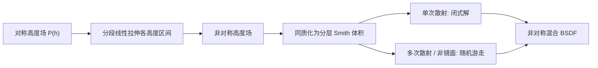

## 一句话总结

本文放松了经典 microfacet 理论中"法线分布(NDF)与材质沿高度均匀"的假设，把 Smith 微表面重写成一个分层的体渲染介质，从而能物理正确地刻画那些"侵蚀、磨损、坑洼"等在不同高度上具有不同粗糙度/材质的非对称粗糙表面。

## 研究背景

- 领域现状：microfacet BSDF 是图形学里描述粗糙表面外观的主力工具，其精度已被实测数据和蒙特卡洛(MC)仿真反复验证。近年来的一大进展是把 Smith 理论重写为"体积形式"（把微表面等价成一个具有各向异性辐射传输的均匀半空间介质），从而能严格处理多次散射与双站可见性。
- 核心痛点：经典理论要求 NDF 与微表面材质在所有高度上都是均匀的。这条假设直接排除了两类真实表面——① 材质随高度变化（如海浪的白色浪尖）；② 非对称高度场（侵蚀、磨损、坑蚀表面，外凸部分与内凹部分粗糙度不同）。当粗糙度随高度变化时，掠射角下最外层部分因自遮挡而主导外观，产生角度相关效应，而"两个对称 BSDF 做固定线性混合"这一常见做法无法复现这种行为。
- 本文 idea：一个关键洞察是——很多有趣的高度场，都可以由一个普通的对称高度场，对不同高度区间施加不同的线性缩放变形得到（例如把负位移压扁、正位移不动）。在体积形式的 microfacet 理论中，这种分段线性拉伸恰好对应"沿深度分层、各层具有不同粗糙度但同一 NDF 类别"的介质。作者据此把 Smith 理论推广到分段常数的 NDF 与材质，得到一族新的 BSDF。

## 方法

整体框架：把微表面同质化成一个沿光学深度 $$z$$ 分层的 Smith 体积；每一层对应一个高度区间，可以指派各自独立的 NDF 与材质。光子在体内做随机游走，穿越层边界时对自由程做相应的缩放。对镜面材质，单次散射能写出闭式解；多次散射与非镜面材质则用无偏随机游走做随机估计。

关键设计：

1. **对称 NDF 混合（回顾并补全采样）**。先处理最简单的情形：整个微表面共用一个线性混合的 NDF $$D_{\text{mix}}(\boldsymbol{\omega}_m) = w_A D_A(\boldsymbol{\omega}_m) + w_B D_B(\boldsymbol{\omega}_m)$$。由于 Smith 消光系数 $$\sigma$$ 与 Lambda 函数对 NDF 线性，$$\Lambda_{\text{mix}}$$ 与 $$\sigma_{\text{mix}}$$ 都是各分量的加权和，因此单次散射与多次散射都能由 $$D_A$$、$$D_B$$ 直接组合得到。本文补上了缺失的重要性采样：碰撞落在分量 $$A$$ 上的概率为 $$P_A(\boldsymbol{\omega}) = w_A \sigma_A(\boldsymbol{\omega}) / \sigma_{\text{mix}}(\boldsymbol{\omega})$$。其效果与"两个 BSDF 线性混合"不同：因为混合内部各 NDF 相互遮挡，掠射角下最粗糙的分量最终主导外观。

2. **非对称分层（核心贡献）**。把不同 NDF 指派给不同高度区间 $$[h_j, h_{j+1}]$$，混合权重 $$w_j = \int_{h_j}^{h_{j+1}} P(h)\,dh$$，层边界在光学深度上由 $$z = \log C(h)$$ 给出。以两层为例（$$D_A$$ 在顶层），层界深度 $$z_s = \log(1 - w_A)$$。关键在于：即使两个非对称表面拥有完全相同的混合 NDF，只要分层顺序不同，得到的 BSDF 也不同——这正是经典理论中丢失的自由度。

3. **单次散射的闭式解与角度相关混合**。对分层介质重做单次散射推导，得到一个"看起来像线性混合、但混合权重随角度变化"的形式：
$$f_1(\boldsymbol{\omega}_i, \boldsymbol{\omega}_o) = (1 - E)\,f_{1,A}(\boldsymbol{\omega}_i, \boldsymbol{\omega}_o) + E\,f_{1,B}(\boldsymbol{\omega}_i, \boldsymbol{\omega}_o)$$
其中角度相关的混合项可写进双站遮蔽函数：
$$E(\boldsymbol{\omega}_i, \boldsymbol{\omega}_o) = \exp\!\left(z_s / G_{2,A}(\boldsymbol{\omega}_i, \boldsymbol{\omega}_o)\right) = (w_B)^{1/G_{2,A}(\boldsymbol{\omega}_i, \boldsymbol{\omega}_o)}$$
只有当 $$E$$ 为常数（即顶层粗糙度为零、无层间互反射）时，它才退化为普通的线性 BSDF 混合。这解析地说明了"线性混合"为何是本理论的一个特例。

4. **折射与非均匀材质**。对介质(dielectric)微表面，折射事件会把 Smith 体积"上下翻转"（方向取反、层序互换、深度经映射 $$M(z) = \log(1 - \exp(z))$$ 重映射），需单独推导；其穿越概率用不完全 Beta 函数表达，可验证退化到经典结果。此外每一层还能指派独立材质（如不同复折射率的导体、不同 albedo 的漫反射），从而在掠射角处额外获得对反射颜色与强度的控制。

## 实验结果

作者用傅里叶变换生成可平铺的 Beckmann 高度场、施加分段线性拉伸，再用光线追踪逐阶(前三阶散射)累计出参考 BSDF，与本文模型及"线性混合"对比。下表汇总两层 Beckmann 粗糙导体($$w_A = w_B = 0.5$$，顶层粗糙度 0.91、底层 0.364)的基准结论：

| 光照角 $$\theta_i$$ | 本文模型 vs 参考 | 线性混合 vs 参考 |
|------|------|------|
| 中等入射(0.75) | 各阶散射均吻合 | 也接近，三者相似 |
| 近掠射(1.5) | 仍与参考吻合 | 明显偏差：无法遮蔽外凸粗糙层对锐反射的遮挡 |

结论：分层 Smith 体积在几何光学假设下能准确复现该类非对称表面的多次散射，精度与既有均匀高度场的对比相当；而线性混合只在非掠射、或顶层粗糙度更小($$\alpha_{\text{top}} < \alpha_{\text{bot}}$$)时才近似成立，一旦 $$\alpha_{\text{top}} > 0$$，总存在掠射角使二者产生可见差异。实现于 Mitsuba，两层模型渲染时间约比单 NDF 多次散射 BSDF 慢 20%，与线性混合相当。

## 亮点与局限

- 亮点：
  - 把"分段线性变形高度场"与"分段同质 Smith 体积"建立起严格对应，第一次让非对称、材质随高度变化的表面进入 microfacet 理论的可解范畴。
  - 镜面单次散射有闭式解，并解析地把线性混合归为自身的特例，理论上很干净。
  - 提供掠射角外观的独立调控能力（可在不改变正面外观的前提下改变轮廓/剪影），且渲染开销很低，易于集成进现有路径追踪器。

- 局限：
  - 目前只做到分段常数的 NDF/材质变化；连续变化会让距离采样、遮蔽/掩蔽与单次散射项都变得难以处理甚至不可解析。
  - 尚未验证该模型作为拟合真实测量数据的实用工具的能力，也未系统比较"分段常数"是否足以刻画真实非对称表面。
  - 当 $$\alpha_{\text{top}} > \alpha_{\text{bot}}$$ 时朴素单向估计方差偏高，需改用双向随机游走求值。

## 延伸思考

- 这项工作与 SpongeCake 分层微片模型思路相近，但本文用单侧微片(one-sided microflakes)来严格描述高度场、并用无偏随机游走替代神经网络/预计算来处理多次散射，物理上更自洽，适合追求可解释性与可预测性的场景。
- "把变形高度场映射到分层体积"这一视角很有启发性：它把外观编辑（look development）与一个有物理意义的几何变形联系起来，未来或可与可微渲染结合，从掠射角外观反解出表面的高度相关统计。
- 一个自然的追问是能否引入沿高度的连续 NDF 变化，用数值/神经方法弥补解析不可解的部分，从而更贴近真实的侵蚀/磨损表面剖面。
