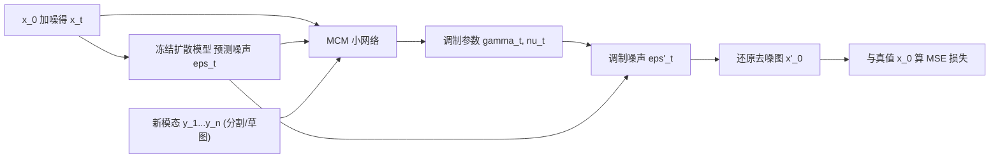

## 一句话总结

在**完全冻结**预训练扩散模型参数的前提下，只训练一个约占基座模型 1% 参数的小型调制网络（MCM），在采样的每一步去调制扩散模型预测的噪声，从而让分割图、草图等原本"没见过"的 2D 模态成为可控条件。

## 研究背景

- 领域现状：扩散模型（尤其是 Stable Diffusion 这类文本条件的隐空间扩散模型 LDM）已经能生成高质量、多样的图像，但大多是无条件的，或只接受文本这类较抽象的条件。
- 核心痛点：想给扩散模型加入分割图、草图等空间性更强的新条件，通常有三条路，各有硬伤——① 从头训练：受限于配对数据稀缺（分割/草图数据集比文本-图像数据集小几个数量级），多样性下降，且换一个模态就得重训；② 微调：需要访问全部模型参数、对整个大模型算梯度，计算昂贵，还容易在小数据上过拟合，且每个新领域都得存一份大模型；③ 测试时用分类器/CLIP 梯度引导：采样时要即时算梯度并逐样本优化，拖慢采样。
- 本文 idea：把扩散网络当成**黑盒**——不改它的参数、不要它的梯度，只需要它每一步的噪声预测。为此训练一个小的、类扩散结构的调制网络，用新模态作为条件，去调制原网络每步的噪声输出，使生成结果服从给定条件，同时保留原模型的质量与多样性。

## 方法

整体框架：给定图像与其对应的 $$n$$ 个目标模态 $$(y_1, \dots, y_n)$$ 的配对数据，MCM 学习在采样过程中"修饰"预训练扩散模型的噪声预测。训练时和标准扩散一样：取图像 $$x_0$$、随机采样时间步 $$t$$、加噪得到 $$x_t$$、用冻结的扩散模型得到噪声预测 $$\epsilon_t$$；再把 $$\lbrace x_t, \epsilon_t, y_1, \dots, y_n\rbrace$$ 连同 $$t$$ 一起喂给 MCM，输出一组逐像素的调制参数。

关键设计：

1. **调制噪声而非结果**。MCM 输出缩放项 $$\gamma_t$$ 与偏移项 $$\nu_t$$，对噪声预测做仿射调制：$$\epsilon'_t = \epsilon_t \otimes (1 + \gamma_t) \oplus \nu_t$$。这种空间调制参数的思路借鉴自 SPADE。之所以调制"噪声"这个中间量、而不是直接改下一步的 $$x_{t-1}$$，是因为噪声是计算下一步的通用中间变量，这样在推理时就不被绑定到某一种采样方法（DDIM、DDPM 等都能用）。

2. **只需一步去噪的 MSE 监督**。用调制后的 $$\epsilon'_t$$ 通过闭式解近似出去噪图 $$x'_0$$，损失就是它与真值的均方误差 $$\mathcal{L}_{\text{MSE}} = \text{MSE}(x'_0, x_0)$$。对 LDM，则在隐空间对 $$z'_0$$ 与 $$z_0$$ 计算，从而**避开对解码器求梯度**，进一步省显存。整个训练不需要经过大扩散网络反传梯度。

3. **$$L_1$$ 正则鼓励最小扰动**。对调制参数加 $$\mathcal{L}_1 = L_1(\gamma) + L_1(\nu)$$，让 MCM 只对噪声做尽量小的改动，从而在"服从条件"与"保持原模型质量/多样性"之间取得平衡。总目标为 $$\mathcal{L}_{MCM} = \lambda_x \mathcal{L}_{\text{MSE}} + \lambda_1 \mathcal{L}_1$$。消融显示：只用 MSE 时对齐更好但质量与多样性明显变差（行为接近微调），加上 $$L_1$$ 后才平衡。

4. **模态 dropout 支持任意模态子集**。训练时以一定概率把某个模态 $$y_i$$ 替换成全 -1，于是测试时缺一个或多个模态也能预测调制参数，避免过度依赖单一模态。多模态可直接靠拼接扩展，且**不需要为每个模态单独的编码器**。分析发现调制参数幅度在采样前半段（$$t$$ 较大时）最强、约在 $$t = N/2$$ 达到峰值后迅速衰减——因为后期主要负责补高频细节，结构在早期就已被"钉住"。

## 实验结果

主要在两个数据集上做：MM-CelebA-HQ（人脸，含分割图/草图/文本，约 6000 测试）与 Flickr Mountains（50 万张山景，用现成网络生成伪真值分割图与草图）。基座分别是两个无条件 LDM（256×256）与文本条件的 Stable Diffusion v2.1（512×512）。默认只用 5000 个训练样本以凸显小数据下的效果。MCM 参数量约为无条件 LDM 的 1%、SD 的 0.4%。评估用 FID（质量）、LPIPS（多样性），以及对齐度指标 mIoU、分割准确率、草图距离。主要对比对象是"直接微调扩散模型"，并附带与 ControlNet、pSp 的对照。

下表为质量/多样性主实验（FID↓ / LPIPS↑，取"分割+草图"联合条件一列）：

| 数据集 | 方法 | FID (Seg+Sk) ↓ | LPIPS (Seg+Sk) ↑ |
|--------|------|------|------|
| CelebA | Fine-tune | 44.247 | 0.272 |
| CelebA | ControlNet | 18.875 | 0.492 |
| CelebA | MCM (本文) | 18.842 | 0.461 |
| Mountains | Fine-tune | 102.341 | 0.191 |
| Mountains | MCM (本文) | 26.145 | 0.666 |

结论：相比微调，MCM 相对基座 LDM 的质量/多样性掉落很小，在 Mountains 上甚至提升了质量；而微调在小数据上严重过拟合，图更糊、更缺乏多样性（人脸微调结果身份几乎相同，只靠光照变化"伪装"多样性）。对齐度指标上，MCM、微调、ControlNet 相比基座都提升了输入与生成图的一致性。ControlNet 与 MCM 表现相当，但它训练的模型大得多（约为原模型 50%）且需要访问原模型参数。消融进一步验证 $$L_1$$ 正则与更多训练数据都在"对齐提升、质量/多样性下降"之间起平衡作用。

## 亮点与局限

- 亮点：
  - 真正把扩散模型当黑盒——不改参数、不要梯度，甚至可远程访问，只用其每步噪声预测；MCM 只有基座约 1% 参数。
  - 训练便宜、小数据也能泛化，测试时不额外拖慢采样（不像梯度引导那样逐样本优化）。
  - 调制"噪声中间量"使方法与具体采样器解耦；模态 dropout 让单模型自然支持任意模态子集。
- 局限：
  - 目前只支持 2D 模态，1D 模态（如更细的文本控制）留作未来工作。
  - 对起始噪声图 $$z_T$$ 较敏感；训练数据质量差时（如 Mountains 用现成网络生成的 182 类伪标签）难以把语义准确落到类别标签上。
  - 更适用于结构性较强的领域。

## 延伸思考

MCM 与同期的 ControlNet、T2I-Adapter 是同一波"给冻结扩散模型加空间条件"的思路，区别在于 MCM 把接入点放在**噪声预测的仿射调制**上、且刻意做到不碰原模型梯度，因此天然支持"远程/黑盒 API 式"的基座模型——这一点在只能调用闭源大模型的场景下颇有想象空间。它对起始噪声敏感、依赖标注质量的两个局限，指向后续可结合更强的伪标签生成或噪声选择策略；而"调制噪声中间量以解耦采样器"的做法，也可迁移到视频或 3D 扩散等需要在多种采样流程间切换的任务上。
