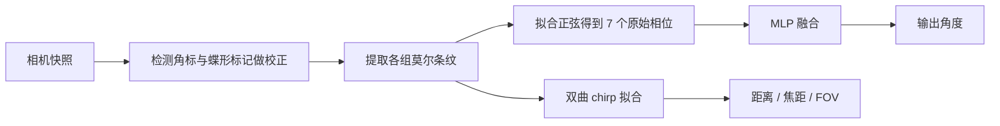

## 一句话总结

在一块玻璃晶圆两面印刷周期条纹，利用莫尔效应把微小的视角变化放大成可被相机直接读出的相位偏移，实现无需标定、单张快照即可完成的高精度（约 0.17°）角度测量与 6 自由度物体跟踪。

## 研究背景

- 领域现状：视觉方向测量在 VR/AR、视觉里程计、工业机器视觉里应用广泛。常用手段有几类——棋盘格 / ArUco 等基准标记做位置跟踪、自准直仪做高精度角测、IMU 做低成本姿态估计，以及基于深度学习的位姿回归。
- 核心痛点：棋盘格与基准标记的角度精度差且严重依赖相机内参的预标定，无法"即拍即用"；自准直仪精度虽高却只能在受控实验室环境使用；IMU 便宜易得但漂移误差大；深度学习方法依赖场景结构与海量训练数据，难以稳定测量细微运动。已有的莫尔位姿方法要么工作体积受限、要求相机正对标记，要么（如 MoiréPose）需要对特定相机-屏幕组合仔细标定，角误差仍达数度。
- 本文 idea：把角度信息编码进莫尔条纹的低频相位里。莫尔效应像一把"光学游标卡尺"，能把两层条纹之间因视差产生的微小错位放大成宏观的相位移动，从而用普通相机、无需标定就读出高精度角度，并进一步扩展到 6 自由度跟踪与相机内参估计。

## 方法

整体框架：标记由印在玻璃晶圆两面的多组周期条纹构成，观察方向改变会在两层间引入视差错位，经莫尔效应放大为低频条纹的相位偏移；相机拍一张图，系统提取每组条纹的原始相位，再用一个小型 MLP 把多频相位融合成最终角度；对大角度/近距离场景，另用双曲 chirp 模型恢复距离与相机内参。

关键设计：

1. **相位放大与编码（莫尔的物理核心）**。两个频率略有差异的方波相乘，其乘积里出现一个低频分量，频率等于两者频率差 $$\epsilon$$。把方波做傅里叶展开后，最低频项的相位为 $$\phi = 2\pi l (f+\epsilon)\,\Delta t$$，其中 $$\Delta t$$ 是两层条纹的微小错位。也就是说，一个几乎不可见的层间偏移被放大成低频条纹上可测的宏观相移，高频项则被有限的相机分辨率天然抑制或后期滤除。视角 $$\theta$$ 与像素偏移 $$x$$ 通过玻璃折射（Snell 定律，厚度 $$d=510\,\mu m$$、折射率 $$n_1\approx1.46$$）建立映射：$$x = d\tan\!\left(\arcsin\frac{\sin\theta}{n_1}\right)$$。

2. **由粗到细的相位解缠**。单个莫尔对的可测范围受相位缠绕限制——高周期对相位范围大、低周期对范围小但重复。借鉴游标卡尺的思想，作者设计了 7 组基频从低到高、重复性从粗到细的莫尔对，让每个视角都对应一组唯一的相位组合，实现相互校正，既扩大量程又保精度。设计时以"在大范围下采样倍率下仍保持最低频足够对比度"为准则来挑选频率对。

3. **MLP 信息融合**。7 组原始相位到角度的映射受拍摄距离、分辨率、运动模糊、噪声等隐变量影响，解析建模困难，因此用一个小 MLP（输入 7 维，隐层 90-50-15、ReLU，输出 1 维角度）做融合。训练数据结合仿真与实拍：把仿真出的不同旋转姿态显示在显示器上，用装在平移台上的相机在多种距离下重成像，共 203 个姿态 × 40 张 = 8210 张图，Adam、学习率 $$5\times10^{-3}$$、batch 2800、训练 2500 轮。

4. **双曲 chirp 模型做 6-DoF 与内参估计**。当标记相对相机较大或斜视时，透视缩短会让两层条纹频率随空间变化，形成 chirp 效应。作者推导出像面上莫尔周期随坐标点 $$a$$ 变化的双曲关系 $$\tilde{T}_m = \dfrac{f_l T_m \cos\theta}{T_m \sin\theta + z}\ (a=0)$$，进而从条纹频率变化中反解出拍摄距离 $$z$$、焦距 $$f_l$$，并得到视场角 $$FOV = 2\arctan\dfrac{\text{sensor size}}{2 f_l}$$，实现无标定的内参估计与 6 自由度跟踪。

标记版面上还带有类似二维码的四个角标用于自动检测定位，以及蝶形标记用于亚像素级校正（定义一个单应变换把每组莫尔图整流成规范姿态）。原型采用光刻工艺在 4 英寸熔融石英晶圆两面刻蚀铬层，并沉积 100 nm 二氧化硅作为吸光层以减少层间互反射。

## 实验结果

在旋转/平移台上与经典棋盘格、基准标记 ArUco、以及最新的莫尔位姿方法做对比，距离范围 1–4 m，分别测量角度与位置误差。MoiréTag 在角度精度上比现有方法提升约一个数量级：

| 方法 | 角度误差 | 位置误差 |
|------|---------|---------|
| Checkerboard | 6.23° | 18.65 mm |
| ArUco | 2.79° | 16.32 mm |
| MoiréPose | 1.66° | 7.50 mm |
| MoiréTag（本文） | 0.17° | 3.04 mm |

在大角度范围（约 −65° 到 65°）的稳定性实验中，以 $$\Delta\theta=1°$$ 逐格旋转拍摄，角度估计的 RMSE 为 0.1719°，与训练精度一致。此外还验证了：即使部分莫尔图被手电或障碍物遮挡，凭借多频相互校正设计仍能准确预测视角；用未重新训练的 iPhone 11 与 DJI Mavic 3 无人机相机做相机角度回溯与室内外无人机角度跟踪，均能稳定工作。

## 亮点与局限

- 亮点：
  - 完全被动、超薄、低成本，无需相机标定即可单张快照测角，精度达 0.17°、位置 3.04 mm，比现有标记方法角精度高约一个数量级。
  - 由粗到细的多频莫尔对 + MLP 融合，同时兼顾大量程与高精度，且对局部遮挡鲁棒。
  - 双曲 chirp 模型让同一标记还能反解拍摄距离、焦距与视场角，扩展到 6 自由度跟踪且跨相机通用（无需重训）。
- 局限：
  - 训练数据主要来自"显示器重成像 + 平移台"的半仿真流程，真实三维旋转的直接采集较难，模型泛化边界尚未充分刻画。
  - 强调的是细微角度变化下的精度，对剧烈运动、强运动模糊等极端情形未充分验证。
  - 制作依赖光刻等精密工艺，玻璃厚度、折射率等参数需要准确已知，量产与标定一致性是实际部署的问题。

## 延伸思考

这项工作把"光学游标卡尺"这一经典物理直觉与轻量神经网络融合，思路很值得借鉴：当解析模型清晰但隐变量太多难以闭式求解时，用小网络接管融合环节是务实的折中。相较于纯深度学习位姿估计，它把"精度"交给物理编码、把"鲁棒性/融合"交给数据驱动，可解释性和数据需求都更友好。后续可追问的方向包括：能否把角标/蝶形检测与相位提取端到端可微化，从而联合优化条纹频率设计；能否推广到彩色或多光谱编码以进一步提升单标记的信息密度；以及在真实 AR/VR 头显、无人机集群等动态场景中，标记尺寸与工作距离、帧率之间的权衡如何系统性优化。
