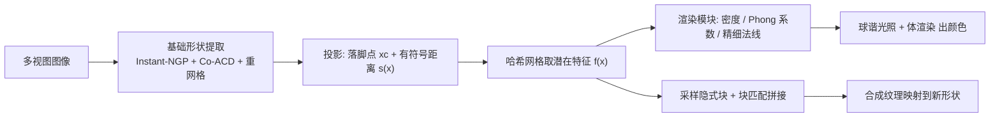

## 一句话总结

把带有细密几何"介观结构"（草、树皮、织物等）的真实场景拆成"基础形状 + NeRF 纹理"两层，用隐式特征块匹配的方式合成任意大小的 NeRF 纹理，并贴到任意新形状上做实时渲染。

## 研究背景

- 领域现状：2D 图像纹理合成已经很成熟，NeRF 也能从多视图重建复杂真实场景。少数工作（NeuMesh、NeuTex）尝试把几何和外观解耦以支持纹理编辑。
- 核心痛点：现实世界大量纹理带有 3D 介观结构（草叶、织物、鹅卵石），无法用 2D 纹理图或平滑 UV 参数化刻画；原生 NeRF 又把几何与外观混在一起，难以迁移复用；此前几乎没有针对 NeRF 纹理"合成"的工作。
- 本文 idea：把场景解耦为平滑的基础形状（粗网格）和定义在其上的隐式纹理特征场，用块匹配在潜在特征空间里合成更大的纹理，再映射到目标形状上，实现捕获、建模、合成、渲染一条龙。

## 方法

整体框架：给定手机拍的多视图，先重建并平滑出基础形状粗网格；把空间中任意查询点投影到粗网格上，得到落脚点与有符号距离，用哈希网格取出该处的潜在纹理特征；特征经渲染模块预测密度、Phong 反射系数与精细法线，用球谐光照渲染出颜色。合成时从基础形状上采样出隐式纹理块，做块匹配与拼接生成更大的纹理，再贴到新形状。

关键设计：

1. **粗细解耦表示（是什么/为什么/怎么做）**：把场景显式拆成"基础形状"和"介观结构纹理"两层。原因是介观结构无法用多边形/体素直接建模，而混合表示又难以迁移。做法是先用 Instant-NGP 跑 Marching Cubes 得到粗网格，再用 Co-ACD 做近似凸分解去掉介观细节使其光滑，最后均匀重网格化。任意点 $$\boldsymbol{x}$$ 被参数化为落脚点 $$\boldsymbol{x}_c$$ 与有符号距离 $$s(\boldsymbol{x})$$。

2. **可微投影层**：光线投射得到 $$\boldsymbol{x}_c$$ 的过程本身不可微，但基于物理的渲染需要法线梯度、相机位姿优化也需要梯度回传。作者显式指定求导规则 $$\frac{d\boldsymbol{x}_c}{d\boldsymbol{x}} = \boldsymbol{I} - \boldsymbol{n}_c^\top \boldsymbol{n}_c,\ \frac{ds(\boldsymbol{x})}{d\boldsymbol{x}} = \boldsymbol{n}_c$$，让投影层可微，与"把 3D 坐标参数化为落脚点+符号距离"的语义一致。

3. **哈希网格特征 + 解耦着色**：不像 NeuMesh 那样从高分辨率网格顶点查特征（慢、难从头训），而是用哈希网格以 $$O(1)$$ 取特征，支持实时渲染与从零训练。着色上用球谐表示光照、Phong 模型（漫反射 $$k_d$$、镜面 $$k_s$$、光泽度 $$g$$）解耦材质与光照，从而能把纹理搬到新位置渲染。精细法线用仰角 $$\theta$$ 和方位角 $$\phi$$ 在局部切空间中表示，且 $$\theta$$ 与切空间定义无关、供块匹配用。

4. **隐式块匹配合成 + 聚类约束**：在基础形状上用泊松盘采样块中心，在切平面放 $$128\times128$$ 扫描阵列取交点、查哈希网格得到隐式块集合；用块匹配与拼接（动态规划求最小代价缝合路径 $$E_{i,j} = e_{i,j} + \min(E_{i-1,j-1}, E_{i-1,j}, E_{i-1,j+1})$$）逐步生长合成纹理。为保证潜在空间度量与内容空间一致，引入基于 Student-t 分布核的聚类损失 $$\mathcal{L}_{clu} = \mathrm{KL}(P \mid\mid Q)$$，让相似纹理的特征聚拢，提升匹配质量。方法进一步扩展到任意曲面：把网格参数化到 $$2048\times2048$$ 的 UV 图，用多分辨率金字塔做由粗到细匹配，把单次匹配从约 10 秒降到 0.05 秒以内。

## 实验结果

在 DTU 数据集上做新视角合成质量对比（PSNR/SSIM/LPIPS 的多场景平均），本文方法在支持纹理捕获/合成/迁移的前提下，质量与仅做重建的 Instant-NGP 相当、远好于原生 NeRF：

| 方法 | Scan 83 PSNR↑ | Scan 83 LPIPS↓ | Scan 122 PSNR↑ | Scan 122 LPIPS↓ |
|------|--------------|----------------|----------------|-----------------|
| NeRF | 37.816 | 0.092 | 36.464 | 0.135 |
| Instant-NGP | 42.602 | 0.049 | 41.976 | 0.057 |
| Ours | 43.842 | 0.027 | 42.704 | 0.031 |

其余实验用文字补充：与 2D 纹理相比，本文表示在各仰角下 SIFID 更低（平均 0.60 对 1.05），高仰角时 2D 纹理会因缺介观结构而失真；与 NeRF-Tex 相比更好地保持了纹理连续性和结构规律；渲染速度 84.45 FPS，虽慢于 Instant-NGP（307 FPS）但仍实时，远超原生 NeRF（0.02 FPS）；消融显示聚类约束让潜在分布更紧凑、伪影更少，$$128\times128$$ 的块分辨率性价比最优，训练视图通常需 150~300 张。

## 亮点与局限

- 亮点：
  - 首个针对 NeRF 纹理"合成"的工作，把介观结构作为定义在基础形状上的潜在特征场来学习，思路清晰且实用。
  - 粗细解耦 + 哈希网格 + 解耦着色，让捕获—合成—迁移—实时渲染形成闭环，输入只需手机拍的短视频。
  - 可微投影层与聚类约束是两个针对性强的技术点，分别解决梯度回传和潜在空间度量一致性问题。
- 局限：
  - 少视图（如 4/16 视图）下几何与外观仍有明显歧义和漂浮伪影，依赖较多训练视图。
  - 在纯重建质量的部分定量指标上略逊于 Instant-NGP，是解耦设计带来的代价。
  - 渲染速度受 KNN 与光线投射投影拖累，需专门的 CUDA 工程优化才能实时。

## 延伸思考

- 与 3D Gaussian Splatting 等更快的显式表示结合，或许能进一步提升介观纹理的实时渲染速度与编辑灵活性。
- 块匹配本质仍是"经典纹理合成"思路，若换成生成式模型（扩散模型在潜在特征场上采样）可能获得更强的非重复性与可控性。
- 基础形状的质量直接决定投影和特征查询的稳定性，如何在薄壳、非水密或强曲率结构上更鲁棒地提取基础形状，是值得追问的方向。
