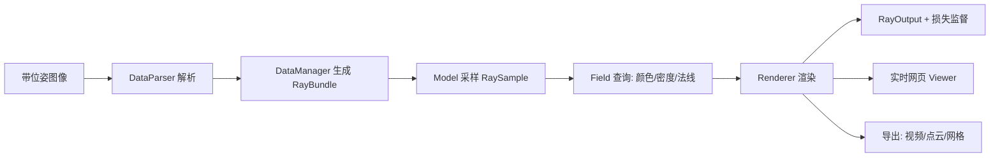

## 一句话总结

Nerfstudio 是一个模块化的 PyTorch 框架，把散落在各篇论文里的 NeRF 技术拆成可插拔组件，配上实时网页可视化和面向真实拍摄数据的端到端流水线，并据此组合出兼顾速度与质量的默认方法 Nerfacto。

## 研究背景

- 领域现状：自 2020 年 NeRF 提出以来，few-shot 训练、可编辑特征、表面重建、实时加速、3D 生成等方向论文井喷，在视觉、图形、机器人、影视等领域应用广泛。
- 核心痛点：每篇论文各自维护一个孤立仓库，特征与贡献难以跨实现迁移，进展难以追踪；缺少易用工具把 NeRF 跑在用户自采的真实数据上；现有实现多以 PSNR/SSIM/LPIPS 等指标为导向，而这些指标基于贴近训练轨迹的留出图像，对大基线、非结构化真实场景往往具有误导性；实时定性评估又因渲染开销大而困难，Instant-NGP 虽快但强依赖定制 CUDA 核，不利于快速原型开发。
- 本文 idea：提供一个模块化、模型无关、可实时可视化的框架，用统一抽象把各种 NeRF 组织成可复用组件，让研究者与从业者（含影视、游戏乃至非技术用户）都能方便地组合、开发和使用 NeRF。

## 方法

Nerfstudio 的整体思路是把一个 NeRF 方法抽象为一条 Pipeline：DataManager 把带位姿的图像解析成光线束（RayBundle），Model 对光线采样（RaySample）并查询 Field 得到颜色/密度等量，Renderer 汇总为输出（RayOutput），整条流水线由一组损失端到端监督。围绕这条主干，框架把编码器、采样器、场、渲染器等做成可替换的模块，并接入实时网页可视化与多种导出。

- 模块化组件抽象：把不同 NeRF 共有的结构拆成 DataManager/DataParser、RayBundle/RaySample/Frustum、Model、Field、Renderer 等层次。其中 Frustum 用统一表示同时支持点采样和带均值协方差的高斯采样（后者利于抗锯齿），用户一行函数调用即可切换表示。编码器涵盖傅里叶特征、哈希编码、球谐、矩阵分解等，Field 侧提供 fused MLP、体素网格、法线 MLP、空间/时间形变等，实现"换组件即换方法"。

- 实时网页可视化：受 Instant-NGP 实时查看器启发，但把查看器做成 ReactJS 网页并公开托管。训练机（本地或远程 GPU、Colab 等）与网页客户端通过 WebSocket + WebRTC 建连，网页把视口相机位姿持续回传，训练端据此渲染并以视频流推回；UI 用 ThreeJS 叠加训练图像、样条、裁剪框等 3D 资产。它在单 GPU 上平衡训练与渲染算力，并按相机移动速度动态调分辨率，支持切换输出、编辑关键帧相机路径、裁剪与导出等，为定性评估提供了远超单一指标的判断依据。

- 面向真实数据的易用流水线：DataParser 兼容 COLMAP，同时内置对 Polycam、Record3D、KIRI Engine 等移动采集应用与 Metashape、RealityCapture 等摄影测量软件的支持，让非技术用户可绕过难装难用的 COLMAP；训练中还能优化相机位姿。导出侧支持视频、深度图、点云、TSDF 转网格与泊松重建，并通过沿法线渲染短光线为网格上色。

- 默认方法 Nerfacto：借模块化把多篇论文的思路组合成推荐方法。以 MipNeRF-360 结构为骨架，先用可优化的 SE(3) 变换标定相机（NeRF--），再用分段采样器（近处密集、远处步长递增）配合 proposal network 采样器做重要性采样（经验上两级密度场效果好，基础配置 256→96→48）；用带哈希编码的小型 fused MLP 表示密度（Instant-NGP）；对无界场景做场景收缩，但改用 $$L_\infty$$ 范数收缩到立方体（而非 MipNeRF-360 的 $$L_2$$ 收缩到球），更契合体素哈希网格；此外引入逐图外观嵌入（NeRF-W）处理曝光差异、用 Ref-NeRF 的技术预测法线。全程纯 PyTorch，无需定制 CUDA。

## 实验结果

在 MipNeRF-360 数据集的 7 个公开场景上与报告数值对比（4 倍下采样，7/8 训练、1/8 评估，不含位姿优化）。Nerfacto 在约 2 分钟（5K 迭代）即可达到可用质量，约 30 分钟（70K 迭代）进一步提升；虽指标不及需数小时 TPU 训练的 MipNeRF-360，但作者强调其取向是效率与通用可用性，而非在该基准上刷指标。表中 Nerfacto 记为 { 70K / 5K }。

| 方法 | PSNR ↑ | SSIM ↑ | LPIPS ↓ |
|------|--------|--------|---------|
| NeRF | 24.85 | 0.659 | 0.426 |
| MipNeRF | 25.12 | 0.672 | 0.414 |
| NeRF++ | 26.21 | 0.729 | 0.348 |
| MipNeRF-360 | 29.23 | 0.844 | 0.207 |
| Nerfacto (ours) | 27.98 / 25.38 | 0.800 / 0.688 | 0.291 / 0.390 |

此外，作者在自建的 Nerfstudio Dataset（10 个真实"in-the-wild"场景，含手机针孔与无反鱼眼拍摄）上做 Nerfacto 组件消融（去位姿优化、去外观嵌入、去场景收缩、改 proposal 网络等）。结果显示：去掉场景收缩会明显掉点（PSNR 从 20.99 降到 18.59），而其余多数改动在指标上差异很小甚至"去外观嵌入"反而更高——这恰恰印证了留出评估图像贴近训练轨迹时，量化指标难以反映真实的新视角质量，需要实时查看器辅助定性判断。

## 亮点与局限

- 亮点：
  - 用一套清晰的组件抽象把碎片化的 NeRF 研究整合进单一可复用框架，显著降低组合创新与复现成本，并已催生 SDFStudio 等衍生工作。
  - 公开托管的实时网页查看器支持远程 GPU，把定性评估变成开发闭环的一部分，弥补纯指标评估的盲区。
  - 面向真实采集数据的端到端流水线（多种手机/摄影测量导入、导出点云与网格），把受众扩展到影视、游戏与非技术用户；Apache2 许可、开源社区活跃。
- 局限：
  - 为模块化与 Python 化牺牲了极致速度/质量，Nerfacto 在合成/标准基准上的指标不及 MipNeRF-360。
  - 更偏工程框架与方法整合，本身缺少全新的算法性突破；Nerfacto 是已有组件的良好组合而非新原理。
  - 自建数据集仅 10 个场景、评估协议依赖测试时位姿与外观优化，规模与标准化程度有限。

## 延伸思考

框架把"方法=组件组合"这一范式固化下来，直接为后续 3D Gaussian Splatting 等新表示的快速接入与横向比较提供了土壤，也让"实时可视化驱动开发"成为神经渲染工具链的默认体验。论文对常用指标误导性的讨论值得关注：当留出视图贴近训练轨迹时，PSNR/SSIM/LPIPS 可能无法区分方法优劣，如何为大基线、真实场景设计更贴合应用的评测协议，仍是值得深挖的开放问题。
