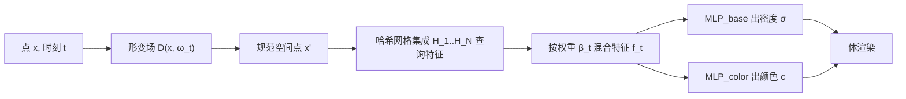

## 一句话总结

NeRSemble 通过"形变场 + 多分辨率哈希网格集成（Hash Ensemble）"的组合，从 16 相机多视角视频中重建高保真的动态人头辐射场，实现任意时刻、任意视角的照片级新视角合成，并配套发布了一个 222 人、31.7M 帧的大规模高分辨率多视角人脸数据集。

## 研究背景

- 领域现状：NeRF 已成为静态场景新视角合成（NVS）的主流表示，近年也被扩展到动态场景——一类靠形变场（deformation field）把观测帧映射回规范空间，另一类干脆用时间相关的隐向量直接条件化 NeRF。
- 核心痛点：人头是极具挑战的对象——头发结构复杂、皮肤高度非刚性形变、还有细尺度皱纹，且对视觉瑕疵的容忍度极低。纯形变场只能表达较简单的运动，纯隐向量条件化又难以精确对齐时序特征，二者在复杂人头动态上都会失真。此外缺乏足够高分辨率、高帧率的多视角人脸训练数据。
- 本文 idea：把两条路线的长处结合起来。用一个形变场先解释场景中粗粒度的连贯运动、并把不同时刻的坐标系对齐；再用一组多分辨率哈希网格的加权混合来表达难以被形变解释的精细细节与复杂运动。

## 方法

整体框架：对一条光线上某点 $$\boldsymbol{x}$$、时刻 $$t$$，先经形变场把它 warp 到规范空间点 $$\boldsymbol{x}' = \mathcal{D}(\boldsymbol{x}, \boldsymbol{\omega}_t)$$；在规范空间用集成中的每个哈希网格查询特征，按随时间变化的混合权重 $$\beta_t$$ 线性组合成 $$\boldsymbol{f}_t$$；最后由两个小 MLP 解码出密度 $$\sigma$$ 与视角相关颜色 $$\boldsymbol{c}$$，做体渲染。

关键设计：

- **多分辨率哈希网格集成**：借鉴经典 blend shapes 思想，把任意时刻的场景状态表示为一组哈希网格特征的线性组合 $$\boldsymbol{f}_t(\boldsymbol{x}) = \sum_{i=1}^{N} \beta_{t,i}\,\mathcal{H}_i(\boldsymbol{x})$$。混合发生在特征空间，因此能表达复杂运动；混合权重 $$\beta$$ 与哈希表、共享 MLP 一起优化。作者还指出这可视为 4D 张量分解在时间轴上的一个特例（用哈希表替代稠密网格来省内存）。
- **形变场做空间对齐**：直接混合无结构的哈希特征效果不佳，必须让各网格处在共享坐标系下。为此用一个基于坐标 MLP 的 $$SE(3)$$ 形变场把观测点映射到规范空间，再在规范空间查询混合：$$\boldsymbol{f}_t = \sum_{i=1}^{N} \beta_{t,i}\,\mathcal{H}_i(\mathcal{D}(\boldsymbol{x}, \boldsymbol{\omega}_t))$$。这样同一运动点在不同时刻更易被对齐混合。
- **Warm-Up 阶段**：形变场与哈希集成会争抢"解释动态"的职责，容易陷入形变无意义的局部最优。因此前 $$E_{\text{init}}$$ 轮只启用一个哈希网格，让模型退化成可形变 NeRF，迫使形变场先学到有意义的对应关系；随后在 $$E_{\text{trans}}$$ 轮内用窗口函数逐步引入其余哈希表来表达精细运动，并始终保持第一张哈希表激活。
- **深度监督与背景/浮点抑制**：利用多视角可算深度，加入深度损失及来自 Urban Radiance Fields 的两个视线先验（空区雕刻 $$\mathcal{L}_{\text{empty}}$$、深度邻域高斯 $$\mathcal{L}_{\text{near}}$$）提升几何保真；用连续 alpha 图配合 L1 稀疏损失抑制背景密度；再辅以视锥剔除与占据网格滤波去除小浮点（floaters）。

## 实验结果

在自采数据集的 10 个多样化序列上评测 NVS：用 16 个视角中的 12 个作输入，在余下 4 个（含极端视角）上评测。主实验对比静态与动态基线，三项图像指标全面领先，SSIM/LPIPS 这类对高频细节敏感的指标提升尤为明显。

| 方法 | 类型 | PSNR ↑ | SSIM ↑ | LPIPS ↓ |
|------|------|--------|--------|---------|
| Instant NGP | 静态 | 28.8 | 0.864 | 0.254 |
| Nerfies | 动态 | 29.5 | 0.849 | 0.299 |
| HyperNeRF | 动态 | 29.6 | 0.848 | 0.304 |
| DyNeRF | 动态 | 30.6 | 0.860 | 0.254 |
| Ours | 动态 | **31.8** | **0.875** | **0.212** |

消融显示：单独的"NGP + 形变"或"哈希集成"都不如完整方法（PSNR 分别 30.8 / 30.5）；去掉 Warm-Up 掉到 31.0，去掉深度监督掉到 31.5，说明形变场与哈希集成的协同、以及 Warm-Up 训练策略都是关键。作者另用感知视频指标 JOD 评测时序一致性（减少闪烁），进一步佐证方法在时域上的优势。

## 亮点与局限

- 亮点：
  - 形变场 + 哈希集成的组合思路清晰，兼顾"粗运动对齐"与"精细动态表达"，且给出与张量分解、HyperNeRF 的统一视角解读。
  - Warm-Up 训练策略巧妙化解了两组件争抢动态解释的局部最优问题。
  - 附带发布了目前在分辨率（3208×2200）和帧率（73 fps）上都领先的大规模多视角人脸数据集与公开 benchmark，对社区价值很大。
- 局限：
  - 每序列需单独优化，训练一天（单张 A6000）、单帧推理约 25 秒，远非实时，也不具备跨身份泛化能力。
  - 属 template-free 的按序列重建，不直接提供表情/身份的语义可控重演；面向头像驱动仍需额外工作。
  - 依赖受控采集环境（强光照、精确标定、背景抠图、COLMAP 深度），对野外数据的适应性未验证。

## 延伸思考

- 与后续 head avatar 工作（如基于 3DGS 的头部化身、结合 FLAME 的可驱动头像）形成对照：NeRSemble 走的是极致保真但慢的重建路线，如何在保持细节的同时获得实时渲染与可控驱动，是自然的延伸方向。
- "哈希网格集成 + 混合权重"本质是把时间维做低秩分解，这一思路可迁移到更一般的动态场景/长序列，值得思考混合权重如何随更复杂运动扩展。
- 数据集本身（222 人、31.7M 帧）可能比方法影响更深远，为后续动态人头生成、泛化重建、微表情研究提供了统一评测底座。
