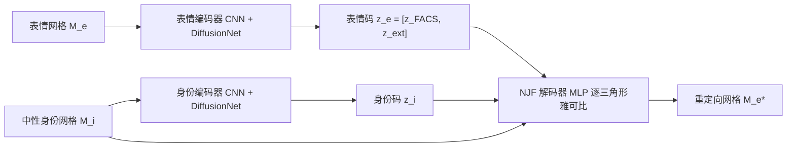

## 一句话总结

NFR 用一个"表情自编码器"端到端地为任意三角化、任意身份的野外人脸网格自动绑定并重定向表情，同时把表情潜码约束成可解释、可编辑的 FACS 参数。

## 研究背景

- 领域现状：FACS/blendshape 与线性 3DMM 提供了直观的表情控制，但只能作用在几何与拓扑固定、已建立对应关系的人脸上；近年的网格神经网络虽更有表现力，却大多绑死在单一模板上，换一套网格就得重新处理甚至重训。
- 核心痛点：想同时拿到三样东西很难——(1) 艺术家可用的可解释表情参数；(2) 对任意拓扑/噪声/缺失的野外网格都适用；(3) 能表达真人脸的高频非线性细节。现有方法要么牺牲可解释性，要么依赖繁重的非刚性配准与手工标定。
- 本文 idea：设计一个表情自编码器，编码器把网格映射为 FACS 式潜码，解码器用 Neural Jacobian Fields 把中性身份网格变形到目标表情；再用"合成数据 + 真实扫描"的多数据集训练方案，把可解释参数与真实细节耦合到同一个潜空间里。

## 方法

整体框架：NFR 是一个自编码器。给定一张带表情的网格 $$M_e$$ 和一张目标身份的中性网格 $$M_i$$，表情编码器从 $$M_e$$ 提取表情码 $$z_e$$，身份编码器从 $$M_i$$ 提取身份码 $$z_i$$，解码器据此把 $$M_i$$ 变形为 $$M_e^{*} \approx M_e$$。训练好的解码器就成了一个可作用于任意人脸网格的高保真"表情绑定器"，其潜空间即艺术家可调的 FACS 控件。

关键设计：

- **三角化无关的编解码器**：编码器把固定尺寸的正视渲染图经 2D CNN 得到全局码，再与逐顶点特征（坐标+法向）拼接送入 DiffusionNet；解码器用 NJF，对每个三角形的中心、法向及各潜码做共享参数的 MLP，输出该三角形的变形雅可比 $$g^{*} \in \mathbb{R}^{3\times 3}$$。渲染图、DiffusionNet、逐三角形 MLP 都不依赖具体网格模板，因此天然支持不同分辨率与连通性。
- **可解释的解耦潜码**：表情码前 53 维 $$z_{FACS}$$ 被约束去模仿 ARKit 兼容的 FACS 语义（如抬左内眉），其余维度 $$z_{ext}$$ 从数据自由学习真实细节。这种显式解耦让模型既能从真扫描学到真实表情，又保留了可编辑性。
- **多数据集训练方案**：先在合成的 ICT FaceKit（有可解释参数但表情偏假）上训练，让 $$z_{FACS}$$ 直接对齐 ICT 参数、$$z_{ext}$$ 置零，把网络初始化成一个线性 3DMM；再混入 Multiface 真实 4D 扫描（细节丰富但没有表情标注）继续训练。对 Multiface 没有真值标注，就只在潜码越出 $$[0,1]$$ 时施加区间正则 $$L_r$$，同时保留一部分 ICT-Real-AU 批次做直接监督以维持可解释性。
- **数据增强与标准化**：随机平移/各轴独立缩放、加遮挡、挖洞，模拟野外网格缺脖子、缺后脑、有洞的情形；并统一裁掉眼窝与口腔内部结构，抹平不同数据集对人脸内部建模方式的差异。

## 实验结果

在 Multiface 上做表情重建（逐顶点欧氏距离，越小越好），NFR 全面超过依赖固定模板的方法，其中完整 NFR（含多数据集训练）相比最好的对比方法在 90% 分位误差上降低约 32%：

| 方法 | Mean (mm)↓ | Median (mm)↓ | 90% (mm)↓ |
|------|-----------|--------------|-----------|
| COMA | 2.324 | 1.858 | 4.380 |
| Neural3DMM | 1.254 | 0.951 | 2.406 |
| SpiralNet++ | 1.256 | 0.944 | 2.438 |
| NFR (仅 Multiface) | 1.005 | 0.772 | 1.895 |
| NFR | 0.879 | 0.678 | 1.651 |

其余实验用文字概括：在 ICT-Real-AU 的逆向绑定任务上，NFR 编码器大幅优于依赖真值绑定模型的迭代优化方法 Seol（Mean 0.443mm vs 0.688mm），验证了表情编码器的有效性；把模型换到顶点/三角形数翻倍的高分辨率模板上，性能几乎不退化，证实三角化无关性；消融显示去掉 CNN 特征或用 PointNet 替换 DiffusionNet 都会带来明显性能下降，数据增强对野外泛化也很关键。

## 亮点与局限

- 亮点：
  - 首个无需手工制作 blendshape 或建立对应关系，就能对野外人脸网格做真实且可控变形的方法。
  - 潜空间与 FACS 参数直接对齐，艺术家可像调 blendshape 一样直观编辑重定向结果。
  - 借助渲染图 CNN + DiffusionNet + NJF 的组合，真正做到对任意拓扑、噪声与缺失区域的鲁棒泛化。
- 局限：
  - 仍需一步标准化（裁掉眼、口内部结构），尚未自动化。
  - 只学了 ARKit 兼容的 FACS 参数化，理论上可学 MetaHuman 等其他绑定，但受限于数据未做验证。
  - 人脸是敏感对象，模型在年龄、性别、族裔等属性上的偏差需要进一步研究后再部署。

## 延伸思考

NFR 把"可解释绑定参数"与"数据驱动的高保真变形"缝到同一潜空间，思路上很像给几何变形领域引入了一个 FACS 对齐的正则化先验，其中 NJF 作为三角化无关解码器是让方法脱离固定模板的关键一环。作者指出它可作为说话人脸生成等下游任务的骨干，若再叠加外观/纹理模型走向照片级表情合成会很有想象空间。另一个值得追问的点是：区间正则这种弱监督能维持 FACS 语义，主要依赖模型被正确初始化成线性 3DMM，这种"初始化决定语义、后续只做约束"的训练范式在其他缺标注的可解释表示学习里是否也能复用。
