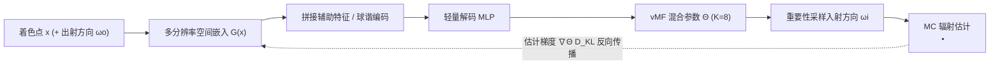

## 一句话总结

用一套连续、紧凑的隐式神经表示（多分辨率空间嵌入 + 轻量 MLP）来编码路径引导所需的方向目标分布，并把它解码成 von Mises-Fisher 混合（VMM）用于重要性采样，从而摆脱传统空间细分结构、更准确地捕捉空间-方向相关性。

## 研究背景

- 领域现状：路径引导（path guiding）通过复用渲染过程中积累的辐射估计，学习入射辐射场的近似分布来指导光路构建、降低噪声。主流做法是用某种参数化模型（高斯混合、四叉树等）表达方向分布，再用空间细分结构（kd-tree、octree）存储这些分布以体现空间变化。
- 核心痛点：多数方法在每个细分区域内学习的是被"边缘化"后的入射辐射分布，无法刻画区域内部的空间-方向相关性，导致视差（parallax）伪影；同时空间细分结构需要频繁重建以获得更细的空间分辨率，带来额外开销和较长的收敛时间；从含噪的在线样本中稳健拟合方向分布本身也很困难。
- 本文 idea：借鉴神经隐式表示在紧凑建模高频空间变化函数上的成功，用连续隐式表示编码空间-方向目标分布，再用轻量网络解码成参数混合模型（保留其高效采样等优良性质）。无需显式空间细分，仅靠基于梯度的优化即可训练，天然规避离散化带来的问题。

## 方法

整体框架：给定着色点 $$\boldsymbol{x}$$，NPM 通过一个可训练的多分辨率空间嵌入把该点编码成特征向量，再送入轻量 MLP 解码出一组 vMF 混合参数 $$\hat{\Theta}(\boldsymbol{x})$$，得到用于重要性采样的引导分布 $$V(\omega_i \mid \hat{\Theta}(\boldsymbol{x}))$$。整个过程可微，用含噪的蒙特卡洛辐射估计来估计训练梯度并反向传播优化。

关键设计：

1. **用隐式表示编码、轻量 MLP 解码 vMF 混合**。目标是让 vMF 混合近似正比于入射辐射：$$V(\omega_i \mid \Theta(\boldsymbol{x})) \propto L_i(\boldsymbol{x}, \omega_i)$$。选 vMF 作为基函数是因为它每个分量只需 4 个浮点参数、采样高效、且乘积与积分有闭式解。网络原始输出需经映射函数正则化以得到合法分布：对精度 $$\kappa$$ 和权重用指数/ softmax（保证 $$\sum_i \lambda_i = 1$$），对决定均值方向 $$\mu \in S^2$$ 的球坐标 $$\theta,\varphi$$ 用 logistic 激活。

2. **用 KL 散度 + minibatch SGD 直接优化**。真值参数 $$\Theta_{gt}$$ 未知，无法套用经典的期望最大化（EM）。作者转而最小化解码分布与目标分布之间的 KL 散度，其对参数的梯度用蒙特卡洛积分估计：$$\nabla_\Theta D_{KL} \approx -\frac{1}{N}\sum_j \frac{D(\omega_j)\nabla_\Theta V(\omega_j \mid \hat{\Theta})}{\tilde{p}(\omega_j \mid \hat{\Theta}) V(\omega_j \mid \hat{\Theta})}$$。因为用的是无偏 MC 梯度估计，参数保证收敛到局部最优；训练样本分布在不同空间位置，等价于优化各位置 KL 散度的期望。

3. **多分辨率空间嵌入避免高频拟合困难**。单个 MLP 难以拟合目标分布的高频空间变化，因此借鉴 NeRF 类工作用 $$L=8$$ 个覆盖全场景、分辨率指数增长的三维网格（最粗 $$D_1=8$$、最细 $$D_8=86$$），每个格点挂一个可学习特征向量。查询时对邻近格点做三线性插值并跨层拼接得到 $$G(\boldsymbol{x})$$，再和其他输入一起送 MLP。这把"表达空间变化"交给嵌入，把"解码成合法混合"交给 MLP，显著加速训练/推理。

4. **全积分学习（NPM-product）**。除了只学入射辐射（NPM-radiance），还可把 BSDF 项和余弦项纳入目标分布，即让分布额外以出射方向 $$\omega_o$$ 为条件，去逼近完整被积函数 $$f_s \cdot L_i \cos\theta_i$$。神经网络天然能处理这种 5D 条件输入，无需像传统方法那样对 BSDF 做场景相关的预计算与离散化。为帮助网络学习，额外输入表面法线、粗糙度等辅助特征，并对 $$\omega_o$$、法线等用球谐基编码。

工程上，方法实现在基于 OptiX 的 GPU wavefront 路径追踪器中，用 tiny-cuda-nn 做网络（3 层、宽度 64、输出 $$K=8$$ 个 vMF 分量），在线训练、无需场景相关微调或预计算，约 150spp / 1000 步 / 15s 即收敛。

## 实验结果

在 10 个测试场景上，与改进版 Practical Path Guiding（PPG）和 Variance-aware Path Guiding 对比，评价指标为相对均方误差 relMSE（越低越好），并以 PPG 为基线报告加速比。下表摘取若干代表场景的等样本数结果：

| 场景 | PPG（基线）relMSE | Variance. PG relMSE | NPM-radiance relMSE | NPM-product relMSE（相对 PPG 加速比） |
|------|------|------|------|------|
| Veach Door | 0.2167 | 0.1945 | 0.0750 | 0.0461（4.69×） |
| Bathroom | 0.0530 | 0.0485 | 0.0251 | 0.0203（2.61×） |
| Pink Room | 0.0082 | 0.0061 | 0.0033 | 0.0026（3.21×） |
| White Room | 0.0278 | 0.0253 | 0.0124 | 0.0100（2.75×） |
| Veach Egg | 0.8379 | 0.7870 | 0.5984 | 0.5352（1.56×） |

即使只学入射辐射（NPM-radiance）也已超越两个对比方法；引入全积分学习（NPM-product）在含大量光泽/镜面表面的场景上进一步降噪。等时间对比中，仅用 radiance 版就优于 Variance-aware PG。训练效率上，方法在极小训练预算下（如 31spp、约 3s）即可收敛到较好分布，明显优于经典方法。单次 NPM 评估约 3ms，一步训练（$$2^{18}$$ 样本）约 10ms，全部约 2M 参数、显存占用 < 10MB。

## 亮点与局限

- 亮点：
  - 用连续隐式表示替代显式空间细分，从原理上消除视差伪影，更准确地建模空间-方向相关性。
  - 直接用 MC 估计的 KL 梯度做 SGD 训练，不依赖 EM，训练简单、收敛快（十几秒级），小训练预算下即有效。
  - 紧凑设计带来更少的控制流发散、更好的内存局部性，天然适合现代 GPU 并行，优于 tree 类结构。
  - 神经条件建模让全积分（product）采样几乎"免费"扩展，无需对每种 BSDF 做预计算拟合。

- 局限：
  - 方向分布表达灵活性有限——vMF 分量数固定（$$K=8$$），难以自适应场景复杂度；这是经典 PMM 方法的共性问题。
  - 依赖辅助特征与球谐编码来帮助 5D 条件建模，网络仍需应对高维输入到高频分布的非线性映射。
  - 质量与速度之间存在权衡：增大 MLP 或嵌入容量可提升质量但增加开销。

## 延伸思考

- 与试图解决视差问题的替代方案（如 Dodik 等的空间-方向混合、Ruppert 等的分布形变）相比，本文的优势更多来自 GPU 友好性和训练效率；把这些方法中"自适应控制分布粒度"的思想引入 NPM，或许能缓解固定分量数的局限。
- 论文提到的多项正交扩展值得跟进：让网络同时学习 BSDF 选择概率以更好处理近镜面表面，以及学习 variance-aware 目标分布以进一步降低噪声方差。
- 用可训练特征网格 + 轻量解码器"隐式编码参数分布"的范式并不局限于 vMF，也可换成高斯混合等其他基函数，potentially 迁移到其他需要空间变化方向分布的重要性采样任务（如体渲染、NEE 引导）。
