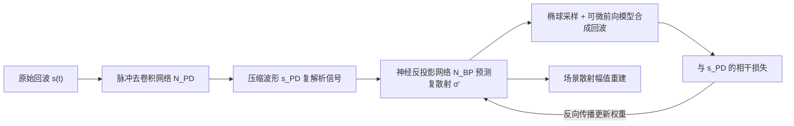

## 一句话总结

把 NeRF 式的"分析-合成"(analysis-by-synthesis)优化搬到合成孔径声呐(SAS)上：用可微声学前向模型 + 隐式神经表示,从欠采样、带宽受限的声呐回波中相干重建出更清晰的 3D 体积图像。

## 研究背景

- 领域现状:合成孔径声呐(SAS)通过让声呐阵列沿轨迹移动、对同一场景多视角测量来提升分辨率,是水下成像的主流技术。传统重建以时域反投影(backprojection)为代表——先用匹配滤波(matched filtering)做脉冲压缩,再按飞行时间把回波相干叠加到场景体素上。
- 核心痛点:SAS 成像是一个欠约束问题。一是采样稀疏(声速远慢于平台移动速度,难以密集采样);二是换能器带宽受限,无法恢复任意精细的空间频率。传统反投影只是"把已有能量聚焦",无法把物理约束和场景先验注入成像过程,后处理式的去卷积/自聚焦也只是对已重建图像做修补。
- 本文 idea:借鉴神经渲染,构建一个针对 SAS 的分析-合成优化框架。用可微前向模型从估计的场景合成回波,通过最小化"合成回波"与"实测回波"的损失来反解场景。这样噪声模型、遮挡、表面法向、Lambertian 散射、稀疏/平滑先验都能自然嵌入重建,且不依赖特定的采样几何。

## 方法

整体框架:方法与传统流水线一一对应但各自升级。传统链路是"匹配滤波 → 反投影相干叠加";本文链路是"脉冲去卷积(pulse deconvolution) → 神经反投影(neural backprojection)"。第一步用一个网络把发射波形从回波里去卷积出来,得到能量集中在稀疏时间格上的压缩波形;第二步用隐式神经表示预测复数散射系数,并借助可微前向模型合成复数回波,以合成-实测差异为损失反向优化网络权重。

关键设计:

1. **脉冲去卷积代替匹配滤波**。匹配滤波在低带宽下压缩能力急剧下降。本文改为优化一个隐式表示网络 $$N_{PD}$$,目标是让"网络输出再卷积上发射脉冲"逼近实测回波,并叠加稀疏与相位平滑(TV)先验:

$$\mathcal{L}_{PD} = \lVert N_{PD}(t;\theta_{PD}) * p^{*}(-t) - s(t) \rVert^2 + \lambda_1 \mathcal{L}^{PD}_{\text{Sparse}} + \lambda_2 \mathcal{L}^{PD}_{\text{TVPhase}}$$

   实验显示它在 20 kHz 与 5 kHz 两种带宽下都能给出相近且优于匹配滤波的压缩效果——这正是本文对带宽不敏感的关键来源。

2. **可微声学前向模型 + 椭球采样**。SAS 的一次时间采样对应"到收发两点飞行时间恒定"的一族点,几何上是以收发器为焦点的椭球面(而非 NeRF 里的直线光线)。因此本文沿椭球面积分复数散射来合成某时刻的回波:

$$\hat{s}'_{PD}\!\left(t=\tfrac{R_T+R_R}{c}\right) \approx \int_{E_r} b_T(x)\,b_R(x)\,T(o_T,x)\,T(x,o_R)\,L(\hat{\sigma}'(x))\,dx$$

   利用去卷积波形的幅值做重要性采样确定采样距离(时间格),再解椭球与光线的交点二次方程定位采样点。

3. **复数散射 + 相干损失**。网络直接输出复数散射 $$\hat{\sigma}'(x)=N_{BP}(x;\theta_{BP})$$,在复数域上计算合成与实测解析信号的损失 $$\mathcal{L}_{BP}=\lVert \hat{s}'_{PD}-\hat{s}_{PD}\rVert^2$$,最终取幅值 $$\lvert \hat{\sigma}'(x)\rvert \approx \sigma(x)$$ 作为散射估计。这与传统反投影恢复复包络一脉相承;论文验证了非相干重建效果明显更差。

4. **遮挡、法向与 Lambertian 散射**。沿深度用累积乘积估计透射概率 $$T(o_T,x)=\prod_{k<i}\exp(-\lvert\hat{\sigma}'_k\rvert\cdot\lvert l_{k+1}-l_k\rvert\cdot\zeta)$$ 处理遮挡;用散射幅值的梯度求表面法向;再乘 Lambertian 项约束表面。为控制计算量,回波光线只在"期望深度"处计算一次(避免采样量平方级膨胀)。损失里还叠加稀疏与空间/相位 TV 正则,可按场景与噪声调节。

## 实验结果

主实验为仿真数据上对 8 个不同网格的重建,与反投影(BP)、梯度下降(GD,即去掉 INR 的神经反投影)、极坐标格式化算法(PFA)对比。本文方法在全部指标上领先,PSNR 约有 2 dB 提升:

| 方法 | Chamfer ↓ | IOU ↑ | LPIPS ↓ | PSNR ↑ | MSE ↓ |
|------|-----------|-------|---------|--------|-------|
| BP | 1.36E-04 | 0.2928 | 0.1215 | 15.783 | 5.55E-03 |
| GD | 2.21E-04 | 0.4309 | 0.1236 | 15.117 | 6.13E-03 |
| PFA | 2.13E-04 | 0.3586 | 0.1238 | 15.048 | 6.64E-03 |
| 本文 | 1.12E-04 | 0.5194 | 0.0988 | 17.918 | 3.99E-03 |

其余实验以文字补充:在 -20/0/20 dB 噪声与 5/10/20 kHz 带宽扫描下,本文方法在各档位都更稳健,尤其在低带宽下几何保真度明显优于反投影;在气载圆周声呐(AirSAS)真实数据上,仅用约 10% 测量的螺旋/稀疏视角欠采样场景里,本文能抑制反投影常见的竖直/放射状条纹伪影;消融显示脉冲去卷积与神经反投影二者缺一不可,去掉 Lambertian 或遮挡建模都会显著劣化。方法还在水下双基地阵列(SVSS,湖床实测)上验证了可用性。

## 亮点与局限

- 亮点:
  - 首次把可微前向模型 + 分析-合成优化系统性地用于相干 3D SAS 重建,能把噪声模型、遮挡、表面法向、Lambertian 散射与稀疏/平滑先验统一注入成像过程。
  - 椭球采样把"恒定飞行时间面积分"这一声学特性正确建模,不绑定特定采样几何(圆周、螺旋、稀疏、双基地均可)。
  - 对发射带宽不敏感——低带宽/廉价硬件也能得到接近高带宽的重建,且在欠采样下大幅优于传统方法。
- 局限:
  - 速度是硬伤,单场景重建需 1-2 小时,而反投影只需几分钟;更适合对反投影已定位的感兴趣区域做精细增强。
  - 重建质量受前向模型准确度限制;点散射模型基于高频/几何声学近似,忽略衍射等波动效应,仿真器也未建模声速变化等环境因素。
  - 水下强背景(湖床回波远强于目标)会让稀疏正则把目标压没,需靠动态范围压缩这一带噪声代价的手段兜底。

## 延伸思考

- 这项工作是"神经场用于非光学时间飞行成像"路线的又一延伸:与 NLOS 成像、ToF 辐射场、CT/断层成像里的 INR 反问题共享同一套分析-合成范式,SAS 的独特点在于沿球面波前采样、双基地阵列与相干相位处理。
- 前向模型仍是单次反弹 + Lambertian 的简化,后续把多次散射、衍射、更真实的声学 BRDF 或波动方程近似引入可微渲染,或许能进一步逼近真实水下场景。
- 慢是当前最大工程障碍,能否借鉴 Instant-NGP 之后的加速思路、或用反投影结果做初始化/引导采样来把重建从小时级压到分钟级,是走向实用的关键。
