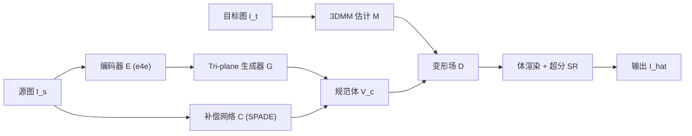

## 一句话总结
NOFA 只用一张人脸照片，就能借助 3D GAN 的生成先验重建出高保真、可自由控制视角与表情的 3D 面部化身，并支持跨身份泛化的视频驱动重演。

## 研究背景
- 领域现状：面部化身重建是图形学与视觉的重要课题，NeRF 的出现大幅提升了照片级、多视角一致的渲染质量。2D 光流扭曲类方法能靠大规模视频数据泛化到新身份、单图即可驱动，但缺乏底层 3D 几何约束，难以保证多视角一致性，且在大姿态/大表情下出现明显伪影。
- 核心痛点：现有 NeRF 面部化身大多是"针对特定人"的重建——需要目标人物多视角、多表情的大量图像来训练，且训练出的模型无法泛化到新身份。这两点严重限制了实际落地。
- 本文 idea：提出一个可泛化的、一次拍摄（one-shot）的 NeRF 面部化身框架。核心思路是借用 NeRF-based 3D GAN 潜空间中蕴含的 3D 一致生成先验，用编码器-解码器把单张源图投影到一个"标准表情"的规范神经体，再配合补偿网络补细节、变形场做表情控制。

## 方法
整体框架分三块：先用编码器把源图 $$I_s$$ 反演进 3D GAN 潜空间、由生成器解码出规范神经体 $$V_c$$（表情已对齐到标准态但保留身份）；补偿网络 $$C$$ 为 $$V_c$$ 补回图像特有细节；再由 3DMM 引导的变形场 $$D$$ 把规范体变形到目标表情，最后经体渲染 + 超分渲染出结果 $$\hat I$$。

关键设计：

1. **用生成先验做图到体的重建**：以预训练 3D GAN（tri-plane 表示）为骨干，用标准 e4e 编码器把源图映射为潜码 $$w_s$$，经生成器得到规范体 $$V_c = G(E(I_s)+w)$$。与追求"忠实还原输入"的常规 GAN 反演不同，这里刻意把图像投影到**表情对齐的规范空间**，为后续用反向变形做显式表情控制打基础。规范空间不需显式监督，靠在视频上端到端联合训练自然习得。
2. **补偿网络补身份细节**：编码器的低秩潜码不足以高保真重建，导致身份保持差。为此加一个由多个 SPADE ResBlock 组成的补偿网络，以生成器中间特征为输入、用源图逐级调制上采样，输出与 $$V_c$$ 同尺寸的补偿体相加，显著改善身份与外观保真度。
3. **3DMM 引导的变形场**：借 3DMM 的身份系数 $$\alpha$$ 与表情系数 $$\beta$$ 作为语义控制信号（$$S=\bar S+\alpha B_{id}+\beta B_{exp}$$）。变形场建模**反向变形**：把目标空间中每个采样点 $$x_d$$ 映射回规范空间的 $$x_c$$ 去查特征。它由 D-Net（回归坐标偏移）和 W-Net（受 FLAME 蒙皮权重启发，预测逐点偏移权重）组成，并同时以源身份和目标表情为条件，从而泛化到不同测试身份与驱动信号。
4. **三阶段训练 + 牙齿精修**：先在 CelebV-HQ 视频上端到端训练基础模型（重建损失、嘴部正则、ArcFace 身份损失、潜空间正则）；再固定变形场、用 GFPGAN 提供清晰牙齿作监督做牙齿精修；最后固定基础模型、在 FFHQ 图像上自监督训练补偿网络。面对困难样本还可只微调补偿网络做快速自适应，比用 PTI 微调整个模型更快。

## 实验结果
在 NeRFACE 数据集上与多种 3D-aware 方法对比自重演（same-ID）。NeRFACE 用每段视频前 1K 帧训练，其余方法保持 one-shot 设定。NOFA 以单图输入取得与"多帧训练"的 NeRFACE 相当的水平，并全面超过其他 one-shot 方法：

| 方法 | 训练设定 | FID↓ | LPIPS↓ | PSNR↑ | CSIM↑ |
|------|----------|------|--------|-------|-------|
| NeRFACE | 1K 帧 | 12.58 | 0.0925 | 30.87 | 0.7846 |
| Face-vid2vid | one-shot | 20.69 | 0.2035 | 30.98 | 0.7912 |
| ROME | one-shot | 25.83 | 0.2314 | 30.85 | 0.7206 |
| AniFaceGAN | one-shot | 24.39 | 0.2105 | 29.86 | 0.7754 |
| 3DFaceShop | one-shot | 22.75 | 0.2154 | 30.07 | 0.7516 |
| NOFA（本文） | one-shot | 16.41 | 0.1377 | 31.09 | 0.7953 |

在更难的跨身份重演（cross-ID）中，NOFA 的 FID（88.61）、身份保持 CSIM（0.5524）与姿态精度 APD（0.01872）均领先，表情精度 AED 取得次优。与 2D 方法（PIRenderer、StyleHEAT）对比时，NOFA 在重建质量与姿态精度（APD）上优势明显——因为头部姿态由外部相机参数直接控制。此外为解决相机对齐导致的"人脸永远居中"问题，作者用未对齐驱动视频的关键点计算像素偏移并转成相机坐标偏移，让人脸能在固定包围盒内自由移动。

## 亮点与局限
- 亮点：
  - 把"3D GAN 生成先验 + 编码器反演 + 变形场"结合，首次实现**单图、可泛化**的 NeRF 面部化身，训练一次即可用于任意新身份，比 per-subject 方法实用得多。
  - 规范空间 + 反向变形的设计让表情控制显式且细腻；补偿网络与牙齿精修分别针对身份细节和牙齿这两个常被忽视的短板。
- 局限：
  - 依赖 3DMM 参数估计与 3D GAN 先验，表情精度（AED）并非全场最优，极端表情/大幅口型仍受训练视频分辨率与质量制约。
  - 困难样本需 one-shot 微调才能达到较好视觉质量；对配饰、复杂头发等非人脸区域的建模仍受生成器先验覆盖范围限制。

## 延伸思考
- 方法本质是"把真实图像锚定到 3D GAN 潜空间的规范态，再用变形场解耦运动"，这一思路与后续基于 3D GAN / 三平面的可控头像生成一脉相承；若把骨干换成 3D Gaussian Splatting，或许能在速度与细节上进一步提升。
- 表情控制受限于 3DMM 的线性基与表情系数表达力，结合更强的表情/音频驱动信号，或用扩散先验替代 GAN 反演补细节，是值得追问的方向。
