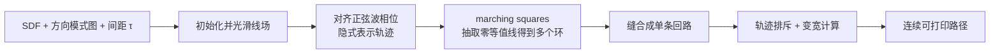

## 一句话总结

用普通的熔融沉积（FFF）3D 打印机，通过高效优化"单条连续、可定向的稠密填充路径"来控制挤出丝的走向，从而在平面表面上"打印"出类似拉丝金属的、方向可控的各向异性外观。

## 研究背景

- 领域现状：图形学里对各向异性外观（如拉丝金属）的虚拟建模与渲染已经很成熟，微表面 BSDF 用切向/法向两个粗糙度参数刻画各向异性高光。近年也出现了不少用增材制造复现外观的工作，但高保真的多材料喷射打印成本高出一个数量级。
- 核心痛点：现有可复现各向异性外观的方法要么依赖昂贵设备/微表面生成、要么路径不连续。已有的稠密可定向填充方法中，Tricard 等的优化器是启发式的、不支持对齐与稀疏方向约束，且会产生大量分叉奇点损害打印质量；最接近本文目标的 Hamiltonian Cycle 方法（Bedel 等）是组合优化，随形状面积增大呈二次复杂度、扩展性差，且难以生成不转弯的长直线。
- 本文 idea：作者的关键洞察是——FFF 挤出的塑料丝本身就天然带有显著的各向异性表面粗糙度（沿走丝方向粗糙度低、垂直方向高）。于是只要让稠密填充路径沿着输入的线场（line field）走向排布，并把整块区域填成"一条连续、无自交的闭合回路"，就能在打印面上分级地调制各向异性外观，同时避免空走带来的表面瑕疵。

## 方法

整体框架：输入是形状的有向距离场（SDF）加一张"方向模式图"（指定各处的走向或平行/正交/最光滑等模式）与目标线间距 $$\tau$$。方法先在网格上初始化并光滑一个线场，用这个线场去驱动一组局部正弦波（隐式表示轨迹），对齐这些正弦波的相位后，用 marching squares 抽取零等值线得到一组互不相交的闭合环，再把所有环缝合成单条回路，最后做排斥与变宽处理输出可打印的连续路径。

关键设计：

1. 轨迹的隐式表示。轨迹被定义为一个"振荡标量场"的零等值集，目标周期取为两倍线间距 $$\tau$$。这样做有两个好处：优化在隐式表示上进行，天然支持拓扑变化（不像显式折线那样需要处理断裂/合并）；用 marching squares 抽取零线时得到的必然是一组无自交的闭合环，能干净地处理形状边界。

2. 用线场而非向量场编码方向。挤出时向左走或向右走产生的各向异性外观相同，所以方向本质上是"无向"的。作者用旋转对称的线场（RoSy / 2-directional field）表示方向约束，并把边界处的线沿 SDF 梯度扩散到内部，通过最小化平滑能量得到最光滑线场：

$$E_l(\boldsymbol{d}, D) = -\boldsymbol{d}^T D^T D \, \boldsymbol{d}$$

其中 $$D$$ 的每行是一条邻居线，$$D^T D$$ 是这些线端点的协方差矩阵，最优方向 $$\boldsymbol{d}$$ 就是最大特征值对应的特征向量（即邻域方向的"平均线"）。平行/正交模式则在光滑后对相应区域整体旋转 90 度得到。

3. 对齐周期函数得到等间距轨迹。每个采样点 $$i$$ 关联一个相位 $$\varphi_i$$，定义局部正弦波

$$s_i(\boldsymbol{x}) = \sin\!\left(2\pi f (\boldsymbol{x} - \tilde{\boldsymbol{p}}_i)\cdot \boldsymbol{d}_i + \varphi_i\right)$$

频率固定为 $$f = 1/(2\tau)$$。相邻正弦波若相位不一致，轨迹间距就会忽宽忽窄；于是定义对齐能量，用邻域内 $$\lvert \boldsymbol{d}_i \cdot \boldsymbol{d}_j \rvert$$ 加权（方向越接近权重越大，正交方向无法对齐），通过局部复数相位平均迭代地把所有正弦波对齐。边界区域的相位被初始化为跟随 SDF 的值并加以约束，使轨迹平行于形状边界。

4. 多分辨率加速 + 缝合成单回路。线场光滑与相位对齐本质是扩散过程、收敛慢且易陷局部极小，作者用多分辨率网格（restrict/prolong）快速传播信息来加速。抽取出的一组环再被递归缝合：每次挑边数最少的环，寻找与邻环之间"缝合后不产生自交、代价最小"的一对边接起来，重复 $$\lvert C \rvert - 1$$ 次直到只剩一条回路。最后对间距过近（小于 $$\tau/2$$）的轨迹点做排斥、并按到邻近曲线的距离计算每点的可变线宽以最大化覆盖、减少重叠。整套算法用 JAX 的 `vmap` 自动向量化，除二次复杂度的缝合步在 CPU 外，其余步骤都在 GPU 上并行，单次优化迭代对采样点数是线性复杂度。

## 实验结果

作者在 Creality CR-10 S Pro（0.4 mm 喷嘴）上打印了 logo、wave、brain、people、vary 五个样例，并与最接近的 Hamiltonian Cycle 方法（Bedel 等 2022）在覆盖率、重叠率、与线场的对齐能量上对比（对齐能量越接近 -1 表示越贴合，取值 [-1, 0]）：

| 样例 | 覆盖率（本文 / Ham.） | 重叠率（本文 / Ham.） | 对齐能量（本文 / Ham.） |
|------|------|------|------|
| brain | 95.91% / 94.43% | 1.13% / 3.30% | -0.930 / -0.863 |
| people | 95.88% / 93.75% | 1.19% / 3.87% | -0.924 / -0.844 |
| vary | 96.79% / 92.88% | 0.85% / 4.18% | -0.946 / -0.838 |

本文方法在三项指标上全面占优：覆盖更高、重叠更少、与输入线场对齐更好，因而打印件更有光泽、各向异性更强。执行时间上优势更悬殊：在 vary 上本文 GPU 版 5.52 s，而 Hamiltonian Cycle 需 11017.7 s（约 1995 倍差距），且随形状面积增大差距进一步拉大（其组合优化器是二次复杂度）；wave 样例用对方方法尝试不同随机种子跑 60 小时仍无法终止，而本文方法在所有测试中都能稳健输出定向回路。作者还展示了把灰度图约束到线场做"伪浮雕"、以及单材料 QR 码等应用。

## 亮点与局限

- 亮点：
  - 抓住"挤出丝天生各向异性粗糙度"这一物理特性，并用轮廓仪实测（RMS 斜率沿走丝/垂直方向的比值最高可达数十倍）予以量化验证，把外观制造问题转化为纯粹的路径定向问题，无需微表面生成、无需专用硬件。
  - 隐式（正弦场零等值线）表示 + 多分辨率对齐 + 单回路缝合的组合，兼顾了鲁棒性、对齐质量与效率，相对最先进方法提速最高三个数量级。
  - 高度可并行（JAX/GPU），且提供开源实现、g-code 与耗材细节。
- 局限：
  - 只适用于平面表面，曲面情形需结合曲面沉积打印进一步研究。
  - 隐式场的奇点可能落在不希望的位置，在打印件上留下可见小瑕疵；尖转弯处会局部产生各种方向导致亮/暗斑，且欠/过挤出使高度场不完全平整。
  - 只能做高对比度的各向异性外观，无法连续控制各向异性粗糙度的强弱。

## 延伸思考

这项工作把"渲染中用来描述外观的线场/各向异性参数"直接落到了物理打印路径，是外观建模与计算制造之间一次干净的闭环。它对稠密可定向填充的隐式优化思路，和四边形/六面体网格生成里的场对齐、条纹图案合成一脉相承，可以看作把这些几何处理工具迁移到了制造轨迹优化。值得追问的方向包括：能否引入可控奇点放置来主动隐藏瑕疵；能否让沉积路径的更细微变化去调制粗糙度强度，从而复现连续可变的各向异性乃至更一般的 BSDF；以及作者设想的、用路径粗糙度控制去反向设计光学或触觉超材料。
