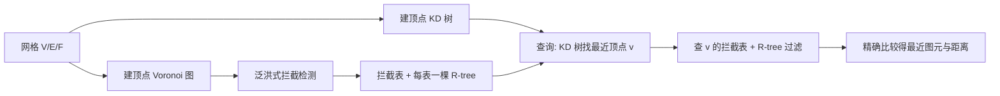

## 一句话总结

P2M 抛弃传统基于包围盒层次（BVH）的思路，改用"网格顶点的 KD 树 + 一张预计算的拦截表（interception table）"来做点到网格曲面的最近距离查询，在保持结果精确的前提下把查询速度提升到 SOTA 的 2~10 倍。

## 研究背景

- 领域现状：点到网格曲面的最近距离/最近图元查询是图形学、物理仿真、计算几何、CAD 里的基础操作。主流解法（PQP、Embree、FCPW、CGAL）几乎都建立在 BVH 之上，通过层次化包围盒在查询时快速剪掉大部分不可能贡献最近点的三角形。
- 核心痛点：BVH 类方法的加速版本（FCPW 的宽 BVH + 向量化遍历、Embree、SIMD、GPGPU）主要靠并行和工程优化压低常数，并没有从算法层面真正减少查询所需的计算量；面对大规模网格时查询开销仍然偏高。
- 本文 idea：换一条完全不同的算法范式。先对顶点集建 KD 树来近似编码曲面几何，但会遇到一个问题——离查询点最近的图元可能是某条边 $$e$$ 或某个面 $$f$$，而 KD 树只会报告一个顶点 $$v$$。作者称这种 $$v$$ 为 $$e$$（或 $$f$$）的"拦截者"（interceptor）。只要预先算出所有"顶点—边/面"的拦截关系并存成拦截表，查询时先查 KD 树找到最近顶点，再查表就能定位真正的最近图元。

## 方法

整体框架：离线预计算 KD 树与拦截表，在线查询时"KD 树搜最近顶点 → 查拦截表锁定候选图元 → 精确比较得最近点"。核心难点在于如何又快又全地把拦截表算出来。

关键设计：

1. **拦截关系的几何本质**。顶点集 $$V$$ 单独诱导一个 Voronoi 图 $$\mathcal{V}_V$$；而把边、面都当作开图元一起作为生成元，则诱导广义 Voronoi 图 $$\mathcal{V}_{V,E,F}$$。作者观察到：$$v$$ 拦截 $$e$$ 当且仅当 $$\text{Cell}(v; \mathcal{V}_V) \cap \text{Cell}(e; \mathcal{V}_{V,E,F}) \neq \varnothing$$。也就是说，拦截表编码的是"一组点"与"一组更复杂图元"之间的委托-代理关系。

2. **凸多面体松弛 + 过滤规则**。广义 Voronoi 胞腔边界是弯曲的，直接判交很难。作者证明 $$\text{Cell}(e; \mathcal{V}_{V,E,F}) \subset \text{Space}_\perp(e)$$（由边的两个邻面与两端点竖直平面围成的凸区域），从而把判交松弛到凸多面体 $$\text{ConvexPoly}(v,e) \triangleq \text{Cell}(v;\mathcal{V}_V) \cap \text{Space}_\perp(e)$$ 上。再借助点-线（点-面）二等分面的凸性，得到只需检查凸多面体各极点的充分过滤条件：若对所有极点 $$x_i$$ 都有 $$\lVert x_i - v \rVert \le \text{Dist}(x_i, l_e)$$，则 $$v$$ 不可能拦截 $$e$$。作者自己实现了受限半平面切割来构造凸多面体，在 20K 面 Camel 上平均约 12 微秒，比 CGAL 更快。

3. **泛洪式拦截检测**。不逐一枚举所有"顶点—边"、"顶点—面"对（暴力法在 1500K 面 Dragon 上要一天以上），而是从边（面）的端点出发，沿 $$\mathcal{V}_V$$ 的邻接关系做泛洪扩散，只在命中的胞腔间传播。作者证明了 $$\text{Cell}(e; \mathcal{V}_{V,E,F})$$ 的连通性，保证泛洪不漏任何拦截对。这一策略把 Dragon 的拦截检测从一天以上压到约 2 分钟。

4. **查询期 R-tree 过滤**。有的顶点拦截列表很长（Dragon 上最长达 782 个图元），逐个测试很慢。对每个拦截图元，用其"真正可能成为最近图元"的非凸区域 $$\text{Region}(v,e)$$ 的包围盒建一棵 R-tree（每个拦截表一棵）。查询时先用 R-tree 过滤，再对幸存图元做 $$\text{Space}_\perp$$ 内外测试与精确距离计算。

## 实验结果

在 AMD Ryzen 9 5950X 上、每个模型随机采样一百万查询点（10 倍包围盒范围内）。下表为五个常规模型的单次平均查询耗时对比（微秒），$$T_{BF}$$/$$T_R$$ 分别为本文不用/使用 R-tree：

| 模型 | 面数 | PQP | FCPW | 本文(无 R-tree) | 本文(有 R-tree) |
|------|------|-----|------|------|------|
| Camel | 19.5K | 7.47 | 3.64 | 1.43 | 1.28 |
| Armadillo | 100K | 9.64 | 5.43 | 2.45 | 2.19 |
| Sponza | 262K | 7.69 | 0.79 | 0.57 | 0.41 |
| Lucy | 526K | 11.84 | 5.43 | 2.44 | 2.13 |
| Dragon | 1500K | 13.83 | 7.56 | 3.54 | 3.34 |

即便在 1500K 面的 Dragon 上，本文查询也比 PQP 快至少 4 倍、比 FCPW 快约 2 倍。对拦截列表很长的模型（Thingi10K 中挑选的病态样例），R-tree 带来的加速尤为显著，最高可达约 100 倍。全 Thingi10K 数据集上整体比 PQP、FCPW 快 2~10 倍。代价是更高的预处理开销（Dragon 约 137 秒，其中拦截检测占约 85%）与更大内存（Dragon 需 1.78 GB，PQP/FCPW 分别为 0.61/0.16 GB）。此外，本文查询对三角化质量、破面/穿插等退化输入的鲁棒性优于 BVH 类方法。

## 亮点与局限

- 亮点：
  - 提出与 BVH 正交的全新范式，用 KD 树 + 拦截表把"点到网格"问题转化为"点到点"最近邻问题，并给出严格的正确性证明。
  - 凸多面体松弛过滤 + 泛洪检测两个"简单但有效"的技巧，把原本一天以上的拦截表预计算压缩到分钟级。
  - 查询速度对三角形质量、三角汤（gapped / 高穿插）等退化输入不敏感，鲁棒性优于 BVH。

- 局限：
  - 预处理仍偏慢，泛洪中约 85% 被访问的顶点最终并非拦截者，存在明显浪费。
  - 对高度对称形状（如球面）拦截表会爆炸——极端情况下每个顶点都拦截所有三角形。
  - 内存占用显著高于 PQP/FCPW，且当前只支持最近点查询，不像 PQP 那样同时支持线-面求交与碰撞检测。

## 延伸思考

- 预处理瓶颈在于大量"无效访问"，若能设计更强的过滤器提前排除非拦截顶点（例如结合更紧的距离下界或分层剪枝），有望把方法推向对预处理时间敏感的动态/可变形网格场景。
- "拦截表"本质上是把复杂图元的邻近关系离线摊派到点上，这一思路或许能迁移到其他"点代理复杂对象"的查询问题，如点到样条曲面、点到隐式表面的近似最近查询。
- 与近年基于神经场/学习的距离场（如各种 SDF 网络）相比，P2M 走的是精确、可证明正确的经典几何路线，二者在精度-速度-内存三角上的取舍值得对照：当需要精确图元级结果时，这类结构化方法仍有不可替代的价值。
