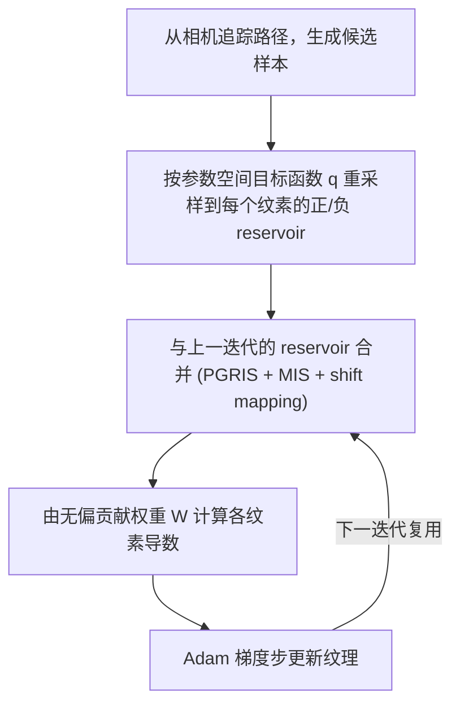

## 一句话总结

把实时前向渲染里的 ReSTIR（时空采样复用）思想搬到可微渲染中，让梯度下降的相邻迭代之间**复用蒙特卡洛采样**，从而在等时预算下大幅降低梯度方差、加速逆向渲染收敛。

## 研究背景

- 领域现状：逆向渲染通过"分析-合成"求解场景参数（材质、光照等），核心是用可微渲染估计图像损失对参数的梯度。现代可微渲染用蒙特卡洛积分估计这些导数，梯度方差过大会拖慢优化。
- 核心痛点：已有的方差削减方法都**只在单次梯度迭代内独立工作**，每次迭代都从零采样，样本数与计算量居高不下。但梯度在相邻迭代之间往往变化缓慢，完全丢弃上一轮的样本其实很浪费。
- 本文 idea：借鉴前向渲染的 ReSTIR，把"跨帧的时间复用"改造成"跨梯度下降迭代的复用"。但直接套用有两个拦路虎——一是每个像素要估计海量导数（每个参数一个），朴素存储 reservoir 会导致内存和计算爆炸；二是 ReSTIR 只能处理非负被积函数，而导数可正可负。本文用**参数空间重构**解决前者，用**正定化（positivization）重采样**解决后者。

## 方法

整体框架：先把逐像素的可微渲染积分**重写成参数空间的单个积分**，使得每个参数（纹素）只需维护一个 reservoir，而不是"每像素 × 每参数"个；再把广义重采样重要性采样（GRIS）扩展到可正可负的被积函数上得到 PGRIS 估计器；最后把它落地为一个跨梯度迭代复用样本的纹理优化算法。

关键设计：

1. **从像素中心到参数中心的积分重构**。前向渲染输出像素强度，可微渲染真正需要的却是"损失对参数的梯度向量"，它活在参数空间里。作者观察到损失导数可以写成对所有像素的求和，并把求和塞进积分内部，得到参数空间的可微渲染方程：

$$\partial_{\pi_i}\mathcal{L}=\int_{\Omega} w(\mathbf{x})\,\partial_{\pi_i} f_c(\mathbf{x},\boldsymbol{\pi})\,d\mu(\mathbf{x})$$

其中 $$w(\mathbf{x})=\sum_{j=1}^{n}\partial_{I_j}\mathcal{L}\cdot h_j(\mathbf{x})$$ 把"对像素求和"隐藏进了路径权重。这样一来，不必先逐像素估计导数再求和，而是直接用单个积分估计；更关键的是，每个参数（纹素）只需**一个 reservoir**，存储代价从"像素数 × 参数数"降到"参数数"。

2. **正定化重采样 PGRIS**。RIS/GRIS 要求目标函数 $$q$$ 非负（它代表未归一化的概率密度），但导数会取负值。若简单地取 $$q=\lvert g\rvert$$，即便 $$M\to\infty$$ 方差也无法归零，只会收敛到"符号差异"带来的残余方差。作者借用统计学的 positivization，把被积函数拆成正负两部分 $$f=f^{+}-f^{-}$$，分别构造正、负两个估计器：

$$\langle F\rangle_{\text{pris}}=\frac{f(x_{z^{+}})}{q^{+}(x_{z^{+}})}\frac{1}{M}\sum_{s=1}^{M}\frac{q^{+}(x_s)}{p(x_s)}+\frac{f(x_{z^{-}})}{q^{-}(x_{z^{-}})}\frac{1}{M}\sum_{s=1}^{M}\frac{q^{-}(x_s)}{p(x_s)}$$

正负估计器共用同一批候选，理论上随候选数增加方差可收敛到零。扩展到 GRIS 就得到 PGRIS。

3. **应对符号翻转的样本复用**。跨迭代复用时目标函数会变化，同一个样本在上一迭代是正、这一迭代可能变负。因此作者要求**把上一轮正、负两个 reservoir 的选中样本都作为当前正、负两个 reservoir 的候选**，避免因符号不匹配而白白丢弃样本。MIS 权重也相应地把正/负估计器视为不同策略，并用置信权重上限（M-capping）限制旧样本的影响。

4. **候选生成与跨迭代复用**。候选不在纹素上直接生成（很多纹素不可见，浪费），而是**从相机追踪路径、所有纹素共享同一批候选**，把生成成本摊薄到所有参数上。复用则把"不同迭代"当作"不同帧"，用 **random replay** shift mapping（复制并重放随机数）把上一迭代的样本映射到当前迭代，简单且通用（尤其适合直接光照）。代价是 random replay 一般不省重算成本，但收益来自候选分布随迭代逐渐收敛到目标分布。

## 实验结果

在 Mitsuba 3 的直接光照积分器（GPU 后端，RTX 2080 Ti）上实现，优化单张 $$2048\times2048$$ 的 Disney principled BSDF 参数纹理，单视角、relMSE 损失、Adam 优化。下表为**等时导数估计的 relMSE**（本文 1 spp，Mitsuba 3 提高 spp 使单迭代耗时相当；括号为相对 Mitsuba 3 的倍数）：

| 场景（优化参数） | Mitsuba 3 导数 relMSE | 本文导数 relMSE | 重建图像 relMSE 改善 |
|------|------|------|------|
| Chalice（roughness） | 6.5e-08 (1.00x) | 1.6e-08 (0.24x) | 6.7e-02 → 1.2e-02 (0.18x) |
| Tire（roughness） | 9.8e-07 (1.00x) | 3.1e-07 (0.32x) | 1.5e-01 → 4.1e-02 (0.27x) |
| Ashtray（anisotropy） | 4.9e-11 (1.00x) | 1.4e-11 (0.28x) | 1.4e-02 → 3.9e-03 (0.28x) |
| Christmas Tree（base color） | 1.2e-08 (1.00x) | 2.8e-09 (0.23x) | 1.8e-02 → 1.3e-02 (0.73x) |

补充结论：在 Tire、Ashtray 这类含低粗糙度高光的场景，Mitsuba 3 在低采样数下频繁算出**符号错误**的导数（该红的地方变蓝），优化轨迹缓慢，只有本文能在限定时间内重建出黄色高光；Christmas Tree 因细针叶+近距光源导致可见性极难，基线导数极其稀疏、早早"收敛假象"，而本文导数误差低四倍多、能持续降低损失。消融显示去掉正定化（改用 $$q=\lvert g\rvert$$ 的 GRIS）会带来更嘈杂的梯度和重建噪点。作者还指出该方法与 Adam 正交：Adam 只是平均历史梯度、无法补回采样不足区域，而本文是无偏地增大有效样本数，叠加在 Adam 之上仍有明显提升。

## 亮点与局限

- 亮点：
  - 首个把 ReSTIR 的样本复用引入可微/逆向渲染的工作，切入点新颖（复用维度从"帧/邻域像素"变成"梯度下降迭代"）。
  - 参数空间重构把 reservoir 存储从"像素×参数"降到"仅参数"，是让 ReSTIR 在此可行的关键。
  - PGRIS 把重采样理论推广到可正可负被积函数，具备理论上的零方差收敛性，且用途不限于渲染，对一般可正负的蒙特卡洛积分都适用。
- 局限：
  - 核心假设是"相邻迭代梯度足够相关"，在高学习率下参数大幅跳变时该假设可能不成立（作者称经验上仍有加速）。
  - random replay shift mapping 不节省重算成本，加速只来自方差下降而非计算量下降。
  - 只处理被积函数对参数连续的情形，不含不连续项（可见性/边界导数）；只做了直接光照与 BRDF 纹理，未覆盖全局光照。
  - 作者坦言可微渲染中"梯度误差"与"优化收敛速度"的关系本身尚不清晰，噪声梯度有时也能到达不错的极小值。

## 延伸思考

- 论文明确点出"跨参数复用"（类比 ReSTIR 的空间复用）是自然的下一步，难点在于如何高效选择邻近参数；同时复用引入的样本相关性对优化的影响也值得深挖。
- 参数空间的重构思路很通用，向体积、神经表示（如 NeRF / 神经材质）等参数化场景推广是显而易见的方向，也可与 radiative/path replay backpropagation 结合扩展到间接光照。
- 一个耐人寻味的观察是：既然逆向渲染对梯度噪声有相当的容忍度，那么"花大力气把梯度估计得很准"到底在何种问题上真正划算，值得从优化动力学角度系统研究。
