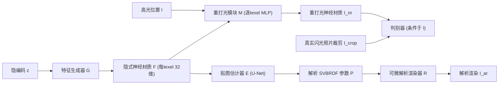

## 一句话总结
PhotoMat 是首个**完全用真实手机闪光照片**训练、无需任何合成材质贴图监督的材质生成模型：它先学一个可重打光的神经材质 GAN，再把隐式神经材质解码成可编辑的解析 SVBRDF 贴图。

## 研究背景
- 领域现状：高质量材质（SVBRDF）是渲染真实感的核心。已有的材质捕获与生成方法（MaterialGAN、TileGen 及各类单图/少图估计网络）都需要对单张材质贴图做显式监督，因而只能在合成数据集上训练。
- 核心痛点：合成材质数据集数量少、多样性有限（常用的数据集只有约 1850 个材质、源自 155 个程序化材质），且与真实世界材质存在明显的视觉鸿沟，导致生成结果带有一股"数字味"。要摆脱合成数据又陷入"先有鸡还是先有蛋"：训练生成器需要大量真实反射率贴图，而获得这些贴图又需要能从图像还原真实材质的方法。
- 本文 idea：把生成与获取放进同一个框架里解决。用海量、易采集的手机闪光照片（已知光源位置）训练一个条件可重打光的 RGB 域 GAN，让模型在从不直接观测真值材质贴图的情况下学到真实反射率属性，再单独训练一个解码器把神经材质转成解析 SVBRDF。

## 方法
整体 pipeline 分两步：第一步训练"可重打光生成器"（特征生成器 G + 神经重打光模块 M），仅用真实闪光图 + 判别器的对抗损失；第二步冻结 G/M，训练材质贴图估计器 E 把隐式神经材质解码为解析 BRDF 参数，用可微渲染器的重渲染损失监督。

关键设计：

- **可重打光生成器（RGB 域对抗训练）**：G 基于 StyleGAN2 改造，输出通道数 $$C=32$$、与目标分辨率同尺寸的隐式材质特征 $$\boldsymbol{F}$$。M 是一个逐 texel 的 8 层 MLP，把每个 texel 的特征向量与该点的局部光照方向拼接后输出 RGB，充当"神经版局部光照渲染器"。生成的重打光图像为 $$I_{nr}(z,l)=M(G(z),l)=M(\boldsymbol{F},l)$$。判别器同样条件于光照 $$l$$（RGB + 逐像素光方向共 6 通道输入），因此若高光被"烘焙"进 $$\boldsymbol{F}$$，判别器会因光照条件与观测高光不匹配而轻易识破——这一机制天然消解了光照与 SVBRDF 之间的歧义。

- **免标定的数据采集与光位检测**：用手机开闪光、在弱环境光下手持拍摄，视闪光与相机为共置的点光源。拍摄时尽量把高光对准中心；再用简单的高光检测器估计闪光位置（取 RGB 逐像素最小值得强度图，gamma 校正后按大于均值的像素做加权平均）。关键技巧是**对原图随机裁剪到一半尺寸**，就能得到一批高光位置各异的样本，每个 texel 的光方向都可由裁剪边界推算，无需专门用不同光源多次拍摄。

- **材质贴图估计器 E**：一个带跳连的 U-Net，输入 $$\boldsymbol{F}$$、输出逐 texel 的解析参数 $$\boldsymbol{P}$$（漫反射/镜面反照率、粗糙度、法线或高度，标准模型 $$n=8$$）。训练目标是让解析渲染 $$I_{ar}=R(E(G(z)),l)$$ 在多种随机光照下逼近神经重打光 $$I_{nr}$$，损失 $$L_E=L(I_{ar},\,I_{nr}(z,l))$$ 采用 VGG 层 Gram 矩阵距离（权重 1.0）加 L1（权重 0.1）。渲染器 R 可换任意解析模型（标准 GGX，或车漆用的双镜面瓣涂层模型 $$n=11$$），体现"不绑定特定 BRDF"。

- **光衰减微调**：真实闪光并非理想全向点光，加上镜头渐晕、色调映射、环境光等使精确衰减无法标定。不完美的衰减会让估计器靠"弯折法线、边缘处调整贴图强度"去补偿，产生瑕疵。解决办法是微调阶段随机地对特征网格 $$\boldsymbol{F}$$ 做带环绕的水平/竖直平移，再用平移前后神经渲染之间的 Gram 矩阵损失（只比整体风格、不做像素对齐），迫使贴图对空间位置不变，从而去除衰减效应（代价是法线对比度略降）。

## 实验结果
主实验是与 TileGen 的**真实感用户研究**（2AFC，30 名参与者，20 对材质：10 皮革 + 10 石材，问哪张更像真实表面的照片）：

| 对比维度 | PhotoMat（真实数据训练） | TileGen（合成数据训练） |
|----------|--------------------------|--------------------------|
| 平均被判"更真实"的比例 | 79.2% | 20.8% |
| 20 个材质中被偏好数 | 18（另 1 个持平） | 1 |
| 30 名参与者中偏好该方法的人数 | 28 | 2 |

结论是"用真实数据训练确实能生成更真实的 SVBRDF"。其余定性结果表明：$$256^2$$（Glossy 2.5k 数据）、$$512^2$$ 与 $$1024^2$$（Diverse 12k 数据）模型都能产出多样且一致可重打光的材质，估计器在无真值贴图监督下仍能反解出合理的参数贴图；车漆数据集上换用双镜面瓣涂层模型能贴合复杂高光（标准单瓣模型会出现多重高光与孔洞）；模型还可经 TileGen 策略或 HexTile 扩展为可平铺版本。采样速度在单张 RTX 2080 上，$$256^2/512^2/1024^2$$ 分别约为 900/200/60 张每分钟。

## 亮点与局限
- 亮点：
  - 首个**完全脱离合成材质贴图**、仅靠真实闪光照片训练的材质生成模型，直击合成数据的视觉鸿沟问题。
  - 巧妙用"裁剪 + 已知闪光位置 + 条件判别器"构造可重打光对抗训练，避免把高光烘焙进材质，隐式解决了光照/反射率歧义。
  - 隐式神经材质可解码为标准或自定义解析 BRDF，兼顾真实感与可编辑性、可直接进渲染管线；采集流程免标定、易规模化（12000 张照片）。
- 局限：
  - 数据集天然偏向"手机方便拍到"的材质类别与尺度，且规模仍有限；作者认为扩大数据规模最能带来提升。
  - 高分辨率与可平铺版本训练时观察到 GAN 常见的模式坍缩问题；可平铺生成的 FID 与视觉质量也弱于非平铺版本。

## 延伸思考
- 论文自陈可探索扩散模型替代 GAN 以缓解模式坍缩——这与后续"文本/图像驱动的程序化材质生成"等工作方向一致，值得对比在真实照片监督下扩散模型能否同样规避高光烘焙。
- "在 RGB 域用条件重打光 + 判别器学隐藏物理量"的范式与 EG3D（仅用 2D 图监督学 3D 人脸）同源，思路可推广到其它"渲染中需要、但照片里不直接可见"的资产（如透射、次表面散射材质）。
- 免标定采集 + 逐 texel 光方向的设计，为把消费级设备众包采集接入生成式管线提供了一个实用样板，后续可关注光位检测误差对贴图质量的定量影响。
