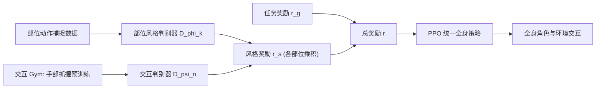

## 一句话总结

通过为身体不同部位分别配置"部位级运动先验"（part-wise motion prior），并结合从独立手部仿真中预训练出的抓握交互先验，让物理仿真中的全身角色仅凭少量、非配对的动作捕捉数据就能学会与环境进行丰富物理交互的复杂技能。

## 研究背景

- 领域现状：基于物理的角色动画用仿真器保证运动的物理合理性，配合深度强化学习（尤其是 AMP 这类对抗式运动先验方法）已能高质量复现参考动作。
- 核心痛点：数据驱动方法被参考动作的关节状态"锁死"——数据库里只有单独的行走和单独的凝视，就无法合成"边跑向目标边盯着某处"的组合动作。而人-物交互的组合随物理参数指数级膨胀，不可能采集齐全；手部又自由度高、易自遮挡与自碰撞，动作捕捉尤其困难，且往往拿不到手与物体的配对轨迹。
- 本文 idea：把全身关节切分成若干"部位集合"，为每个部位单独指定一个判别器去参考各自的运动数据；手这类灵巧部位则从一个极简的手部仿真环境预训练出通用抓握技能，作为额外的"交互先验"注入。物理仿真器负责协调各部位、推断出统一的全身策略，从而用现有数据的不同组合合成出数据集中不存在的新交互技能。

## 方法

整体思路是在 AMP 框架上做"分部位"的改造：不再训练一个覆盖全身的运动判别器，而是把关节划分为 $$K$$ 个部位集合，每个部位配一个独立判别器给出各自的风格奖励；同时把手部从独立仿真中学到的抓握技能，也当作一种"部位先验"混入。全身仍由单一策略统一控制，物理仿真器自然地在部位之间做协调。

关键设计：

1. **部位级运动先验（PMP）**。把关节集合 $$J = \bigcup_{k=1}^{K} J_k$$ 划分成若干部位（如上身、下身、双手），每个部位 $$k$$ 用自己的数据集 $$M_k$$ 训练一个专属判别器 $$D_{\phi_k}$$，只对该部位的局部观测 $$(o_k, o_k')$$ 打分。各部位不必在骨架上空间相连。这让不同部位可以引用不同来源、不同特征集的数据，绕开"必须有一段完整全身参考动作"的限制。

2. **风格奖励用乘积而非求和**。总风格奖励为各部位奖励的连乘 $$r_s = c \cdot \prod_{k=1}^{K} r_s^k$$，其中 $$r_s^k = -\log(1 - D_{\phi_k}(o_k, o_k'))$$。乘积形式确保每个部位都必须"达标"，防止某个部位被忽略；代价是当某部位奖励极小时会拖垮整体，尤其在 $$K$$ 较大时。

3. **交互先验与交互 Gym**。在一个只含手模型与一根圆柱杆的极简环境里，用人工设计奖励训练出稳定的通用抓握技能（要求手均匀接触、并在随机外力扰动下保持抓握）。手的交互状态 $$s_i$$ 同时包含本体感觉与和目标的物理关系：$$s_i = \{q_h, \dot{q}_h, \bar{p}_e, \bar{p}_r, c_e, \langle d_h \cdot d_c \rangle\}$$，即手关节位置/速度、指尖局部坐标、目标杆位姿、接触标记，以及指向手内侧的方向与接触力方向的余弦相似度。预训练得到的专家状态-动作对再作为一组"部分示范"，通过交互判别器 $$D_{\psi_n}$$（$$n \in \{\text{right}, \text{left}\}$$）融入全身策略。融合后的风格奖励为 $$r_s = c \cdot \prod_{n \in H}\{(1-\sigma_n)r_s^n + \sigma_n r_i^n\} \cdot \prod_{k \notin H} r_s^k$$，其中 $$\sigma_n$$ 是基于手到目标欧氏距离的高斯核系数——手越靠近目标，越多地采用交互先验的反馈。

4. **两项训练技巧**。其一，**部位独立的状态初始化**：由于没有可靠的全身参考姿态，各部位独立采样参考姿态，不强求对齐，靠仿真器最终协调出自然全身动作。其二，**Demo Blend 技术**：为缓解乘积奖励在部位多时"某部位失败→整体奖励归零"的问题，以伯努利概率 $$\lambda_d$$（实验中 $$K>2$$ 时取 0.1）随机混入各部位已经历过的轨迹，稳定训练。

## 实验结果

角色基于 DeepMimic 的人形骨架、把球状手换成 MPL 灵巧手，总驱动自由度 54，用 Isaac Gym 在 4096 个并行环境、以 PPO 训练，策略以 30 Hz 输出 PD 目标；参考动作取自 Mixamo。在七个任务上评测归一化平均回报（NR，越高越好，< 0.05 视为完全失败），对比完整方法（PMP）、去掉交互先验（PMP no IP）、以及去掉部位先验（no PMP）。

| 场景 | PMP | PMP (no IP) | no PMP |
|------|------|------|------|
| Cart Pulling (Plain) | 0.65 | 0.63 | 0.59 |
| Cart Pulling (Random) | 0.65 | 9.2e-5 | 0.0066 |
| Cart Pulling (Curved) | 0.69 | 0.63 | 0.59 |
| Bar Hanging | 0.63 | 0.33 | 0.27 |
| Barbell Lifting | 0.55 | 0.052 | 0.022 |
| Rope Climbing | 0.63 | 0.38 | 0.31 |
| Rope Climbing (Low friction) | 0.26 | 0.22 | 0.063 |

在所有场景上完整方法都优于无部位先验的基线；在随机朝向拉车、举杠铃这类强交互场景中，去掉交互先验会直接崩溃（NR 接近 0），说明抓握交互先验对复杂接触任务不可或缺。定性上，即便调高任务奖励权重，带 PMP 的智能体仍能保持自然动作，而无 PMP 的基线会牺牲动作质量去追求任务回报。另外，仅在圆柱杆上训练的抓握先验可泛化到更粗的手柄和完全不同形状的弯曲手柄，改变抓握目标位置还能诱导出不同握法。

## 亮点与局限

- 亮点：
  - 用"分部位判别器"打破了参考动作必须成段全身配对的限制，能把不相关的局部动作数据自由组合出全新技能，数据利用率显著更高。
  - 交互先验可从单次、极简的手部仿真预训练获得，无需手-物配对捕捉数据，且能跨物体形状/握法泛化，一次训练复用于多个下游任务。
  - 全身自然性无需显式的全局协调模块，交由物理仿真器与任务奖励隐式实现。
- 局限：
  - 仍未免除为每个挑战性场景精心设计任务奖励函数的工作量。
  - 部位切分方案（哪些关节归为一组）目前靠人工指定，缺乏自动探索最优组合的机制。
  - Isaac Gym 高度并行化以损失细粒度接触信息为代价，接触细节依赖预训练来补偿。

## 延伸思考

本文与 AMP、以及为角色重组身体部位做物理控制的工作（如 Lee 等 2022）一脉相承，但把"部位组合"的灵活性推得更远——允许非周期动作、更细的控制率组合。作者提出的两条未来方向都很自然：一是引入视觉等额外示范特征，让智能体在更简单的任务奖励下自动探索部位技能的最优组合；二是自动化地搜索最优部位切分。更远一点看，"灵巧部位 + 交互先验"的范式不限于手，换成脚趾控球、或推广到机器人全身操作等接触密集场景都值得尝试，是把稀缺交互数据规模化利用的一条务实路线。
