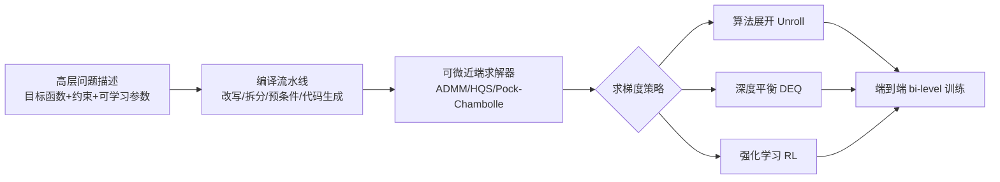

## 一句话总结

∇-Prox 是一套面向大规模优化问题的领域专用语言（DSL）与编译器：用户用几行代码写出优化目标，它自动编译成"全程可微"的近端算法求解器，让模型驱动的近端优化与神经网络训练无缝拼接，并把展开求解器爆炸式的显存开销压下来。

## 研究背景

- 领域现状：近端算法（ADMM、HQS、Pock-Chambolle 等）是求解大规模、含约束优化问题的通用武器，广泛用于成像、控制、调度等领域；近年兴起的"模型驱动 + 学习驱动"混合方法，把可解释、可泛化的形式化优化与神经网络的表达力结合起来，效果好且省数据。
- 核心痛点：手工实现这类混合方法既要懂近端优化又要懂深度学习，容易出错且耗时；更要命的是，为了求梯度而"朴素展开"迭代求解器会生成极长的计算图，用 autograd 反传时显存爆炸（论文首图里手写方案动辄需要 130~350 GB 显存），批量训练几乎不可行。
- 本文 idea：把问题建模、编译、求解、求导整条链路抽象成一个可微的 DSL/编译器。用户只描述"目标函数 + 选哪种近端算法"，编译器负责问题改写、拆分、预条件、代码生成，并提供三种求梯度策略（展开、深度平衡、强化学习）来绕开显存瓶颈。

## 方法

整体框架：∇-Prox 建立在图像优化 DSL ProxImaL 之上，但把它升级成"全程可微"。用户用 Variable / Placeholder / LinOp / ProxFn / Params 等原语把优化目标写成规范形式（一组线性算子上的惩罚函数之和 + 约束），Problem 对象经编译流水线转成指定近端算法的可微求解器；求解器的 `solve` 支持 `L.backward()`，梯度能一路回传到可学习的线性算子、深度先验和求解器内部参数。

关键设计：

1. **规范形式 + 可学习参数**：把问题统一写成 $$\arg\min_{\boldsymbol{x}} \sum_i f_i(\boldsymbol{K}_i \boldsymbol{x}; \theta_i^K, \theta_i^f)\ \text{s.t.}\ c_j(\boldsymbol{x};\theta_j^c)=0$$。相比 ProxImaL，惩罚项 $$f_i$$、线性算子 $$\boldsymbol{K}_i$$ 和约束都能挂上可微的隐参数（神经网络权重、可微物理前向模型的参数等），从而支持端到端学习。近端算子本身也是一个小优化 $$\operatorname{prox}_{\mu f}(\boldsymbol{v}) = \arg\min_{\boldsymbol{x}} f(\boldsymbol{x}) + \tfrac{1}{2\mu}\lVert \boldsymbol{x}-\boldsymbol{v}\rVert^2$$，且与"带正则的去噪"等价——这正是把即插即用（PnP）去噪器塞进求解器的接口。

2. **可微编译流水线**：继承 ProxImaL 的问题改写、问题划分（把惩罚函数分成走最小二乘更新的 $$\Omega$$ 组与走近端更新的 $$\Psi$$ 组）、预条件与代码生成四阶段，但所有线性算子（`grad`/`conv`/`subsample` 等）都以 matrix-free 的前向 $$\boldsymbol{x}\to\boldsymbol{K}\boldsymbol{x}$$ 与伴随 $$\boldsymbol{x}\to\boldsymbol{K}^{T}\boldsymbol{x}$$ 实现，组合成 DAG 后可用反向自动微分高效求导。

3. **优化梯度计算，压显存**：对频繁出现的线性系统 $$\boldsymbol{K}\boldsymbol{x}=\boldsymbol{b}$$，不再对迭代线性求解器逐步展开，而是对系统两边直接微分，把 $$\partial L/\partial \boldsymbol{b}$$、$$\partial L/\partial \theta$$ 的计算转化成"再解一个线性系统"（$$\boldsymbol{K}^{T}(\partial L/\partial \boldsymbol{b})^{T} = (\partial L/\partial \boldsymbol{x})^{T}$$），无需存储中间状态，显存和时间双降；同时做常量折叠、近端函数融合、线性算子吸收来消除重复计算。

4. **三种求梯度策略，绕开长迭代**：① 展开（BPTT）适合固定少量迭代；② 深度平衡（DEQ）把求解器看成不动点 $$\boldsymbol{X}_\infty = f_\theta(\boldsymbol{X}_\infty; \boldsymbol{M})$$，用隐式微分对"概念上无限次迭代"求梯度，显存与迭代数解耦，一行 `specialize(s, method='deq')` 即可切换；③ 强化学习把内部参数调度器与停止信号建模成策略网络，用 actor-critic 等算法训练，只需评估一两步迭代即可端到端训练，天然绕过"停止时间"这类不可微环节。整套系统基于 PyTorch 的 `nn.Module` 实现，自定义反传用 backward hook 对用户透明。

## 实验结果

在端到端计算光学（联合优化衍射光学元件 DOE 与重建算法）上，∇-Prox 用展开 ADMM + 可训练 FFDNet 深度先验，显著超过后处理与深度光学基线，同时保持低显存：

| 方法 | CBSD68 PSNR↑ | CBSD68 SSIM↑ | Urban100 PSNR↑ | 显存/GB↓ |
|------|------|------|------|------|
| DPIR | 21.01 | 0.614 | 18.56 | 3.1 |
| JD2 | 25.94 | 0.903 | 23.78 | 12.7 |
| DeepOptics-UNet | 29.69 | 0.924 | 28.37 | 6.1 |
| ∇-Prox | 32.01 | 0.942 | 30.83 | 3.2 |

其余应用同样验证了通用性与效率：图像去雨中，把可学习前向算子与 Transformer 初始化器结合，∇-Prox 达到与 Restormer / DGUNet 等 SOTA 相当甚至更优的水平；压缩感知 MRI 中，用 PnP 先验 + RL 参数调度器（DRUNet）在多种采样设置下取得最好 PSNR，且 DEQ 版本显存不到展开的三分之一（约 6 GB vs 20 GB）；在完全正交的能源系统规划（大规模线性规划，最大约 4478 万约束 / 2323 万变量）上，∇-Prox 是唯一能在内存与时间预算内解出全部三个实例的求解器，而 Gurobi / HiGHS 在最大实例上直接 OOM，首次展示了 GPU 加速近端算法在大规模 LP 上胜过商业 LP 求解器。

## 亮点与局限

- 亮点：
  - 把"建模—编译—求解—求导"整条链路统一进一个可微 DSL，几行代码就能生成高效可微求解器，大幅降低混合方法的实现门槛。
  - 用隐式微分/DEQ/RL 系统性地绕开算法展开的显存爆炸，让大规模问题的端到端训练可行。
  - 跨领域通用性强：从计算光学、去雨、MRI 到能源系统 LP，同一套框架都能打，且常达 SOTA。

- 局限：
  - 仍构建在 PyTorch 之上、以图像优化为主要落点，对更底层图形/图像 DSL（Halide、Taichi 等）的深度融合只是展望而非实现。
  - 光学实验采用近轴、平面波、移不变卷积等假设，忽略离轴像差（如彗差），与真实复杂成像系统仍有差距。
  - RL 调度器、DEQ 等策略引入额外训练流程与超参，收敛稳定性和调参成本在文中讨论有限；DEQ 在个别设置下精度反而略降。

## 延伸思考

这项工作可看作"可微编程"思想在形式化优化上的落地：它和可微渲染、可微物理是同一股潮流——把传统数值算法变成可反传的层，从而与神经网络联合训练。值得追问的方向包括：能否把编译器进一步下沉到 Halide/Taichi/Dr.JIT 这类高性能后端，自动生成跨硬件的高效核；能否把问题改写/拆分/预条件等编译决策也变成可学习的（学习"怎么编译"而不仅是"编译后学参数"）；以及 DEQ/RL 与展开三者的自动选择——根据显存预算与迭代规模让编译器自行挑选最优求导策略。对做计算成像或逆问题的人，这套 DSL 是快速试验"模型 + 学习"混合管线的顺手工具。
