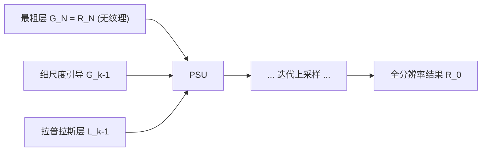

## 一句话总结

论文发现高斯金字塔最粗层天然抹掉纹理却保住主结构，于是把纹理平滑重新表述为"逐级上采样最粗层"的问题，用金字塔引导的结构感知上采样得到高质量结构保持结果，全程不需要任何显式的纹理-结构判别度量。

## 研究背景

- 领域现状：纹理平滑（structure-preserving filtering）是计算摄影与图像分析的基础问题，目标是去掉扰乱视觉的细尺度纹理、保留大尺度结构。已有大量边缘保持平滑方法（双边滤波、WLS、$$L_0$$ 梯度最小化、局部拉普拉斯滤波等）。
- 核心痛点：纹理与结构在强度、梯度、局部对比度等基本视觉元素上往往非常相似，难以区分。传统方法依赖手工设计的纹理-结构分离度量（相对全变分、区域协方差、最小生成树等），遇到度量无法刻画的纹理就会失效，或在去纹理时破坏结构；基于学习的方法又难以泛化到训练集之外的纹理。边缘保持平滑本质上也不适合纹理平滑，因为它保留一切显著边缘、不管来自纹理还是结构。
- 本文 idea：作者主张纹理与结构最具判别力的差异是**尺度**。观察到高斯金字塔的最粗层（代表大尺度信息）常常自然消除纹理而不破坏结构，于是把纹理平滑转化为"把最粗层上采样回原分辨率"。难点在于普通上采样（双线性、联合双边上采样）无法从极低分辨率恢复出锐利结构，因此提出金字塔引导的结构感知上采样来解决。

## 方法

整体框架：给定输入图像 $$I$$，先构建其高斯金字塔 $$\{G_\ell\}$$ 与拉普拉斯金字塔 $$\{L_\ell\}$$（$$\ell=N$$ 最粗，$$\ell=0$$ 最细且 $$G_0=I$$）。令最粗层 $$R_N=G_N$$ 作为起点，反复施加"金字塔引导结构感知上采样"（PSU），每一步在更细一级的 $$G_{k}$$ 与 $$L_{k}$$ 引导下把 $$R_{k+1}$$ 提升为 $$R_{k}$$，直到得到全分辨率结果 $$R_0=R$$。

关键设计：

1. **结构感知上采样的两步走**。为从 $$R_k$$ 得到 $$R_{k-1}$$，先用高斯层 $$G_{k-1}$$ 作引导做联合双边上采样，得到初步结果 $$\hat{R}_{k-1} = \mathrm{JBF}\!\uparrow(R_k, G_{k-1})$$ 。这一步让输出继承 $$G_{k-1}$$ 的结构边缘，且因为起点最粗层几乎无纹理、邻域取得小，不会把纹理带回来。但 $$\hat{R}_{k-1}$$ 的结构锐度仍不如 $$G_{k-1}$$，单靠迭代它无法得到锐利结构。

2. **用拉普拉斯层补回结构细节**。拉普拉斯层恰好记录了每级相对更粗一级丢失的图像细节。作者提出 $$R_{k-1} = \mathrm{JBF}(\hat{R}_{k-1} + L_{k-1},\ \hat{R}_{k-1})$$ ：把 $$\hat{R}_{k-1}$$ 与 $$L_{k-1}$$ 相加后，以无纹理的 $$\hat{R}_{k-1}$$ 为引导做联合双边滤波，滤掉 $$L_{k-1}$$ 带回的多余纹理、只保留结构残差。用 $$\hat{R}_{k-1}$$ 作引导的原因是它无纹理且与相加结果结构边缘相近，既能有效去纹理又能忠实保留结构。

3. **只需两个参数**。虽然每级上采样涉及 $$\sigma_s$$、$$\sigma_r$$、邻域大小 $$d$$ 等多个量，但全流程实际只需调 $$\sigma_s$$ 和 $$\sigma_r$$。所有 range 参数固定为同一 $$\sigma_r$$ 以跨尺度一致对待边缘；空间参数按尺度自适应 $$\sigma_{s,k} = \sigma_{s,0} / 2^{k}$$ ；两步的邻域分别取接近 $$\max(\sigma_{s,k},3)$$ 和 $$\max(4\sigma_{s,k},3)$$ 的奇数——第一步用小邻域避免带回纹理，第二步用大邻域确保拉普拉斯层引入的纹理被去干净。

4. **实现细节**。以 1/2 下采样率、$$5\times5$$、标准差为 1 的高斯核构建标准金字塔，最粗层长轴限制在 $$[32,64)$$ 以确定金字塔深度；像素归一化到 $$[0,1]$$，推荐起始参数 $$\sigma_s=5$$、$$\sigma_r=0.07$$。range 权重采用 RGB 三通道共享（基于颜色向量欧氏距离）而非逐通道，以增强结构保持。

## 实验结果

论文以定性对比为主（与 RTV、Karacan、Cho、Fan 等 SOTA 在复杂大尺度、高对比纹理上的去纹理与结构保持对比，并展示细节增强、图像抽象、HDR 色调映射、逆半调、低照度增强等应用）。最能体现方法优势的可量化结果是其效率——因主要计算集中在低分辨率金字塔层上而非始终全分辨率处理：

| 实现方式 | 硬件 | 处理 1280×720 耗时 | 相对加速 |
|----------|------|---------------------|----------|
| 未优化 Matlab（核可分离） | 2.66GHz Intel Core i7 CPU | 约 1 秒 | 1× |
| GPU 实现 | NVIDIA GeForce RTX 3090Ti | 约 5 毫秒 | 约 200× |

其余分析结论（文字）：金字塔不可或缺——用单尺度高斯模糊序列替代金字塔会导致结构模糊失真；更深的金字塔（更小最粗层）能去除更大尺度纹理，但最粗层小于 $$40\times40$$ 后收益不再明显；单次平滑通常就足以去纹理，重复平滑几乎不再改变结果；因最粗层近乎无噪，方法对噪声高度鲁棒。

## 亮点与局限

- 亮点：
  - 视角新颖——用尺度空间（图像金字塔）而非显式判别度量来分离纹理与结构，思路简单却出人意料地有效。
  - 不依赖任何纹理-结构分离度量、不需额外轮廓输入、不需训练，泛化性好，能应对以往困难的大尺度/高对比纹理。
  - 实现简单、速度快（GPU 约 5ms），且天然抗噪；可支撑细节增强、图像抽象、HDR 色调映射、逆半调、低照度增强等多种应用。
- 局限：
  - 会丢失在最粗层中"无迹可寻"的小尺度结构（如犀牛角间的细小结构失败案例）；降低金字塔深度和 $$\sigma_s$$ 可缓解，但会导致去纹理不彻底。
  - 继承双边滤波的固有缺陷，图像被过度平滑时可能出现梯度反转伪影。

## 延伸思考

- 该工作把"多尺度表示"这一经典工具重新用于纹理-结构分离，提示图像金字塔在图像编辑领域仍有未被充分挖掘的价值；与局部拉普拉斯滤波（LLF）的对比很有意思——两者都用金字塔，但 LLF 操作拉普拉斯系数做边缘感知滤波，本文则是上采样最粗高斯层。
- 方法本质是一串联合双边滤波的级联，是否可以用可微形式嵌入端到端网络、或用引导滤波/双边网格进一步加速值得探究。
- 作者提到的未来方向包括缓解小结构丢失与梯度反转，以及扩展到视频纹理滤波（此时时序一致性会成为新的关键挑战）。
