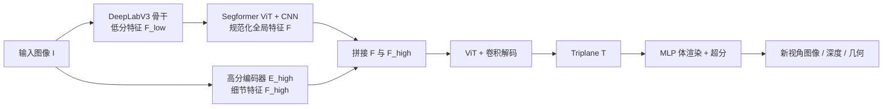

## 一句话总结

给定一张无位姿的人像照片，用一个前馈编码器直接预测出规范化的 triplane 神经辐射场表示，从而在消费级显卡上实时（24fps）完成单图到 3D 的新视角合成，且质量超过需要测试时优化的 3D GAN 反演方法。

## 研究背景

- 领域现状：EG3D 等 3D 感知图像生成方法把 NeRF 表示与 GAN 结合，能从单视角 2D 图像集合中无条件生成高质量、多视角一致的 3D 表示。训练好之后，可以把生成器冻结，通过 GAN 反演 + 测试时微调（如 PTI）来做单图 3D 重建。
- 核心痛点：这类基于反演的方法有三个硬伤。其一，单视角下 NeRF 训练高度欠约束，需要精心设计的优化目标和额外 3D 先验，否则新视角画质与几何都会崩坏；其二，测试时优化需要准确的相机位姿作为输入或联合优化；其三，逐张图像做优化非常耗时（EG3D-PTI 编码要约 2 分钟），无法用于实时视频场景。
- 本文 idea：不再复用预训练生成器做逐图优化，而是端到端训练一个编码器，直接从单张输入图像预测 triplane 特征。关键做法是把预训练 3D GAN 的知识"蒸馏"进这个前馈编码器——训练数据全部由 EG3D 在线合成，完全不需要任何真实图像，也不需要昂贵的物理渲染人脸资产。

## 方法

整体框架：核心是一个图像到 triplane 的编码器 $$\boldsymbol{T} = E(\boldsymbol{I})$$，它把一张无位姿 RGB 图像映射为 EG3D 风格的规范化 triplane 表示；随后复用 EG3D 的 MLP 体渲染器与超分模块解码出深度、特征、颜色和超分图像。整条管线端到端训练，监督信号完全来自冻结的 EG3D 在线合成的多视角一致数据。

关键设计：

1. **混合卷积-Transformer 编码器**。作者把"从任意图像推断规范化 3D 表示"拆成两个相互矛盾的目标：一是把主体规范化（正面化、对齐）到 3D，二是保留人物特有的高频细节（发丝、胎记等）。编码器先用 DeepLabV3 提取鲁棒的低分特征，再送入 Segformer 的高效自注意力 ViT 得到规范化的全局特征 $$\boldsymbol{F} = \mathrm{Conv}(\mathrm{ViT}(\boldsymbol{F}_{\text{low}}))$$。选 Segformer 是因为它天生擅长映射到 triplane 这样的高分输出空间，且高效注意力允许保留高分中间特征。
2. **重新注入高分细节**。浅层 ViT 足以完成规范化，但表达不了高频细节。于是再用一个只做单次下采样的编码器 $$E_{\text{high}}$$ 提取高分图像特征 $$\boldsymbol{F}_{\text{high}}$$，与全局特征沿通道拼接后再过一层 ViT，最终卷积解码为 triplane：$$\boldsymbol{T} = \mathrm{Conv}(\mathrm{ViT}(\boldsymbol{F} \oplus \boldsymbol{F}_{\text{high}}))$$，让规范化与细节两个目标同时达成。
3. **纯合成数据蒸馏训练**。每步从 EG3D 采样一个身份（隐编码），渲染一个参考视角作为编码器输入、另一个视角做多视角监督。损失综合了 triplane 的 L1、渲染图与超分图的 L1、LPIPS 感知损失、特征 L1，以及一个对抗损失和可选的类别损失（人脸用 ArcFace 身份特征）：$$L = L_{\text{tri}} + L_{\text{col}} + L_{\text{LPIPS}} + L_{\text{feat}} + \lambda_1 L_{\text{adv}} + \lambda_2 L_{\text{cate}}$$。值得注意的是判别器不接触任何真实数据，只区分编码器渲染图与冻结 EG3D 渲染图。
4. **在线相机增强**。若直接优化上述目标，模型在合成数据上近乎完美却无法泛化到真实图像。作者不再沿用 EG3D 固定的相机 roll、焦距、主点和距离，而是从随机分布采样参考相机 $$\boldsymbol{P}_{\text{ref}}$$（人脸约 pitch $$\pm 26^\circ$$、yaw $$\pm 49^\circ$$）。高变化的位姿迫使模型学会对侧脸、遮挡等困难输入做规范化。整个训练相当于使用了超过 1600 万张图像，这是真实或物理渲染数据都无法企及的量级。

## 实验结果

在 500 张 FFHQ 图像上评测单图新视角合成的 2D 重建质量（LPIPS、DISTS、SSIM）、位姿准确度（Pose）与身份一致性（ID）。为公平对比只产出人脸区域或前景的基线，作者也在对应掩膜区域给出自身结果。

| 方法 | LPIPS↓ | DISTS↓ | SSIM↑ | Pose↓ | ID↑ |
|------|--------|--------|-------|-------|-----|
| HeadNeRF（仅人脸区） | .2502 | .2427 | .7514 | .0644 | .2031 |
| Ours（仅人脸区） | .1240 | .0770 | .8246 | .0490 | .5481 |
| ROME（仅前景 256） | .1158 | .1058 | .8257 | .0637 | .3231 |
| Ours（仅前景） | .0468 | .0407 | .8981 | .0486 | .5410 |
| EG3D-PTI | .3236 | .1277 | .6722 | .0575 | .4650 |
| Ours | .2692 | .0904 | .6598 | .0485 | .5426 |
| Ours (LT) | .2750 | .1021 | .6655 | .0448 | .5404 |

除 SSIM 外，本文在所有指标上都显著优于基线；SSIM 仅略低于 EG3D-PTI，而后者是直接对评测视角优化像素、且本文因前馈位姿估计存在轻微图像错位，使得 PSNR/SSIM 这类像素指标本就不可靠（故主要看 LPIPS、DISTS 这类感知指标）。在 H3DS 真实 3D 扫描上的尺度-平移不变深度评测中，本文 L1 误差 0.048、RMSE 0.074，也优于 ROME（0.054 / 0.084）和 EG3D-PTI（0.071 / 0.101）。速度上，编码阶段全模型 40ms、轻量版仅 16ms（RTX 3090），比需要 2 分钟的 EG3D-PTI 快约三个数量级。消融实验进一步表明 ViT 层对精确 3D 表示至关重要，在线相机增强对泛化到真实图像不可或缺。

## 亮点与局限

- 亮点：
  - 用"3D GAN 蒸馏进前馈编码器"的思路，把单图 3D 重建从分钟级测试时优化压缩到毫秒级前馈推理，真正做到实时（24fps）。
  - 训练完全依赖在线合成数据，无需任何真实多视角图像或昂贵的物理渲染资产，还能免疫真实数据的位姿噪声。
  - 在线相机增强 + 混合卷积-Transformer 编码器，让模型对侧脸、遮挡乃至画作等域外输入都能鲁棒地正面化并抬升到 3D。
- 局限：
  - 能力上限受限于所蒸馏的 3D GAN（EG3D），只覆盖有 3D 感知生成器的类别（当前展示了人脸 FFHQ 与猫脸 AFHQ）。
  - 不处理重光照与编辑，且颜色与视角无关（沿用 EG3D 的视角无关渲染），难以表现视角相关的高光等效果。
  - 评测中前馈估计位姿带来的图像错位使像素级指标不可靠，说明输出与输入的精确对齐仍有改进空间。

## 延伸思考

- 这项工作本质上是把生成式先验"编码器化"，与后续用扩散模型或大型前馈网络做单图/稀疏视角三维重建的思路一脉相承；把 EG3D 换成更强的 3D 生成器（甚至 3D Gaussian Splatting 类表示）是自然的升级方向。
- 逐帧应用即可得到视频新视角合成，但没有显式时序约束；引入时间一致性建模有望支撑真正的 3D 视频会议与远程呈现。
- "只用合成数据蒸馏、判别器不接触真实数据"的范式很有启发性——它把泛化难题转化为数据增强设计问题，值得思考在其他重建任务中如何设计能覆盖真实分布的在线增强。
