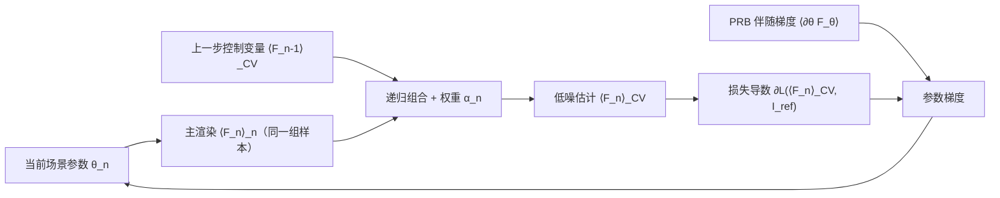

## 一句话总结

把优化循环里"相邻迭代的渲染高度相似"这一冗余利用起来，用一个跨迭代递归累积的控制变量（control variate）复用历史渲染信息，从而同时降低可微渲染中梯度的方差与偏差，把主渲染效率最多提升约 10 倍。

## 研究背景

- 领域现状：可微渲染（PBDR）已成为从图像重建 3D 场景的主流工具。它把渲染函数用梯度下降反演，每一步都要先渲染当前场景状态（primal，主渲染），再计算对场景参数的梯度（adjoint，伴随渲染），动辄上千步。
- 核心痛点：相邻梯度步之间场景变化极小，重复渲染存在大量冗余；为省算力常用极低的每像素采样数（spp），导致主渲染噪声大。更隐蔽的问题是——优化器作用的不是噪声图像本身，而是从中算出的损失。除 L2 外的所有损失（如常用的 L1、VGG 感知损失）在对含噪输入求导时会引入偏差，即使图像本身无偏，也会让优化漂移到坏的局部极小甚至发散。以往只能靠成百上千 spp 硬压偏差，代价高昂。
- 本文 idea：把历史渲染当作控制变量。控制变量是一种通用、无偏的蒙特卡洛方差缩减手段；而梯度下降天然让相邻步高度相关，相关性越高降噪越强，正好契合。作者进一步提出一个把所有历史渲染递归融合、并自适应加权以最大化与下一步渲染相关性的方案。

## 方法

整体框架：在每个优化步，除了照常渲染当前场景，还维护一个"递归控制变量"$$\langle F_n \rangle_{\text{CV}}$$，它把上一迭代的控制变量与本步用同一组蒙特卡洛样本渲染的结果组合起来，从而把方差缩减沿整条优化轨迹累积传递。组合系数（控制权重）$$\alpha_n$$ 由估计出的（协）方差统计量自适应决定，再把这个低噪的估计喂给损失函数求导。

关键设计：

- 递归控制变量。核心递推式为
$$\langle F_n \rangle_{\text{CV}} = \langle F_n \rangle_n + \alpha_n \left( \langle F_{n-1} \rangle_{\text{CV}} - \langle F_{n-1} \rangle_n \right)$$
它把 Rousselle 等人"用上一帧渲染做控制变量"的单步做法推广到任意长的渲染序列。$$\langle F_{n-1} \rangle_{\text{CV}}$$ 已凝聚了此前所有历史信息，因此一步递推即可复用整段历史。

- 自适应控制权重 $$\alpha_n$$。最优权重为
$$\alpha_n = \frac{\mathrm{Cov}[\langle F_n \rangle_n, \langle F_{n-1} \rangle_n]}{\mathrm{Var}[\langle F_{n-1} \rangle_n] + \mathrm{Var}[\langle F_{n-1} \rangle_{\text{CV}}]}$$
它有直观含义：场景变化大时相关性低，$$\alpha_n$$ 趋近 0，自动丢弃过时的历史；场景趋稳时相关性高，$$\alpha_n$$ 逼近 $$n/(n{+}1)$$，此时控制变量等价于用大得多的采样数渲染。权重被截断到 $$[0,1]$$ 以保证优化早期统计量未收敛时的稳定。

- 单遍在线统计 + 递推方差。式中的（协）方差无法解析求得，需在线估计。作者用带指数加权的 Welford 单遍算法，在固定存储下估计均值与方差，兼顾"低方差需长期聚合"与"场景演化引入偏差"的矛盾（稳态时变为无偏）。由于递归定义使各迭代间相关、破坏了标准方差估计的独立性假设，作者额外推导了 $$\mathrm{Var}[\langle F_n \rangle_{\text{CV}}]$$ 的递推式来正确追踪。

- 偏差控制与样本复用域。控制变量无偏要求权重与输入估计不相关；本文做法会让二者相关而引入偏差，作者通过"先评估控制变量、后更新统计量"让统计估计滞后一拍，消除与当前渲染的相关（残余偏差仅来自更早历史）。以此在控制变量里换取损失梯度中更大的偏差缩减。样本复用可在"原始样本空间"（CV-PSS，实现简单但粗糙度/折射率等改变路径几何的参数会削弱相关性）或"路径空间"（CV-PS，通过 BSDF/介质适配器复用光路，相关性更高、可融合进单个 GPU kernel）进行；论文主要结果用 CV-PS。

## 实验结果

方法在 Mitsuba 3 中实现，分别与 PRB（表面材质/均匀介质重建）和 DRT（异质体积重建）结合。下表取"室内间接光照场景材质重建"这一主实验，对比不同损失下最终 L1 误差（越低越好）：

| 配置 | L1 损失下误差↓ | L2 损失下误差↓ |
|------|--------------|--------------|
| Baseline (PRB) | 2.42e-02 | 3.05e-03 |
| Baseline + 去噪 | 1.47e-02 | 5.17e-04 |
| Ours | 1.45e-02 | 4.63e-04 |
| Ours + 去噪 | 1.44e-02 | 4.60e-04 |

结论：本文方法在两种损失下都优于基线，L1 下增益最大（因额外的偏差缩减）。一个反直觉发现是——直接对主渲染加去噪反而会因引入偏差而损害重建；但把去噪叠加在控制变量估计之上则能得到全场最好结果。此外，VGG 感知损失重建实验显示基线明显被噪声诱导的偏差污染，本文能给出更贴近参考的结果；异质体积重建（DRT）上，等采样预算下质量更高，普通 DRT 需约 4–8 倍采样才能追平质量。

## 亮点与局限

- 亮点：
  - 通用性强——对底层可微渲染算法基本无关，只需可控随机数种子或固定路径顶点即可接入，越噪声大的基线收益越明显。
  - 一石二鸟——既降方差，又缓解非 L2 损失求导带来的偏差漂移，作者形象地把它类比为"动量之于梯度下降"。
  - 实现代价低、可与去噪等其他方差缩减手段正交叠加；稳态时等价于以大得多的 spp 渲染。
- 局限：
  - 并非完全无偏——权重与历史控制变量仍相关，残留一定偏差；只是用它换取了损失梯度中更大的偏差减少。
  - 未处理移动/形变几何的参数（会破坏样本相关性），需引入 shift mapping，留作未来工作。
  - 只优化了主渲染阶段，伴随阶段的加速潜力未验证；体积中的样本复用会因 majorant 需同时包住新旧状态而增加空碰撞开销。

## 延伸思考

- 该框架不限于渲染：任何"蒙特卡洛估计 + 梯度下降"的场景（量子系统模拟、强化学习）都可能套用同一递归控制变量思路。
- "损失函数对含噪输入求导会引入偏差"是随机系统优化中的普遍问题，本文只是识别并缓解，未来可发展更通用的损失导数去偏方法（如多级蒙特卡洛让有偏梯度至少一致）。
- 空间复用与时间复用的结合值得探索，但需注意近期反渲染反而刻意打散空间相关性（随机跨视角选像素）以改善收敛，二者如何调和是开放问题。
