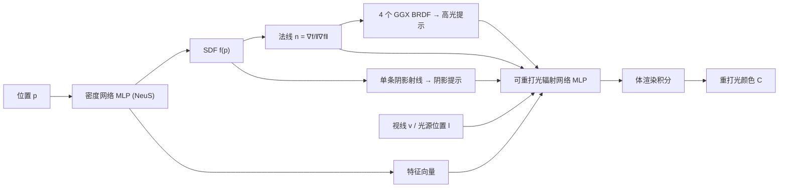

## 一句话总结

用手持设备拍摄 500–1000 张"随机视角 + 随机点光源"的照片，训练一个基于 NeuS 的神经隐式表示，并向辐射网络喂入**阴影提示**与**高光提示**，实现对复杂形状与材质物体的自由视角重打光。

## 研究背景

- 领域现状：NeRF 类神经隐式表示在自由视角合成上非常成功，但拍摄时的光照被"烘焙"进模型，无法重打光。为支持重打光，多数方法走反向渲染路线——把外观拆解成几何、BRDF、光照等分量。
- 核心痛点：反向渲染的分量解耦是病态问题，充满歧义；一个模型不准会连累其他分量，需要强正则和强假设。它们通常依赖解析 BRDF 和三角网格，难以处理毛发、次表面散射、强层间反射等复杂光传输与病态几何。与之相对，数据驱动的重打光方法（如 Deferred Neural Lighting）能处理这些难例，但需要上万张照片，且依赖多视图立体重建，复杂场景易失败。
- 本文 idea：不做分量解耦，直接用一个 MLP 建模每点的完整（直接 + 间接）光传输；针对 MLP 难学的高频效应（硬阴影、镜面高光），额外提供廉价计算得到的**阴影提示**和**高光提示**作为"建议"，但**不规定**如何使用它们（比如不强制阴影去乘可见性），而是让网络自己学会何时采纳、何时忽略。

## 方法

整体框架：沿用 NeuS 的两 MLP 结构。密度网络把位置映射为 SDF 与特征向量；可重打光辐射网络接收位置、法线（由 SDF 求梯度得到）、视线方向、点光源位置、密度特征，**外加阴影/高光提示**，输出该点的视依赖与光依赖辐射；最后经体渲染沿视线积分得到像素颜色。

关键设计：

1. **为什么用 NeuS 而非 NeRF 作几何底座**：本方法需要沿视线求"平均深度"来定位表面，进而只打一条阴影射线。NeRF 的深度估计有偏，会污染阴影提示；NeuS 用 SDF 的零水平集给出无偏深度估计，是获得可靠阴影提示的前提。消融显示换成 NeRF 底座会明显劣化阴影质量。

2. **阴影提示（Shadow Hint）**：直接算光源可见性需要对每个视线采样点各发一条二次射线，代价上升一个数量级。作者观察到重要性采样后视线样本紧密聚集在 SDF 零水平集附近，于是只在零水平集处**打一条阴影射线**，用密度加权深度 $$D(\boldsymbol{o},\boldsymbol{v})=\int_0^\infty w(t)\,t\,\mathrm{d}t$$ 定位表面，并把这一次可见性结果复用给该视线上所有样本。对非不透明/病态几何单条射线估计不准，且硬掩膜会抹掉间接光——所以把它当"提示"而非硬乘子，让网络自行决定是否采纳、并在阴影区混入间接光。

3. **高光提示（Highlight Hint）**：受 Deferred Neural Lighting 启发，用 4 个粗糙度为 {0.02, 0.05, 0.13, 0.34} 的 GGX 微表面 BRDF 计算高光线索。与 Gao 等人不同，这里只用**基于 SDF 法线的局部着色**计算，每条视线算一次并复用。消融表明 4 个基材料在代价与质量间最平衡，太多反而引入错误相关性。

4. **损失与视角优化**：联合训练密度与辐射网络，用重建损失 $$\mathcal{L}_c=\lVert \bar{C}-C \rVert_1$$ 加 NeuS 的 Eikonal 正则 $$\mathcal{L}_e=(\lVert \nabla f(\boldsymbol{p}) \rVert_2-1)^2$$；提示不回传梯度。为抑制相机标定误差，把相机姿态写成可学习的修正量 $$R=\Delta R\cdot R_0$$、$$t=\Delta t+\Delta R\cdot t_0$$，与网络联合优化（用 0.06 倍学习率限制姿态漂移）。数据采集沿用手持双相机方案：主相机随机视角拍摄，副相机的同轴闪光灯提供不同方向的点光照，从视频中随机抽 500–1000 帧训练。

## 实验结果

在 17 个合成场景与 7 个真实场景上验证。下表为合成场景上的核心消融（提示的作用与训练图数量），指标为对 100 张测试图的平均：

| 配置 | PSNR ↑ | SSIM ↑ | LPIPS ↓ |
|------|--------|--------|---------|
| 完整提示 | 32.02 | 0.9727 | 0.0401 |
| 去掉高光提示 | 31.96 | 0.9724 | 0.0407 |
| 去掉阴影提示 | 27.67 | 0.9572 | 0.0610 |
| 去掉全部提示 | 27.54 | 0.9568 | 0.0620 |
| 50 张训练图 | 24.29 | 0.9335 | 0.0706 |
| 250 张训练图 | 30.36 | 0.9666 | 0.0456 |
| 500 张训练图 | 32.02 | 0.9727 | 0.0401 |

阴影提示是质量的主导因素（去掉后 PSNR 掉约 4.4 dB），高光提示提升较小但对镜面区域可见。与反向渲染方法 IRON、神经辐射传输场 NRTF、Philip 等人的预训练重打光网络相比，本方法在强层间反射的 Metallic 场景上均明显领先（如 27.79 dB vs. IRON 19.13 dB）。与 Deferred Neural Lighting 相比，本方法仅用其约 1/25（∼500 张）的图像即可达到相近质量，且因优化 3D 表示而具备更好的时间稳定性（DNL 数值略优，但存在标定不准时的"闪烁"）。视角优化在真实场景上把 PSNR 从 33.62 提升到 34.72，且视觉锐度提升明显。

## 亮点与局限

- 亮点：
  - 抛开分量解耦，用单 MLP 直接建模含遮挡与层间反射的完整光传输，避开了反向渲染的病态与歧义。
  - "提示而非约束"的设计巧妙——网络自行决定信任程度，既保留高频细节又能在阴影区融入间接光。
  - 单条阴影射线 + NeuS 无偏深度，把二次射线成本从"每样本一条"降到"每视线一条"，实用性强。
  - 相比同等能力的数据驱动方法减少约一个数量级的照片需求，手持采集约 10 分钟即可。

- 局限：
  - 高度镜面、会反射场景其他部分的表面仍是难点；直接加"反射提示"或重参数化都不奏效，主因是尖锐镜面材质的法线精度不足，难以预测反射方向。
  - 相比固定光照的 NeRF，仍需约 5 倍照片、2 倍渲染代价；单场景训练约 20 小时（4×V100）。
  - 每个场景需单独训练，不具跨场景泛化。

## 延伸思考

- "提示驱动"是介于纯物理反向渲染与纯黑箱学习之间的折中：用廉价近似（一条阴影射线、几个 GGX 高光）给网络"脚手架"，让它专注于难以显式建模的残差。这一思路可迁移到其他高频效应，关键在于找到既廉价又与几何强相关的线索。
- 镜面反射的失败根源指向法线精度，后续工作若能结合更好的法线估计或显式反射方向重参数化（如 Ref-NeRF 思路）或可突破。
- 该方法已被后续 3D Gaussian Splatting 时代的可重打光工作作为对照与思想来源，"用提示辅助光传输网络"的范式仍有延展空间。
