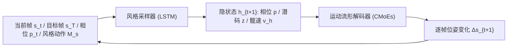

## 一句话总结

RSMT 把"在关键帧之间补全过渡动作"和"保持指定风格"两件事解耦成一个通用运动流形和一个风格采样器，从而在实时（每帧约 1.7ms、无后处理）条件下生成既满足时空约束、又带有目标风格的过渡动作。

## 研究背景

- 领域现状：在线补间（in-between）动作生成关注的是在起始帧与目标帧之间快速算出自然、满足约束的动作；风格化动作生成关注的是语义相同但外观各异的动作（如正常走 vs 僵尸走）。这两个方向在已有工作里几乎是分开研究的。
- 核心痛点：把二者合到一起需要同时满足四个互相牵制的要求——生成速度、动作质量、风格多样性、合成可控性。前两者逼着用简单快速的模型、禁止后处理；后两者很少被一起考虑：有的只做无风格的控制，有的只做不可控的风格动作。强行加控制容易破坏风格，反之亦然。
- 本文 idea：把"生成的来源"和"合成的控制"解耦。一个高质量的运动流形负责提供带各种风格的自然动作源，一个风格采样器负责在控制信号（起止帧、时长、目标风格）下从这个源里实时采样。两个组件可以在不同数据集上分别训练，因此数据需求更小、对未见风格泛化更好。

## 方法

整体上，作者把人体运动建模成一个随机线性动力系统，并将其联合概率分解成两部分独立学习：运动流形 $$P(s_{t+1} \mid s_T, h_{t+1}, s_t)$$ 负责由潜变量还原出高质量的逐帧动作，采样器 $$P(h_{t+1} \mid s_T, h_t, s_t, k)$$ 负责在目标帧 $$s_T$$ 与风格码 $$k$$ 的条件下自回归地预测下一步的隐状态。采样器预测出的隐变量 $$h_{t+1}=\lbrace p_{t+1}, z_{t+1}, v^{t+1}_h \rbrace$$ 再喂给流形解码器采出下一帧。

关键设计分四块：

1. **运动流形（自编码器 + 相位）**：不直接学下一帧，而是学位姿变化 $$\Delta s_{t+1}=s_{t+1}-s_t$$（等价于学速度剖面，更能刻画动力学）。编码器把两帧编成服从 $$N(0,1)$$ 的潜变量 $$z$$ 以捕捉过渡的随机性；解码器再依据 $$z$$、相位特征 $$p_{t+1}$$、当前帧 $$s_t$$ 和未来髋部速度朝向 $$v^{t+1}_h$$ 还原动作。这里刻意用较小的 KL 权重 $$\beta=0.001$$ 保证动作质量，牺牲的泛化能力交给采样器补偿。

2. **相位流形（Periodic Autoencoder）**：借鉴相位思想，用周期自编码器抽出多维相位流形，每个相位向量由带符号相移 $$S$$ 与幅度 $$A$$ 表示：$$p_{2i-1}=A_i \sin(2\pi S_i)$$，$$p_{2i}=A_i \cos(2\pi S_i)$$。相位描述的是动作在模式上的连续变化，和风格高度相关，正好补足 $$v_h$$ 缺失的风格信息。

3. **条件专家混合（CMoEs）**：过渡分布本身是多模态的，加了风格后更甚，单个网络会把不同模式平均掉。作者用门控网络依据 $$z_{t+1}$$ 和 $$p_{t+1}$$ 混合多个专家，每个专家学一个模式。其中 $$z$$ 管随机状态转移，$$p$$ 则被发现是编码风格的良好连续表征——这意味着流形隐式地学到了风格特征，供采样器后续利用。

4. **风格采样器（LSTM + 时变噪声）**：先用卷积风格编码器从风格动作 $$M_s$$ 抽出带时间维度的风格码 $$k$$（保留每帧风格信息很关键），与当前帧共嵌入；目标帧及其偏移单独编码后叠加一个时变噪声 $$z_{noise}=\lambda N(0,0.5)$$，其中 $$\lambda$$ 随剩余时间收缩——离目标越近随机性越小。相位预测上不直接回归下一相位，而是分别预测中间相位、幅度与频率，再用球面线性插值融合，得到更平滑的相位演化。

## 实验结果

在 100STYLE 数据集上与两个补间基线 RTN 和 CVAE 对比（40 帧过渡，取重建/风格谱相似度/脚滑/多样性四类指标的代表值）：

| 方法 | L2 位置(40帧)↓ | NPSS×100(40帧)↓ | 脚滑↓ | 多样性↑ |
|------|--------|--------|--------|--------|
| RTN | 1.365 | 8.794 | 0.474 | 6.172 |
| CVAE | 1.224 | 8.108 | 0.284 | 5.560 |
| 本文 | 1.148 | 9.659 | 0.272 | 6.683 |

重建精度上本文与 CVAE 接近（CVAE 的 NPSS 略优，因其采样被严格约束在高斯潜空间），但在脚滑和多样性两项本文明显领先——作者认为在风格化生成里这两项更关键。更重要的是时空控制实验：改变目标位置和时长（如 $$d_t=2$$ 减速、$$d=-1$$ 目标在身后）时，最后一帧到目标的 L2 误差本文稳定在 0.29~0.36，而 RTN/CVAE 普遍在 0.6~0.9，说明本文在偏离训练分布的极端控制下仍能到位、且保持风格不漂移。此外，流形与采样器在无风格重叠的子集 A/B/C 上交叉训练的实验表明：流形主要影响可控性与质量，采样器主要影响风格与泛化，二者可独立训练而指标不显著退化。

## 亮点与局限

- 亮点：
  - 把"生成源"与"控制"解耦，流形可在大规模通用数据上预训练并共享，采样器只需小规模专用风格数据即可适配，数据需求低、对未见风格可零/少样本泛化。
  - 实时（每帧约 1.7ms）、无后处理即可同时满足速度、质量、风格、可控性四项要求。
  - 相位流形被证明是保持风格的关键，替换掉 CVAE 的采样器实验进一步验证了这一点。
- 局限：
  - 纯重建/NPSS 指标略逊于 CVAE，优势主要体现在脚滑、多样性和分布外控制上。
  - 风格的定量评估本身困难，FMD 只能在不改变时长和目标位置的设定下使用（时空控制会显著改变分布）。
  - 依赖 100STYLE 这类带风格标注的动捕数据组织训练，风格采样仍需一段目标风格示例动作作为输入。

## 延伸思考

- 相位表征在这里承担了"隐式风格编码"的角色，这与近年把周期相位作为运动通用先验的思路一脉相承，值得思考它能否替代显式风格标签、支撑更开放的风格插值与组合。
- 解耦"源—控制"的设计范式与图像领域的表征学习 + 条件生成很像；若把流形换成更强的生成先验（如扩散模型），能否在保持实时性的前提下进一步提升质量与多样性是一个自然的方向，但扩散模型的采样速度会与实时目标冲突。
- 采样器主导泛化、流形主导可控性这一分工结论，为"预训练大流形 + 轻量风格适配器"的工程落地提供了依据，和当下基础模型 + 适配器的思路相合。
