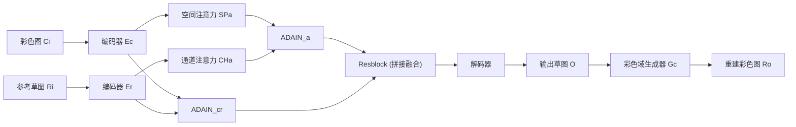

## 一句话总结
提出一个多模态的参考式草图提取方法：给定一张彩色图和一张参考草图，模型能提取出模仿参考草图风格的线稿，并借助预训练的对比学习风格损失，使得整个网络可以用非成对数据以半监督方式训练。

## 研究背景
- 领域现状：从彩色图提取草图的方法已有很多，从传统边缘检测（Canny、XDoG、HED）到深度学习方法（SketchKeras、Anime2Sketch、Chan et al. 2022），近期 Ref2sketch 进一步实现了"用参考草图指定输出风格"的多模态提取。
- 核心痛点：传统边缘检测结果噪声大、断线多；单风格深度方法每换一种风格就得重训；而能做多风格的 Ref2sketch 是监督方法，需要大量成对（草图-彩色图）数据，而艺术家手绘的真实成对数据极其稀缺。
- 本文 idea：沿用 Ref2sketch"用参考草图指风格"的设定，但把风格监督信号搬到一个预训练的对比学习模型里——用它来度量两张草图是否同风格。这样主网络就能用非成对数据训练，只在风格损失这一环用到成对先验，整体变成半监督，大幅降低数据门槛。

## 方法
整体框架是一个基于循环一致性的非成对图像翻译网络：彩色图 $$C_i$$ 和参考草图 $$R_i$$ 分别过两个编码器，经注意力与自适应实例归一化融合后由解码器生成草图 $$O = G_s(C_i, R_i)$$；再用一个彩色域生成器 $$G_c$$ 把 $$O$$ 重建回彩色图 $$R_o$$，用于约束形状。风格监督则由一个预训练对比模型提供。

关键设计：

- **双路注意力 + 拼接融合**：借鉴 CBAM，在彩色图编码器后接空间注意力 $$SP_a$$（强调形状），在参考图编码器后接通道注意力 $$CH_a$$（强调风格），二者经 $$ADAIN_a$$ 对齐均值方差；同时另有一条不带注意力的 $$ADAIN_{cr}$$ 支路。两路特征在 Resblock 处拼接。作者发现：低分辨率（256×256）不加注意力拼接能保形但质量低，高分辨率（512×512）不加拼接则形状扭曲——拼接让模型能在高分辨率下既保形又高质量。
- **草图风格损失（核心贡献）**：用一个基于对比学习（三元组损失）预训练的模型 $$C_w$$ 提取草图的风格嵌入，把同风格不同形状的草图（Anchor/Positive）拉近、同形状不同风格的（Negative）推远。训练该对比模型的多风格草图数据由 Ref2sketch 生成。风格损失直接比较输出与参考的风格嵌入：$$L_{style} = \mathbb{E}_{O,R_i}[\lVert C_w(O) - C_w(R_i) \rVert_1]$$。正是这个预训练权重让主网络无需成对数据也能学到风格，从而实现半监督；去掉它模型会退化成固定风格输出。
- **线条损失保形**：用 HED 边缘检测分别处理彩色输入 $$C_i$$ 和重建输出 $$R_o$$，再用 VGG16 感知损失比较边缘图：$$L_{Line} = \mathbb{E}_{C_i,R_o}[\sum_l \lVert \phi_l(HED(C_i)) - \phi_l(HED(R_o)) \rVert_1]$$，确保输出草图的形状忠于彩色图。
- **循环一致性与对抗损失**：$$L_{Cyc} = \mathbb{E}[\lVert C_i - R_o \rVert_1]$$ 进一步约束整体形状；对抗损失 $$L_{adv}$$ 让判别器判定输出属于草图域。总损失 $$L_{total} = \lambda_{style}L_{style} + \lambda_{line}L_{line} + \lambda_{cyc}L_{cyc} + \lambda_{adv}L_{adv}$$，其中风格/线条权重随训练进度从 5 线性衰减到 0.5，$$\lambda_{cyc}=10$$、$$\lambda_{adv}=1$$。

## 实验结果
训练数据取自 safebooru（4302 张线稿域 + 3804 张彩色域，非成对）。评测用作者请专业画师新制作的 4SKST 数据集：4 种风格 × 25 张彩色图 = 100 对。主实验是与六个基线在 4SKST 上的定量对比（PSNR/FID/LPIPS），本文在三项指标上全面领先。

| 方法 | PSNR↑ | FID↓ | LPIPS↓ |
|------|-------|------|--------|
| Ours | 35.58 | 82.18 | 0.1271 |
| Ref2sketch | 35.02 | 115.96 | 0.2192 |
| Chan et al. 2022 | 35.05 | 128.96 | 0.2130 |
| IrwGAN | 35.36 | 125.14 | 0.2229 |
| MUNIT | 34.23 | 144.82 | 0.2582 |
| Park et al. 2020 | 35.04 | 174.12 | 0.2745 |
| Council-GAN | 31.76 | 215.81 | 0.4632 |

其余实验以文字补充：消融显示去掉注意力拼接结果最差（FID 从 82 涨到 147），去掉风格/线条/循环损失也都明显掉分；200 人的主观评测中本文以 79.5% 的选择率远超第二名 Ref2sketch（10.66%）；循环评测（用输出当参考再提取）本文同样三项最优；在自动上色应用里，用本文生成的多风格草图训练上色网络比用 Canny/XDoG/SketchKeras 等单一或组合数据都更好，能缓解对单一风格的过拟合。

## 亮点与局限
- 亮点：
  - 把风格监督封装进预训练对比模型，使主网络摆脱对成对数据的依赖，用非成对数据即可训练多风格草图提取，实用性强。
  - 空间/通道双注意力 + 拼接融合有效兼顾了"保形"与"高分辨率下的质量"。
  - 附带公开了一个由专业画师绘制、含 4 种风格 100 对图的 4SKST 评测数据集（CC-NC），并展示了自动上色、草图风格迁移/简化等下游应用价值。
- 局限：
  - 当参考图与彩色图内容类别不匹配时（如用人物草图去引导风景照）质量下降，作者建议可借鉴 IrwGAN 的重要性重加权缓解。
  - 与 Ref2sketch 共享同一缺陷：无法模仿不由线条构成的风格（如点彩画 pointillism），因为方法本质是提取线稿。
  - 对比学习权重的训练数据依赖 Ref2sketch 生成，风格多样性上限某种程度上受其牵制。

## 延伸思考
- 方法本质是"把风格度量外包给一个预训练嵌入模型"，这与用 CLIP/感知网络做风格损失的思路一脉相承；随着更强的草图/线稿表征模型出现，风格损失的判别力可直接升级，值得关注换成更通用的对比或多模态编码器能否进一步提升风格保真度。
- "半监督"的巧思在于把稀缺的成对监督压缩进一个小的、可复用的风格判别器，主任务转为非成对训练——这种"用少量成对数据训练一个度量、再用它监督大规模非成对训练"的范式，对其他成对数据稀缺的图形学翻译任务（材质、着色、风格化）有借鉴意义。
- 内容不匹配即降质，说明模型学到的"风格"与"内容"仍未充分解耦；如何在参考与输入语义差异大时仍稳定迁移风格，是后续可深入的方向。
