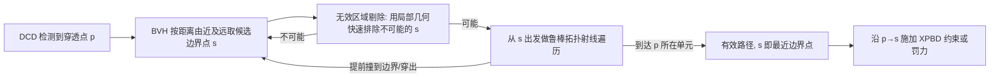

## 一句话总结

针对会出现自交（self-intersection）的体网格，提出了对"内部点到边界的最短路径"的严格定义，并给出一个鲁棒、精确、无需预计算的求解算法，让不保证消除穿透的快速仿真器（如 XPBD）也能稳健处理复杂的自碰撞与物体间碰撞。

## 研究背景

- 领域现状：可变形体仿真中的碰撞处理通常依赖连续碰撞检测（CCD）或离散碰撞检测（DCD）。CCD 要求始终维持无交状态，必须配合能保证完全消解碰撞的昂贵方法（如 IPC）；DCD 允许从已穿透状态恢复，但需要额外计算穿透深度与"到边界的最短路径"来施加约束/力。
- 核心痛点：一旦网格发生自交，"到边界的最短路径"本身的定义就变得含糊——一个点可能同时既在边界上又在内部，它的欧氏最近边界点就是它自己，对消解自交毫无帮助。已有方案要么依赖无交的静止姿态（大变形、深穿透时失效），要么把物体预先切成若干片以回避自交（片内自交被忽略，且切分点难以事先确定、运行时更新昂贵），要么用符号距离场（SDF 无法表达浸入/immersion，且预计算与存储成本高）。这些方法都不能对任意自交给出鲁棒的通用解。
- 本文 idea：绕开构造无交姿态与形变映射，直接基于离散网格的拓扑连接关系，把"路径是否有效"转化为"能否沿网格单元的拓扑邻接走出一条单元遍历序列"，从而精确、鲁棒地找到内部点到边界的真实最短路径。

## 方法

整体框架：作者先在数学上把自交模型看作某个无交"无形变姿态" $$\bar{M}$$ 经一个浸入映射 $$\Psi$$ 得到的像 $$M=\Psi(\bar{M})$$（自交意味着 $$\Psi$$ 非单射），并据此定义"有效路径"与"到边界的最短路径"。核心是两条性质：最短路径必须完整落在无形变姿态 $$\bar{M}$$ 内部；在欧氏度量下连接两点的最短路径必是一条线段。由此得到定理——内部点 $$\boldsymbol{p}$$ 的最短边界路径，就是从 $$\boldsymbol{p}$$ 到某个边界点 $$\boldsymbol{s}$$ 且构成有效路径的最短线段。算法据此枚举候选边界点并检验其连线是否有效，全程不需要真的构造 $$\bar{M}$$ 或 $$\Psi$$。

关键设计：

- **有效路径与最短路径的形式化定义**：把与内部点 $$\boldsymbol{p}$$ 重合的边界点区分为拓扑上不同的点（同一空间位置、不同原像），从而给出"有效路径必须是无形变姿态内一条连续曲线的像"这一判据。这解决了自交场景下"最短路径无定义"的根本问题，且证明该最短路径等价于在 $$\Psi$$ 拉回度量下的全局测地路径的像。

- **单元遍历（element traversal）与拓扑射线遍历**：把"线段是否为有效路径"等价转化为"能否找到一串拓扑相邻、且共享面的单元序列（2D 三角形、3D 四面体）容纳该线段"。从边界点 $$\boldsymbol{s}$$ 出发沿射线逐个穿面进入相邻单元，若最终到达 $$\boldsymbol{p}$$ 所在单元则路径有效；若中途撞到边界或越过 $$\boldsymbol{p}$$ 而未进入其单元，则 $$\boldsymbol{s}$$ 不是最近边界点。相比渲染用的射线遍历，这里的遍历直接沿拓扑走、无需加速结构判定出射面。

- **鲁棒的四面体遍历（避免死循环）**：有限精度下射线掠过边/顶点会导致遍历陷入死循环，而在仿真中一旦误判路径有效性就会选出任意错误的最短路径、施加灾难性的错误约束。作者用三招保证正确：用小容差 $$\epsilon_i$$ 扩展面以允许一条射线与多个面相交（形成分支）；记录已进入的单元，重复进入即终止该分支；用栈保存所有候选出射面，检测到环后回到最近的候选继续。$$\epsilon_i$$ 只是保守的数值容差，不给最终结果引入误差。

- **无效区域剔除（infeasible region culling）**：很多候选点 $$\boldsymbol{s}$$ 无需做射线遍历、仅凭局部几何即可排除。作者基于 Hilbert 投影定理，针对 $$\boldsymbol{s}$$ 落在顶点/边/面上分别构造"可行区域"。例如顶点情形：对每条相邻边界边，若 $$(\boldsymbol{p}-\boldsymbol{s})\cdot(\boldsymbol{s}-\boldsymbol{v}_i) < 0$$ 则 $$\boldsymbol{p}$$ 落在无效区、可直接跳过。该剔除带来一个数量级以上的最短路径查询加速。

- **反转单元与跨物体碰撞**：对非边界处的反转单元（$$\det(\nabla\Psi) \le 0$$），允许射线沿反方向回退遍历并一律从边界点 $$\boldsymbol{s}$$ 出发以消除方向歧义；边界处的反转单元则跳过其自交检测。跨物体碰撞在其中一方自交时，同样归结为"内部点到边界的最短路径"这一相同问题。

得到最近边界点 $$\boldsymbol{s}$$ 后，用标准 PBD 碰撞约束 $$c(\boldsymbol{x},\boldsymbol{s}) = (\boldsymbol{x}-\boldsymbol{s})\cdot \boldsymbol{n}$$（$$\boldsymbol{n}$$ 为 $$\boldsymbol{s}$$ 处表面法向）在 XPBD 中投影消解，也可用于基于力的罚能量 $$E_c = \tfrac{1}{2}k\big((\boldsymbol{p}-\boldsymbol{s})\cdot\boldsymbol{n}\big)^2$$。作者推荐 CCD + DCD 混合方案：时间步开头用 DCD 找出上一步未消解的既有穿透，其余碰撞交给 CCD，兼顾鲁棒与效率。

## 实验结果

作者用 GPU 并行的 XPBD（mass-spring / NeoHookean）作基线，碰撞检测与最短路径查询在 CPU 上用 Embree 构建 BVH 完成。核心结论是：即便基线求解器已高度优化，本方法引入的额外开销（表中 "Ours %"）通常很小。下表摘取几个代表性场景：

| 场景 | 顶点数 | 平均碰撞数(CCD/DCD) | 帧时均值(s) | Ours 占比 |
|------|--------|--------------------|-------------|-----------|
| 压扁毛毛球 | 774K | 16.8K / 7.1K | 10.89 | 8.3% |
| 扭转细梁 | 400K | 8.3K / 3.1K | 8.16 | 6.9% |
| 两球对撞 | 418K | 22.4K / 1.3K | 1.96 | 10.9% |
| 预置自交面条 | 40K | N/A / 15.2K | 0.21 | 12.4% |
| 600 只章鱼堆积 | 3.1M | 104K / 6.4K | 16.40 | 2.9% |
| 16 只毛毛球堆积 | 3.5M | 118.5K / 8.5K | 18.50 | 3.9% |
| 8 章鱼(混合CCD+DCD) | 40K | 2.3K / 0.2K | 0.035 | 1.0% |

其余实验以文字佐证鲁棒性：把毛毛球压扁到原半径的 1/20、两球以 50 m/s 对撞、扭出屈曲的细梁与弹性绳打结、600 只章鱼/16 只毛毛球/长面条堆成稳定接触堆（单步高达十几万活跃碰撞），本方法都能正确消解；对"事先关掉自碰撞造出大量穿透"的初始状态，也能在少数子步内快速恢复到无自交。消融方面，无效区域剔除在部分帧带来 10–30 倍查询加速且结果完全一致；与"用静止姿态查最短路径"的对比显示，后者会给出更长的错误路径、向系统注入能量，导致小方块逆重力弹起乃至仿真爆炸。

## 亮点与局限

- 亮点：
  - 首次给出自交情形下"到边界最短路径"的严格定义，并证明其为一条有效线段，理论干净。
  - 精确、无需预计算与体素存储，对任意复杂度、任意严重程度的自交都能求出真实穿透深度与最短路径。
  - 让不保证消解碰撞的快速仿真器也变得鲁棒，混合 CCD+DCD 时额外开销常低至个位数百分比。
  - 鲁棒的拓扑射线遍历彻底规避了数值精度导致的死循环误判。
- 局限：
  - 需要体网格，无法处理布料、绳线等余维（codimensional）物体，也难处理薄体积或无内部单元的网格。
  - 基于欧氏度量的线段假设，无法用于非欧空间（如曲面上的测地路径）。
  - 无法处理边界处反转单元引发的自交（其最近边界点定义本身就歧义）。
  - 沿用 DCD 的固有局限：大时间步 + 高速运动下穿透过深时，最短路径可能落到穿透模型另一侧而误导消解，需靠 CCD 缓解；方法本身也不对"消解所有既有穿透"提供理论保证。

## 延伸思考

- 当前碰撞检测与最短路径查询都在 CPU、且每次迭代要 GPU→CPU 拷贝内存，作者指出整体搬到 GPU 有望进一步压低开销——这与近年把 XPBD/碰撞管线全 GPU 化的趋势契合。
- "到边界最短路径"本质是把多源测地/最短路径（MSSP）问题在体网格上用欧氏线段特化求解，思路上可与 SDF、walk-on-spheres 等隐式距离查询方法对照：本方法牺牲了通用性（限体网格、欧氏），换来对自交/浸入的精确表达能力。
- 对余维物体（布料、发丝）的自碰撞，能否借助厚度化/虚拟体积或改用面上测地度量把该框架推广，是自然的后续方向。
