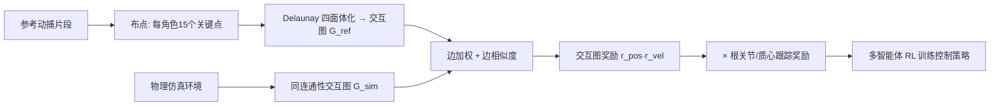

## 一句话总结

本文提出一种基于"交互图(Interaction Graph)"奖励的多智能体深度强化学习方法,让物理仿真的人形角色不仅复现单体动作,还能保持角色之间复杂的空间交互关系,从而把参考动捕数据中的交互迁移到体型、骨骼甚至运动学结构都截然不同的角色上。

## 研究背景

- 领域现状:单角色的物理仿真模仿控制(DeepMimic 等)已相当成熟,但多角色物理交互的研究少得多。既有工作要么用二次规划做准静态优化(动作慢、缺乏动感,且需逐帧指定所有交互),要么为每个任务定制专门的奖励函数,能展示的交互复杂度远低于日常真实的人际互动。
- 核心痛点:多角色控制既要各自维持平衡,又要同时满足角色间的交互约束;而当仿真角色的体型/骨骼与动捕演员不同时,单纯逐关节模仿姿态会破坏交互语义(高个角色不会主动弯腰去够矮个角色)。
- 本文 idea:借鉴运动学领域的交互描述子思想,用一个衡量"角色身上成对关键点之间距离"的交互图来构造奖励。这个奖励鼓励策略在模仿自身动作的同时,保持参考动作里角色间的空间关系,且因归一化设计对体型不敏感,天然支持重定向。

## 方法

整体框架:把问题建模为多智能体 MDP,每个角色是一个由 stable-PD 伺服驱动的 22 关节铰接刚体。给定一段多角色交互的参考动捕片段,在仿真环境和参考动作上分别构建交互图,通过比较两张图的差异来定义奖励,用多智能体强化学习训练出各角色的控制策略。

关键设计:

1. **交互图构建**:在每个角色的四肢、骨盆、躯干、头部布置 15 个关键点作为图节点,每个节点带 6 维位置+速度特征。每帧对所有节点做 Delaunay 四面体化得到紧凑的边集合,边分为"角色自连接"(维持个体动作质量)和"角色间跨连接"(约束两角色身体部位的相对位置)。相比原始交互网格(Interaction Mesh)用四面体体积做度量,本文改为边级(距离)计算,并给边特征加上速度分量——这对物理仿真至关重要。

2. **自适应边加权**:直觉是"两个身体部位靠近或接触时最重要"。因此按边长用指数函数动态归一化地分配权重:两角色离得远时,跨连接边权重低、个体自连接边主导(保证各自动作贴近原动作);两角色靠近时,身体部位间的连接权重变大,聚焦到真正发生交互的区域。

3. **边相似度奖励**:自连接误差先减去各自 T-pose 边再按 T-pose 边长归一化,从而对体型/比例不敏感;跨连接因两角色距离方差极大无法定义参考边长,改为直接惩罚边长与方向差异,并用仿真、参考各自的边长对称归一化,使其能跨体型使用。速度相似度则不做归一化(实验发现速度对体型变化不敏感)。

4. **最终奖励与训练技巧**:总奖励是位置图、速度图、根关节跟踪、质心跟踪四项指数奖励的**乘积**(任一项差都会拉低整体)。动作是相对参考姿态的姿态增量 $$\Delta q$$。策略采用编码器-解码器结构,先在无需搭档的单人动作上预训练一个模仿策略,再复用其解码器加速交互策略的学习。

## 实验结果

本文以定性对比为主,没有统一的定量指标表。下面归纳各类实验设置与核心结论:

| 实验类别 | 代表场景 | 关键结论 |
|----------|----------|----------|
| 人-人轻交互 | Rapper 式问候、跳跃越过 | 短时、力小的接触交互能在正确时机语义保真复现 |
| 人-人重交互 | 抬举俯卧撑、Salsa 抓握/支撑 | 有显著力交换的高协调动作也能成功模仿并维持平衡 |
| 人-物交互 | 抛接小箱、抬移大箱 | 在箱子顶点加标记点即可,被动物体交互同样成立 |
| 体型重定向 | 四肢缩放 0.5~1.3(高矮相差近 2 倍) | 高个角色会主动弯腰/降腰去够矮个角色,交互语义被迁移 |
| 非人角色 | Baxter 机械臂替换一个角色 | 不同运动学结构(更少 DoF)也能复现问候/击掌交互 |
| 对比:逐关节奖励 | 缩放角色的问候/抬举/抛接 | 仅逐关节奖励无法让高个弯腰,交互语义丢失 |
| 消融:边加权函数 | 问候动作 | 去掉加权后角色会以不自然的屈腿姿态完成动作 |

训练成本较高:简单序列约需 3~5 亿样本,困难序列超过 20 亿;用 640 个 CPU 训练一个策略需 3~9 天。

## 亮点与局限

- 亮点:
  - 交互图奖励是**角色无关**的通用设计,无需为每种交互手工定制奖励,也无需逐帧标注(仅需选一组通用关键点)。
  - 归一化的边特征使同一份参考动作能重定向到体型、骨骼乃至运动学结构差异巨大的角色,交互语义得以保持。
  - 覆盖从稀疏问候到 Salsa 舞、抬举、抛接箱子等密集复杂交互,泛用性强;还能"清洗"动捕数据使交互物理可信。
- 局限:
  - 动作空间与奖励未直接关联,收敛所需样本比逐关节奖励多。
  - 缺少对关节角的直接监督,对交互无影响的关节(头、腰)可能出现不自然扭转。
  - 属于模仿控制器,无法生成参考动作中不存在的交互;且每个策略只适配训练时的特定体型,不能泛化到其他体型。
  - 极端缩放或差异过大的骨骼可能因物理极限失败(如用机器人替换角色做抛箱)。

## 延伸思考

方法核心在于把"交互"抽象成关键点间的相对几何关系并做归一化,这与运动学时代的交互描述子一脉相承,却借强化学习跨越到了动力学与跨形态重定向。一个自然的追问是:能否在此之上构建更强的运动先验(motion prior),让策略在共享先验上做少量微调,从而摆脱"一个策略只服务一种体型"的束缚,并在极端形变时通过探索找到可行解。此外,当前观测仍用常规的逐关节表示,若换用更贴合交互结构的图表示,或许能进一步提升泛化能力,把单一策略推广到多种角色配置。
