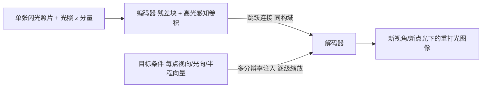

## 一句话总结

给定一张平面材质的单张（闪光）照片，直接用一个编码器-解码器网络生成该材质在新视角、新点光源下的重打光图像，全程绕过 SVBRDF 参数估计与渲染这一中间环节。

## 研究背景

- 领域现状：从单张照片恢复空间变化材质外观是近十年计算机图形学的热点。主流做法分两类——直接推断法（网络直接把照片映射成 SVBRDF 参数图）与神经逆向渲染法（在线优化，让恢复参数的渲染结果匹配输入照片，其中若干步骤被可学习组件替代）。
- 核心痛点：单图估计 SVBRDF 高度欠约束（每个表面点未知量 9+，观测只有 3 个），且高光并非在每个点都被观测到。更关键的是，这些方法都要在两个不同空间之间学非线性映射——先从"视觉外观空间"映到"SVBRDF 参数空间"，再渲染回"视觉外观空间"。这带来两个负担：训练要同时平衡参数损失与渲染损失（两个空间、可能相互冲突）；跳跃连接需要把图像特征"翻译"成 SVBRDF 特征，而两者并非一一对应。
- 本文 idea：作者的核心观察是——一个空间变化材质是否"可信"，只由其视觉外观决定，与底层 SVBRDF 参数分布无关。因此不必绕道参数空间，直接学习"在视觉外观空间里导航"：以目标视角方向与点光源位置作为导航终点，把输入照片重新可视化为目标条件下的外观。这被形象地称为"神经材质重打光"。

## 方法

整体框架：网络是一个编码器-解码器结构。编码器把输入照片压成材质特征编码，解码器在目标视角/光照条件的引导下逐级上采样，直接输出重打光图像。因为输入与输出处在同一个视觉外观空间，跳跃连接（passthrough）连的是两个同构域，信息从输入照片到输出图像的传递更顺畅，无需额外的跨域特征翻译。

关键设计：

1. **骨干：残差块 + 高光感知卷积。** 编码器-解码器采用带 passthrough 连接的架构，配合残差块与高光感知卷积。残差块更擅长重建高光的形状，高光感知卷积则抑制过曝导致的"烧入"伪影。消融显示二者结合的 LPIPS 误差最低。
2. **多分辨率条件注入。** 目标视角与光照不是拼在输入端，而是以逐像素的条件图（每个表面点的视向、光向，以及半程向量 halfway vector）在解码阶段按空间分辨率缩放后注入解码器的每一层。这样能把"材质编码"与"神经渲染"干净地分离，避免编码器学到输出条件与输入照片之间的错误相关性。消融证实半程向量的加入以及"注入解码器而非输入端"都能提升质量。
3. **输入里的光照 z 坐标。** 除照片外，网络还额外接收入射光方向的 $$z$$ 坐标。它类似 "coord-conv" 技巧，帮助网络学习高光的位置与统计规律（高光与 $$z$$ 强相关）；只给 $$(x,y)$$ 无法捕捉这一相关性。
4. **三项损失联合训练。** 总损失为

$$L = \lambda_d L_d + \lambda_p L_p + \lambda_c L_c$$

其中 $$L_d$$ 是与参考重打光图的图像相似度（数据）损失、$$L_p$$ 是 VGG 感知损失、$$L_c$$ 是以输入图为条件的判别器损失（判断重打光结果与输入是否为同一材质），权重取 $$\lambda_d=1,\ \lambda_p=0.01,\ \lambda_c=0.025$$。判别器同时用正例（同材质重打光）与负例（他材质重打光）训练，避免网络忽略输入。
5. **训练采样策略。** 在 INRIA-SVBRDF 数据集上训练，每个 batch（大小 16）含 4 种材质、每材质 4 组不共享的视/光组合。视/光采样刻意让多数样本带高光、部分无高光，并让光源距离变化，以便网络学会"移动高光"并顾及邻近点间光方向的相对差异。先在 $$128\times128$$ 裁块训练、再在 $$256\times256$$ 上精调（全卷积结构可复用权重）。

## 实验结果

主实验为直接重打光的质量对比：在 40 个测试材质、3 个视角、49 个光向上重渲染，以 LPIPS 衡量与参考的差距，对比若干代表性单图 SVBRDF 估计方法（数值越低越好）。

| 方法 | LPIPS↓ |
|------|--------|
| 本文 神经材质重打光 | 0.1902 |
| 本文架构改输出 SVBRDF | 0.1966 |
| Deschaintre et al. 2018 | 0.2713 |
| Gao et al. 2019 | 0.2323 |
| Zhou & Kalantari 2021 | 0.2375 |

本文方法误差最低，且能重现挑战性的空间变化高光（不连续高光、细小几何凸起上的高光、砖块瓦片的大尺度法线变化与透视缩短）。此外还有两点结论：一是用本文方法为单张照片合成 5 张不同光位的重打光图，作为多图 SVBRDF 方法（Deep Inverse Rendering）的合成输入，可把平均 LPIPS 从 0.2323 降到 0.2021；二是同架构改成输出 SVBRDF 参数图时训练更不稳定、会在左下角产生"卡死像素"伪影，且在偏离训练集的困难材质上泛化更差（20 个非 INRIA 材质：SVBRDF 版 0.2431 vs. 重打光 0.2248）。鲁棒性实验表明：光源相对传感器偏差 5° 以内结果仍可信，光源距离外推到 0.5~100 单位也能给出合理结果。

## 亮点与局限

- 亮点：
  - 提出"直接在视觉外观空间导航"的新范式，绕开 SVBRDF 中间表示，损失只需定义在单一空间，跳跃连接连接同构域，信息传递更高效。
  - 兼作数据增强器：把单图扩成一组合成多图，喂给已有多图 SVBRDF 方法，拓宽了这些方法可用的输入条件。
  - 推理很快，训练好后单次重打光在 RTX 2070ti 上约 15ms。
- 局限：
  - 只支持平面材质，无法直接把材质贴到曲面上；受训练时见过的视/光组合范围限制。
  - 无法只重打光单个像素（必须整幅重算），不适合光线追踪式渲染管线。
  - 只支持单点光源，环境光重打光代价高；输入若缺乏足够高光，或存在严重过曝，仍会重现失败或烧入。

## 延伸思考

作者指出的一个自然改进是把解码器换成以像素坐标为额外输入的 MLP，从而支持逐像素重打光、更好地对接光追渲染。这一思路与后续把材质外观表示成神经场/隐式函数的工作（如坐标网络、神经外观建模）相呼应。另一个值得追问的点是"绕过参数空间"的代价：直接生成外观省去了冲突损失，但也失去了可编辑、可复用的显式 SVBRDF 资产——在需要材质编辑或跨管线复用的场景，参数化表示仍不可替代。把该方法从单点光扩展到环境光重打光，则会触及经典基于图像的重打光（线性叠加反射场）与神经生成之间的结合点。
