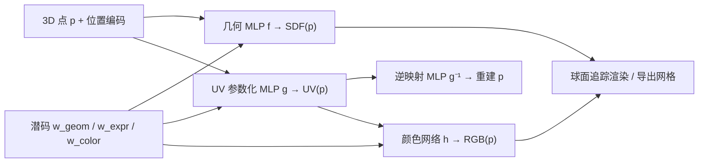

## 一句话总结

从单张随手拍的人像图重建出可动画、可编辑的高质量 3D 头像：用隐式 SDF 表示几何、用显式 UV 纹理图表示外观，把二者拼成一个既有隐式表示的高保真度、又保留 3DMM 直观可控性的混合可变形人脸模型。

## 研究背景

- 领域现状：可动画 3D 数字人主要有两条路线。一条是基于网格模板的 3D 可变形模型（3DMM），编辑直观、单视图重建鲁棒；另一条是基于神经隐式表示（SDF、神经辐射场）的方法，逼真度高、能表达头发等复杂几何。
- 核心痛点：模板网格路线受限于固定拓扑和低维线性空间，难以刻画细节几何与高分辨率纹理；隐式路线虽然逼真，但潜空间纠缠、可解释性差、难动画，也不易泛化到未见数据，更谈不上直接编辑纹理。
- 本文 idea：把两条路线的优点合起来——几何用隐式 SDF（不受拓扑与分辨率约束），外观用一张显式且语义一致的 UV 纹理图（可导出为带纹理网格、可直接在 UV 上作画）。几何分支与外观分支解耦，并用可变形模型式的几何 / 表情 / 纹理潜码提供直观控制。

## 方法

整体框架：每个头像由几何码 $$\boldsymbol{w}_{geom}$$、表情码 $$\boldsymbol{w}_{expr}$$、颜色码 $$\boldsymbol{w}_{color}$$（各 512 维）表征，通过 AutoDecoder 从一批高质量 3D 扫描中学出字典。渲染时对每个采样点 $$\boldsymbol{p}$$，几何分支 MLP 预测 SDF 值（用于球面追踪求表面），纹理分支把 $$\boldsymbol{p}$$ 映到 UV 坐标、再由颜色网络预测该点 RGB。训练完成后即可自由改视角、改表情码做动画、直接编辑 UV 纹理，或导出为独立的带纹理网格资产。

关键设计：

- **隐式几何 + 显式纹理的解耦双分支**：几何用 SDF MLP，训练时用表面损失约束零等值面、Eikonal 损失约束梯度模长为 1、法向损失对齐真值法向；颜色分支在 UV 空间用真值纹理图与渲染图（含 LPIPS 感知损失）双重监督。几何不受网格分辨率与拓扑限制，纹理则天然支持传统图形管线的编辑与重光照。
- **可逆且一致的 UV 参数化**：除了参数化 MLP $$g$$，还额外学一个逆映射 $$g^{-1}$$，通过 UV 循环一致损失 $$\lVert \boldsymbol{x} - g^{-1}(g(\boldsymbol{x})) \rVert^2$$ 逼使映射构成真正的表面参数化。再用一组稀疏人脸关键点约束，让不同个体的 UV 映射语义对齐——这既保证纹理编辑（如加纹身、胡子）在动画中稳定传播，也为单图反演提供了 2D-3D 关键点对应。
- **非线性表情空间**：表情通过在表情码上线性插值来驱动，但由于潜空间是从高质量扫描学得的，插值在 3D 顶点上呈现非线性形变轨迹，比传统线性 3DMM 更贴近真实表情。
- **单图反演管线**：给定野外人像，先用 LUMOS 去光照，再用一个 DeepLabV3+ 编码器初始化三组潜码（这一初始化对鲁棒性很关键）；随后冻结网络、优化潜码（图像、轮廓、多视角一致、关键点、正则损失，约 800 步）；最后仿照 PTI 冻结潜码、轻微微调网络权重（仅 60 步，且去掉轮廓损失以免几何膨胀）以补细节。编码器训练时用合成增强的数据缓解野外图像中未见发型、遮挡等问题。

## 实验结果

在 FFHQ 采样的 500 张野外图上做单图重建对比（图像/身份指标只在人脸区域算，深度指标在 H3DS 上算）。本文完整方法在图像质量、身份保持与深度精度上全面领先网格类基线（EMOCA、ROME）和隐式类基线（HeadNeRF）。

| 方法 | LPIPS↓ | DISTS↓ | SSIM↑ | ID↑ | RMSE Depth↓ |
|------|--------|--------|-------|-----|-------------|
| EMOCA | 0.1122 | 0.1268 | 0.9182 | 0.0697 | 0.0677 |
| ROME | 0.1054 | 0.1130 | 0.9317 | 0.3866 | 0.0513 |
| HeadNeRF | 0.1090 | 0.1199 | 0.9268 | 0.2334 | 0.0695 |
| 本文（无编码器） | 0.0890 | 0.0921 | 0.9441 | 0.4600 | 0.0527 |
| 本文（完整） | 0.0879 | 0.0905 | 0.9451 | 0.4670 | 0.0510 |

此外，在 Triplegangers 测试集 32 对表情上做自表情重定向，本文的 FACS 系数误差（1.733）与关键点误差（0.1165）显著低于所有基线；与 FaceVerse 的单独对比中，本文在三项图像指标上同样占优。消融显示编码器初始化能明显提升 ID 与深度精度。

## 亮点与局限

- 亮点：
  - 首个能跨单张野外图泛化、同时支持隐式表示、灵活拓扑与显式纹理控制的可变形人脸模型（作者据此在方法对比中占满四项能力）。
  - 一致的 UV 参数化一石三鸟：支持 UV 直接编辑、提供跨个体语义对应、并直接为单图反演提供 2D-3D 关键点约束。
  - 可导出为标准带纹理网格，无缝接入传统图形管线做重光照等下游任务。
- 局限：
  - 训练数据 Triplegangers 身份有限、无发型与背景变化，需靠合成增强来撑野外泛化。
  - 计算代价高：AutoDecoder 训练约一周（8×A40），单图反演需约 3 小时、球面追踪单次约 8.5 秒，远非实时。
  - 内嘴、眼周等区域因 billboard 几何与真值误差难以获得完美 UV 配准；网络微调虽提细节，但会削弱动画与新视角能力，只能浅调。

## 延伸思考

- 反演耗时 3 小时是落地的主要瓶颈，能否用前馈编码器一步到位、或引入更强的先验（如 3D GAN 反演的加速技巧）值得探索。
- 纹理是漫反射 UV 图，天然适合重光照，但当前未显式建模反射率/法线细节；结合 SVBRDF 估计可望做出真正可重光照的头像。
- 隐式几何 + 显式一致 UV 的组合思路不止用于人脸，对头发、身体等需要既灵活拓扑又要可编辑纹理的资产可能同样适用。
