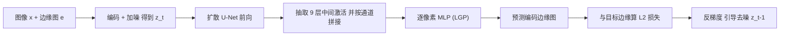

## 一句话总结

训练一个逐像素的轻量 MLP（Latent Edge Predictor），把预训练文生图扩散模型的中间特征映射成边缘图，并用它的梯度在推理阶段引导去噪，让生成图像在遵循文本语义的同时贴合输入草图的空间布局——无需为该任务训练专用编码器或大模型。

## 研究背景

- 领域现状：大规模文生图扩散模型（Stable Diffusion、Imagen、DALL·E 2 等）能从文本生成高质量、多样化的图像，但只提供语义层面的控制，缺乏对空间布局的直观控制手柄。
- 核心痛点：想用草图这类"跨域空间图"引导一个已训练好的模型仍是难题。已有做法要么为每个任务从头训练专用模型，要么训练一个专用编码器把引导图映射进扩散模型潜空间（如 PITI），这类方法在训练域内表现好，但在自由手绘（out-of-domain）草图上崩坏；SDEdit 一类往输入图加噪再去噪的做法则要求引导图本身处于 RGB 域，空间保真度低且随机。
- 本文 idea：与其训练大模型或专用编码器，不如训练一个**逐像素、领域无关**的小 MLP，把扩散模型 U-Net 的内部激活翻译成边缘图；由于是逐像素、局部化地学习，它更像一个"可微边缘检测器"，因此只需几千张图训练，且能泛化到任意风格的域外草图。

## 方法

整体框架：方法分两阶段。先离线训练一个 Latent Edge Predictor（LGP）——一个逐像素 MLP，学习从扩散模型的中间特征预测编码后的边缘图；再在推理时，把 LGP 预测边缘与目标草图的差异作为损失，对当前潜变量求梯度，用该反梯度像"分类器引导"一样推动去噪轨迹，使生成图像的边缘逼近草图。

关键设计：

1. **逐像素的潜空间边缘预测器（LGP）**：从 U-Net 固定选取的 9 层（input/middle/output block 各若干层）抽激活，统一 resize 到潜空间分辨率后沿通道拼接成特征张量 $$F(z_t \mid c, t)$$。MLP 只对**单个潜像素**做映射，训练目标是

$$L = \mathbb{E}_{(x,e,c),\,t,\,\xi}\ \sum_{i,j}\ \lVert P(F(z_t\mid c,t)_{i,j},\,t) - E(e)_{ij}\rVert^2$$

其中噪声图像 $$z_t = \alpha_t \cdot E(x) + \mu_t \cdot \xi$$ 遵循扩散模型自身的加噪调度，边缘图 $$e$$ 复制成三通道后再用同一编码器 $$E$$ 编码。MLP 额外接收噪声级 $$t$$ 及其位置编码 $$\sin(2\pi t \cdot 2^{-l})$$。逐像素+局部化正是"域无关、少样本"的来源。

2. **推理阶段的边缘引导**：在每个去噪步 $$t$$，复用为算 $$\varepsilon(z_t,t,c)$$ 而做的前向传播顺手收集中间激活，用 LGP 预测边缘 $$\tilde{E}$$，计算 $$L(\tilde{E}, E(e)) = \lVert \tilde{E} - E(e)\rVert^2$$，取反梯度更新：$$\tilde{z}_{t-1} = z_{t-1} - \alpha \cdot \nabla_{z_t} L$$。

3. **引导强度归一化**：梯度作用大小取决于它相对模型原步长的量级，故按 $$\alpha = \dfrac{\lVert z_t - z_{t-1}\rVert_2}{\lVert \nabla_{z_t} L\rVert_2}\cdot \beta$$ 归一化，$$\beta$$ 为常数（经验值约 1.6）。$$\beta$$ 小则更真实、纹理丰富，$$\beta$$ 大则更贴合边缘但趋于分段平滑、不够真实。

4. **只在前半程引导**：去噪末段基本不再影响几何布局，因此只在 $$t = T,\dots,S$$（取 $$S = 0.5T$$）施加引导。这个停步点来自实验：LGP 的重建误差在 $$t \approx 0.5T$$ 后趋于稳定，说明更低噪声阶段不再带来新的边缘信息。

## 实验结果

论文以定性对比为主（多组草图-生成图画廊），核心结论是本文方法在**域外自由手绘草图**上显著优于各类基线。下表按"方法 × 能力"归纳其对比结论：

| 方法 | 是否需专用训练 | 域内草图 | 域外手绘草图 | 输出真实感/多样性 |
|------|------|------|------|------|
| 本文（Latent Guidance） | 仅训练小 MLP（几千图，约 1 小时/A100） | 好 | 好 | 高，色彩/风格变化丰富 |
| SDEdit | 无需训练，加噪-去噪 | 一般 | 差（要求引导图在 RGB 域，易出黑白不自然结果） | 保真度低且随机 |
| pix2pix | 需成对数据训练 GAN | 好 | 差（域外崩坏） | 受训练域限制 |
| PITI | 需大规模训练专用编码器 | 好 | 差（自由手绘上失真） | 色彩/风格变化少 |

此外还给出边缘保真度的定量趋势：边缘保真度（目标边缘与生成图边缘的 MSE）随引导停步 $$S$$ 增大而提升，但以牺牲真实感为代价；笔画风格消融显示，相同几何、不同笔触风格生成的形状一致、仅颜色纹理变化，印证方法对笔触风格不敏感。方法还可推广到显著性引导的图像修复与"太阳照亮指定区域"等空间引导任务。

## 亮点与局限

- 亮点：
  - 用一个逐像素小 MLP 就能给**任意**预训练文生图扩散模型加空间控制，不改主干、不训编码器、不需大数据；
  - 逐像素+局部化训练带来强域外泛化，能吃各种风格的自由手绘草图；
  - 训练极轻（几千图、约 1 小时单卡），$$\beta$$ 提供真实感与边缘保真的连续可调；框架通用，可迁移到显著性引导修复、地平线控制等任务。
- 局限：
  - 对笔画局部风格仍敏感；面对复杂、杂乱的草图会把所有笔画一视同仁，缺乏按语义/显著性排序；
  - 扩散过程随机，随机种子可能与草图冲突导致输出不贴合；复杂/语义歧义场景与不良初始化下质量下降。

## 延伸思考

- 这是"用外部可微预测器的梯度引导扩散推理"范式（源自 classifier guidance）在空间控制上的一次巧妙落地，和几乎同期、走另一条路的 ControlNet（复制主干分支+零卷积微调）形成鲜明对照：本文以极小代价换泛化，ControlNet 以更大训练换更强、更多样的条件保真。二者取舍值得对比。
- "逐像素、少样本地探测扩散模型内部特征"这一思路本身可迁移：既然中间激活能线性/浅层地解出边缘、显著性，或许也能解出深度、法线、分割等，暗示扩散特征是通用的密集表征。
- 作者提出的"草图反演求更好种子"和"少样本个性化笔触风格"是自然的后续方向，指向把用户草图更深地绑进采样初始化而非仅靠推理期梯度纠偏。
