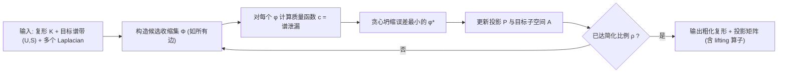

## 一句话总结

提出一种与具体 Laplacian 无关的谱粗化算法，能在三角网格、四面体网格乃至一般单纯复形上，同时保留来自多个不同维度 Hodge Laplacian 的指定谱带，从而按下游任务需求可控地简化几何。

## 研究背景

- 领域现状：几何处理常需先"粗化"（简化）离散表示以加速后续计算（FEM 仿真、拓扑数据分析等）。谱方法把要保留的"显著特征"形式化为某个 Laplacian 特征向量张成的子空间——类似 Fourier 谱之于导数算子。
- 核心痛点：已有的保谱粗化方法几乎都只用**零维**（定义在顶点上）的 Laplacian 离散化，例如 cotan Laplacian。但很多应用（如物理仿真需要同时保留 0 维和 1 维 Laplacian 的谱；PDE 高维离散、单纯复形上的信号分析）本质上依赖**多个维度**的算子，现有方法无法覆盖。
- 本文 idea：把图论、网格里各种 Laplacian 统一看作 **Hodge Laplacian 的特例**（graph Laplacian、cotan Laplacian 都能由带权 $$k$$-Hodge Laplacian 导出），据此设计一个"算子无关"的贪心粗化框架——输入是一组 Laplacian 及其待保留的谱带，输出是尽量保住这些谱带的粗化复形。

## 方法

整体框架：把每次收缩（如边坍缩）看成一个从细复形到粗复形的投影 $$P_k$$，用它构造一个衡量"谱泄漏"的质量函数；对所有候选收缩集评估质量函数，贪心地坍缩误差最小的那个，重算受影响单纯形的质量，迭代直到达到目标简化比例。

关键设计：

1. **谱质量函数（谱泄漏）**。待保留子空间记为 $$A_k = U\sqrt{S}^{+}$$（$$U,S$$ 为 Hodge Laplacian 的特征向量与特征值）。收缩投影 $$P_k$$ 与其伪逆合成 $$\Pi_k = P_k^{+}P_k$$，表示信号"下投到粗复形再抬回细复形"的往返。理想收缩应让 $$\Pi_k A_k$$ 与 $$A_k$$ 一致，于是质量函数取正交补投影的范数 $$c_k = \lVert \Pi_k^{\perp} A_k \rVert_L$$，其中 $$\Pi_k^{\perp} = I - \Pi_k$$。这一形式的关键好处是误差计算**局部化**（$$\Pi_k^{\perp}$$ 的非零项只涉及被收缩影响的单纯形），因此天然可并行。

2. **多 Laplacian 谱带聚合**。可为 $$B$$ 个不同谱带各自定义代价 $$c_k^{\nu}$$（每个谱带可来自不同维度的 Laplacian），再用一个用户可定制的聚合函数 $$q_{\text{agg}}$$ 合成最终质量。实验里对 $$L_0, L_1, L_2$$ 的贡献简单取平均。这正是"跨维度同时保谱"的核心。

3. **粗化矩阵与跨维一致性**。边坍缩通过修改单位投影矩阵的条目实现（删除、合并或重索引受影响单纯形）。文中证明粗化矩阵与边界算子可交换 $$\hat{\partial}_k P_k^{\mp} = P_{k-1}^{\mp} \partial_k$$，保证不同维度间的一致性；任意（连通）单纯形族的收缩都能分解为一串边坍缩，因此结论普适。为规避不同维 Laplacian 间的"谱冲突"，实现上只取所选 Laplacian 的 $$L_k^{\text{up}}$$ 分量。

4. **实用细节**。对高维 Laplacian 用修正特征值 $$\tilde{S} = I + S$$ 以保留零特征值对应的调和（拓扑）信息；四面体网格用基于局部 Delaunay 的顶点定位避免自交；附带一个简单的 lifting 算子把粗网格上的解抬回细网格。

## 实验结果

在 100 个具有非平凡拓扑（多孔环面上采样构造的 alpha 复形，最多 66 个同调环）的单纯复形数据集上，与保同调的 Gudhi edge-collapser 及随机坍缩基线比较。下表为各谱误差指标均值（保留 $$L_1$$ 前 30 个特征对、简化比例 $$\rho=0.8$$；括号内为标准差，越小越好）：

| 方法 | 简化比 $$\rho$$ | $$\lVert\cdot\rVert_{L_c}$$↓ | $$\lVert\cdot\rVert_{\Pi^{\perp}}$$↓ | $$\lVert\cdot\rVert_{\lambda}$$↓ | 同调误差 $$E_\beta$$↓ |
|------|------|------|------|------|------|
| Gudhi | 0.9 | 3.84 | 29.1 | 71.5 | 0.0 |
| 本文 | 0.8 | 0.49 | 8.98 | 2.76 | 0.07 |
| Random | 0.8 | 3.08 | 20.8 | 400000 | 0.98 |

Gudhi 按设计精确保住同调数 $$\beta_1$$，但在其他谱带泄漏严重；随机坍缩谱误差被均摊却平均破坏约 1 个同调环；本文方法在几乎所有谱指标上明显更优，且能按需锁定不同谱带。其他实验（文字简述）：三角网格上与谱粗化基线结果相当，并额外支持四面体网格的高维 Laplacian；去噪（用极窄低通滤除噪声频率）；FEM 求解 Poisson 方程在加噪扰动下比多种基线更鲁棒；谱距离（扩散/双调和/通勤距离、热核与波核签名）在粗网格上计算再 lift 回细网格，误差比基线低数个数量级。计算时间上比谱粗化基线快数个数量级。

## 亮点与局限

- 亮点：
  - **算子无关**：把各种 Laplacian 统一到 Hodge Laplacian 框架，任何半正定算子都可作为输入，一套算法覆盖三角网格、四面体网格与一般单纯复形。
  - **跨维度同时保谱**：首次能同时约束多个不同维度 Laplacian 的谱带，支持带通滤波（可分别保留低频/调和部分或高频）。
  - 质量函数局部化、可并行，速度比谱粗化基线快数个数量级，并给出跨维一致性的理论保证。
- 局限：
  - 工具的价值高度依赖"下游任务需要保留哪些谱约束"这一先验，而多数应用并不明确知道该约束。
  - 需要预先做 Laplacian 的特征分解（该开销未计入计时对比），对大模型是额外成本。
  - 未显式强制 link condition，导致同调保持存在非零误差；极端简化下四面体化偶有自交需额外坍缩修复；自带 lifting 算子简单，不追求超过专门的函数对应/延拓算子。

## 延伸思考

- 这项工作把"谱粗化"从顶点上的 0 维 Laplacian 推广到 Hodge Laplacian 的全维度谱，思路上与离散外微积分、拓扑信号处理相呼应；把网格简化、图粗化、持续同调化简统一在同一个谱保持视角下，是一个有整合力的框架。
- 真正的落地瓶颈在"如何为具体任务选谱带"。若能把某类仿真/学习任务的误差与特定 Laplacian 谱带自动关联起来（甚至可微地学习聚合权重 $$q_{\text{agg}}$$），会让该工具从"专家可调"走向"任务自适应"。
- 与多重网格（multigrid）prolongation、functional map 等已有细粗对应算子的结合值得探索：粗化过程中顺带装配出的投影/lifting 算子，能否直接服务于高维 PDE 求解或几何学习的层级结构，是自然的后续方向。
