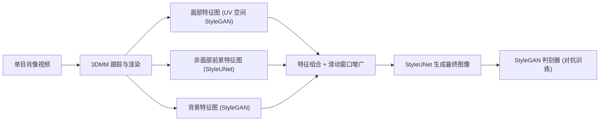

## 一句话总结

用一段单目视频、基于 StyleGAN 网络在两小时内重建出可实时驱动、照片级真实的全景肖像化身，兼顾图像质量与精细表情控制。

## 研究背景

- 领域现状：从单目视频重建可驱动的肖像化身有两条主流路线。一条是基于 NeRF 或其他 3D 表示的方法，视角一致性好、控制精细，但分辨率和图像质量受限，且大多只关注刚性面部区域，忽略长发、肩颈、背景等元素；另一条是基于 StyleGAN 的 2D 方法，图像质量高、语义编辑强，但依赖 FFHQ 这类高度对齐的高清人脸数据集，缺乏表情变化，也难以生成自然的头部运动。
- 核心痛点：质量与可控性之间存在两难——2D GAN 方法画质高但难做细粒度面部属性控制；3D 方法可控但纹理易被平滑、画质偏低。此外现有单视频方法难以恢复头发、雀斑、毛孔等精细细节，也难处理大幅度头部平移带来的画面撕裂。
- 本文 idea：用 StyleGAN 类网络做「渲染图到视频」的图像翻译，同时把肖像场景拆成面部、非面部前景、背景三部分分别处理，并引入滑动窗口数据增广与预训练策略，从而在保持高保真的同时实现快速收敛与实时推理。

## 方法

整体上，系统输入单目肖像视频，先做 3DMM 跟踪得到像素对齐的合成渲染图；随后在特征生成阶段把肖像拆成三个区域各自生成特征图，再组合成统一特征图；最后由一个 StyleUNet 生成最终图像，并用 StyleGAN 判别器做对抗训练。重演时只需替换来自另一段视频的表情与姿态参数即可，推理阶段仅需计算两个 StyleUNet。

关键设计：

- **三区域组合式表示**：把肖像视频分成面部区域、非面部前景（肩、颈、头发等）和背景，因为三者属性不同。面部几乎所有运动信息都来自 3DMM，用 UV 空间生成的静态特征图加上 Deferred Neural Rendering 的 Neural Textures 采样表达；背景基本静止，用一个 StyleGAN 生成静态特征图；非面部前景运动不可控但可从面部运动推测趋势，用 StyleUNet 从 3DMM 渲染图生成像素对齐特征图。分区处理提升了稳定性与训练速度。
- **StyleUNet**：融合 UNet、StyleGAN 与时间编码的图像翻译网络，采用编码器-解码器加跳连结构，引入映射网络、调制卷积以及时间隐编码 $$z_{tmp}$$。时间隐编码把头发抖动这类不可控、与时间相关的变化纳入隐空间，避免网络把细节过度平滑。所有网络借鉴 SWAGAN 用小波变换，把 $$1024\times1024\times3$$ 图像换成 $$512\times512\times12$$ 表示以加速。
- **滑动窗口数据增广**：普通 UNet 对图像平移非常敏感，大幅头部平移时易撕裂。方法先在输入图与对应 3DMM 渲染上随机采样框，把采样渲染 pad 到更高分辨率（256→512）以保证前景像素对齐，再用两个滑动窗口从生成的特征图中裁出像素对齐的背景与前景区域，窗口位置由随机采样框决定，从而显著提升平移泛化，支持更大范围的前景与背景移动。
- **预训练与损失**：用从 4K 视频裁出的 6 段视频、以各自身份隐编码 $$z_{id}$$ 做预训练来加速收敛。训练用直接监督，损失为 L1、感知损失（VGG19）、前景掩码 L1 与 GAN 损失之和：

$$\mathcal{L} = \mathcal{L}_1 + \mathcal{L}_{percep} + \mathcal{L}_{mask} + \mathcal{L}_{GAN}$$

## 实验结果

与视频驱动的重演方法在两个测试案例上的自驱动对比（去背景、512×512 分辨率）如下，方法在 FID 上优势尤为明显：

| 方法 | Case1 SSIM↑ | Case1 PSNR↑ | Case1 FID↓ | Case2 SSIM↑ | Case2 PSNR↑ | Case2 FID↓ |
|------|-------------|-------------|------------|-------------|-------------|------------|
| DVP | 0.80 | 21.6 | 31.3 | 0.85 | 24.2 | 25.9 |
| NeRFace | 0.77 | 18.8 | 36.4 | 0.87 | 22.2 | 50.0 |
| NHA | 0.73 | 16.0 | 83.5 | 0.86 | 19.5 | 62.9 |
| IMAvatar | 0.78 | 19.0 | 59.7 | 0.89 | 25.6 | 58.7 |
| 本文 | 0.87 | 25.6 | 15.1 | 0.87 | 26.2 | 13.2 |

与单张图化身方法（DaGAN、Next3D）对比时，本文在 SSIM/PSNR/FID 上全面领先（0.87 / 27.1 / 12.2），且能做到 3D 方法难以实现的细粒度表情控制。消融实验表明：去掉数据增广与视频分解的「Single-StyleUNet」虽能生成高保真图像但无法避免大幅运动下的撕裂；Neural Textures 主要贡献在于加速训练收敛。效率上，方法训练仅需约两小时（收敛约需再 4 小时训练牙齿区域），单帧渲染 0.028 秒、输出 1024 分辨率，实时直播系统在单张 RTX 3090 上以 16 位 TensorRT 模型跑到 35 fps、约 4 GB 显存。

## 亮点与局限

- 亮点：
  - 首次用 StyleGAN 类网络把 2D 高画质与可控表情结合起来，覆盖面部、肩颈、头发、背景的完整肖像视频，能保留牙齿、眼中光点等精细细节。
  - 训练极快（约两小时）、推理 20 毫秒级，并落地为可实时驱动的直播系统，推动方法走向应用。
  - 三区域组合式表示与滑动窗口增广两个设计通用且有效，分别解决稳定性/速度与平移泛化问题。
- 局限：
  - 图像翻译网络受训练视频质量与变化范围限制，无法生成与训练集差异过大的姿态和表情，头部旋转大约只能处理到 30 度。
  - 依赖 3DMM 跟踪，参数模型难以精确刻画细腻表情，导致表情控制不准；口腔内部无约束，重演时口内常显模糊。
  - 可被滥用于生成伪造肖像视频，存在社会影响风险，部署前需谨慎应对。

## 延伸思考

方法本质是把 3D 先验（3DMM 跟踪、UV 空间、Neural Textures）作为几何骨架，交给 2D StyleGAN 完成高保真「渲染到视频」翻译，这种「3D 定结构、2D 补细节」的混合范式在后续头部化身工作中很有借鉴意义。旋转受限与口腔模糊的问题，指向了更强的参数化模型或引入 3D 生成先验（如 EG3D 类）来提升大姿态外推与口内建模；而时间隐编码处理不可控头发运动的思路，也可推广到衣物褶皱、饰品等其他难控动态区域。随着 3D 高斯等表示的兴起，如何把本文的实时性与分区思想迁移到显式 3D 表示上，是值得追问的方向。
