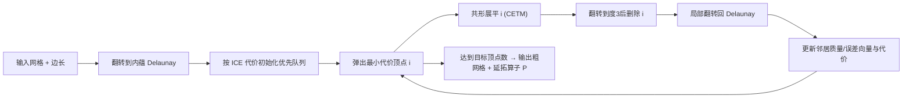

## 一句话总结

本文提出面向"在曲面上解方程"而非"显示曲面"的网格简化方法：不再逼近外在几何（顶点坐标、法向），而是在内蕴三角剖分上做贪心抽稀，用一套内蕴曲率误差度量（ICE）来指导顶点删除，得到粗网格的同时还附带细-粗之间的双射映射与延拓算子。

## 研究背景

- 领域现状：网格简化最初是为渲染显示服务的，经典的二次误差度量（QEM）以"到原始曲面的距离"这类外在量为误差，至今仍是主流。
- 核心痛点：图形学、几何处理与科学计算里大量任务其实是在曲面上求解方程（如拉普拉斯算子相关问题），这些微分算子本质是内蕴的——只依赖沿曲面的距离，与嵌入空间坐标无关。用外在度量简化会去保留对内蕴问题不重要的信息，且外在简化必须同时兼顾"逼近精度"和"三角形质量"，二者互相牵制。
- 本文 idea：借助近年成熟的内蕴三角剖分数据结构（边长而非顶点坐标编码几何，边可以是沿曲面的任意测地弧），把 QEM 的"贪心局部删除 + 全局误差聚合"思想搬到内蕴设定下。既然连通性可以自由改变而不引入几何误差，就能把"网格质量"和"几何逼近"这两件事彻底解耦。

## 方法

整体框架：算法维护一个内蕴 Delaunay 三角剖分，用优先队列按 ICE 代价从小到大贪心地逐个删除顶点，直到达到目标顶点数。每次删除只做三步局部操作，误差信息以"每顶点固定大小的记录（质量 + 切向量）"的形式随简化过程不断聚合，这与 QEM 累加二次型如出一辙。

关键设计：

1. **顶点删除是纯内蕴的原子操作**。删除顶点 $$i$$ 分三步：先用共形等价（CETM）把 $$i$$ 的邻域"内蕴展平"——把它的曲率重分配给邻居而边界边长不变；再通过一系列内蕴边翻转把 $$i$$ 降到度 3（边界顶点降到度 2）后合并三角形；最后翻转回内蕴 Delaunay。除第一步展平外，其余两步都严格保持几何不变，因此误差度量只需盯住展平这一步。

2. **ICE 度量：局部用最优传输，全局用 Karcher 均值**。以曲率作为"质量"$$m$$。删除某顶点时，其质量按凸权重 $$\alpha_{ij}$$ 分配给邻居，局部代价正是把质量搬到邻居的 1-Wasserstein 传输代价 $$C_i = \sum_{j \in \mathcal{N}_i} \alpha_{ij} m_i \ell_{ij}$$。为了做出更好的全局贪心决策，每个顶点还存一个切向量 $$\boldsymbol{t}_i$$，让指数映射 $$\exp_i(\boldsymbol{t}_i)$$ 逼近所有"祖先"顶点的曲率加权 Karcher 均值（质心）。删除时切向量按质量加权更新：$$\tilde{\boldsymbol{t}}_j = \dfrac{\alpha_{ij} m_i (R_{ij}\boldsymbol{t}_i + \boldsymbol{e}_{ji}) + m_j \boldsymbol{t}_j}{\alpha_{ij} m_i + m_j}$$，其中 $$R_{ij}$$ 是跨切空间的平行移动。优先删除那些能让这些误差向量保持小的顶点，等价于让曲率不在曲面上"漂移"。

3. **权重与带符号曲率的处理**。由于 Gauss-Bonnet 定理，展平顶点会把它的高斯曲率守恒地分给邻居，天然适合当质量。但曲率有正有负，作者把曲率拆成正、负两支 $$K^+, K^-$$ 各自当作非负质量独立追踪，用两个向量 $$\boldsymbol{t}^+, \boldsymbol{t}^-$$，权重取 $$\alpha_{ij} = \dfrac{\lvert \tilde{K}_j - K_j \rvert}{\sum_{l \in \mathcal{N}_i} \lvert \tilde{K}_l - K_l \rvert}$$，避开了对带符号测度求解最优传输的昂贵做法。面积、颜色等其它属性可作为额外通道加权混入。

4. **双射映射与延拓算子**。整个简化过程逐点追踪重心坐标（穿过边翻转、展平、删除），天然得到细网格到粗网格的双射映射。由此构造稀疏延拓矩阵 $$P$$（每行三个非零重心坐标），把粗网格上的函数用重心线性插值搬回细网格；对切向量场则用复数编码的 $$P_{\text{vec}}$$ 完成向量场延拓。这让"在粗网格上解、再延拓回细网格"成为可能。

5. **内蕴重三角化带来的硬质量保证**。这是内蕴设定独有的优势：简化后可选做内蕴 Delaunay 细化，只要输入闭合且每个顶点角度和不小于 60°，就能保证最小角不小于 30°。外在网格化算法给不出这种逐单元质量保证，甚至保证不了拉普拉斯算子的正权重。

## 实验结果

作者在 Thingi10k 约 6k 个流形网格上做基准测试：方法近似线性可扩展，约每秒删除 1 万个顶点；98% 和 84% 的模型能分别被简化到输入分辨率的 10% 与 1%（细化前）。核心价值体现在"用粗网格加速内蕴计算"——下表汇总几个代表性任务在保持精度的同时取得的加速：

| 任务 | 加速/收益 | 相对误差 |
|------|-----------|----------|
| 全体点对测地距离矩阵（6k 顶点） | 约 1650 倍 | 1.4% |
| 测地 Voronoi 图 | 约 2252 倍 | 误分类约 1% 顶点 |
| 单源测地距离（速度-精度权衡） | 约 3 个数量级 | 约 1% |
| 相对外在方法的测地距离误差 | 误差约降到 1/4 | — |
| 内蕴多重网格加速平均曲率流 | 约 20 倍 | — |

此外，在同等顶点预算下与外在方法（QEM、Liu et al. 2021）对比，本方法在面积失真与各向异性失真上更低，尤其在可展曲面、低内蕴曲率或存在自相交的困难网格上优势明显——因为外在依赖光线投射的双射壳方法在自相交时会失败，而内蕴方法照常工作。

## 亮点与局限

- 亮点：
  - 把 QEM 式的贪心简化范式干净地迁移到内蕴设定，解耦了"网格分辨率"与"求解矩阵规模"，实现真正"黑箱"式的几何处理加速——用户输入输出不变，内部换成粗网格解方程。
  - 附带双射映射 + 标量/向量延拓算子，且内蕴 Delaunay 细化能给出外在方法拿不到的最小角硬保证，对低质量输入网格尤其鲁棒。
  - 提供了完整的开源参考实现。

- 局限：
  - ICE 度量含三处近似：用质心概括所有祖先的质量分布；用沿边平行移动近似对数映射（这一近似在 QEM 里没有对应物，作者自认应做消融来评估其影响）；用逐顶点曲率变化近似曲率重分配代价。
  - 各向异性简化时对边长做非均匀缩放可能违反三角不等式，实际中限制了各向异性强度。
  - 极少数（约 0.1%）网格因浮点误差导致删除失败；高亏格模型受全局拓扑限制难以大幅简化。

## 延伸思考

- 该方法把"内蕴三角剖分"从此前只支持细化，补上了缺失的"粗化"能力，与 geometry-central 等内蕴数据结构工作形成完整工具链，可作为多重网格、Cholesky 预条件、GPU 并行几何处理等求解器的通用加速底座。
- "误差度量应匹配下游任务"是很有普适性的思路：渲染看重外在，解 PDE 看重内蕴。是否还能针对谱分析、形状对应等特定任务设计更贴合的内蕴代价，值得追问。
- 论文自己点出的"用平行移动近似对数映射"缺乏消融，是一个明确可深入的验证方向；若能量化这一近似的误差上界，会让方法的理论基础更扎实。
