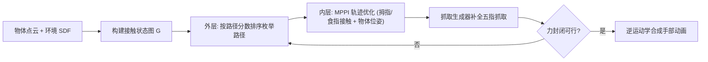

## 一句话总结

针对"初始状态无法直接抓取"的物体（如书架上被夹住的书、平摊在桌面的纸），本文用图搜索 + 最优控制 + 学习型评分函数，合成物理真实、策略多样的灵巧手"预抓取"（pregrasp）操作，让手先借助环境接触把物体挪到可抓状态，再完成抓取。

## 研究背景

- 领域现状：灵巧手抓取合成大多假设物体处于自由空间、无遮挡，或只考虑手与物体这一对交互；纯学习式方法虽然高效，但容易产生穿模、"隔空操控"等物理不真实的动作。
- 核心痛点：真实生活场景里物体常被周围环境遮挡而"初始不可抓"，需要先做一系列非抓握式（nonprehensile）操作——推、撬、倾——把物体调整到可抓状态。引入环境接触会带来接触配置的组合爆炸，现有运动规划器难以处理；而且"当前是否更接近可抓"这一目标本身很难用启发式定义。
- 本文 idea：作者的关键观察是——对任意放置的物体，最多两个手指接触就足以完成非抓握预抓取，因为环境中至少存在一个外部接触点，能与两指接触共同构成力封闭（wrench closure）。这把搜索空间从五指降到两指，使问题可建模为规模合理的混合整数优化。同时用一个从灵巧抓取数据集中学到的"可抓性"度量取代手工启发式。

## 方法

整体框架：给定物体点云、环境 SDF、学到的评分函数 $$f_\theta$$ 和抓取生成器 $$g_\phi$$，方法分三步——先构建"接触状态图"，再在图上做双层轨迹优化（外层离散路径规划 + 内层连续最优控制）搜出拇指/食指接触轨迹与物体 6D 位姿，最后解一串逆运动学（IK）得到完整手部动画。

关键设计：

1. **接触状态图（Contact State Graph）**：先把物体点云用网格简化拟合成 30~50 个三角面片。因为只需考虑拇指与食指，每个节点定义为一对三角面片 $$\boldsymbol{v} = (T^1, T^2)$$，表示两指分别接触的区域。用评分函数对每个节点算两个分数——考虑环境遮挡的 $$s_c$$ 和不考虑环境的 $$s_n$$，只保留高分节点剪枝。为防止两指同时换位，只有共享 $$T^1$$ 或 $$T^2$$ 的节点之间才连边，节点也连自身以允许接触状态保持不变。

2. **双层轨迹优化**：外层把长度为 $$N$$ 的路径按累计分数 $$s_p = s_c(\boldsymbol{v}_1) + \sum_{i=2}^{N} s_n(\boldsymbol{v}_i)$$ 排序，从高到低枚举，首个节点限定在初始可行子集 $$V_c$$ 内。内层对给定路径优化状态变量（拇指/食指接触位置 $$\boldsymbol{p}^1_i, \boldsymbol{p}^2_i$$ 与两个二元接触标志 $$b^1_i, b^2_i$$）与控制变量（目标接触位置），用 PD 式控制力 $$\boldsymbol{f} = -k(\boldsymbol{p}^j - \bar{\boldsymbol{p}}^j)$$ 驱动手指。目标函数直接最大化沿轨迹的可抓性分数之和。由于接触密集控制存在大量局部极小，作者用采样式优化器 MPPI 而非梯度法。

3. **抓取生成器与评分函数**：抓取生成器 $$g_\phi$$ 是三个条件变分自编码器（CVAE）的解码器，在给定拇指/食指接触位置和物体点云后，预测中指、无名指、小指的接触位置补全五指抓取；训练数据由 YCB 物体集出发、通过对种子抓取扰动并校验可行性自动扩增。评分函数 $$f_\theta$$ 是一个 MLP，用 PointNet++ 编码点云与 SDF，再拼接两指接触位置，输出"这两指接触通向可行抓取的概率"，其标签正是用抓取生成器采样 $$P$$ 次后可行抓取的比例。二者均离线训练。

4. **逆运动学动画合成**：在拿到接触轨迹与物体轨迹后，逐帧解 IK 得到手部姿态，目标兼顾满足接触轨迹、避免与环境及自身碰撞、以及运动平滑。作者发现按**逆时间顺序**先解 $$N+1$$ 个关键帧（每个接触阶段首帧 + 末帧）再插值效果更好——因为末帧涉及全部五指、约束最强，逆序求解能让约束较松的早期帧从后一帧的解出发初始化，避免正序求解时手掌突然翻转。

## 实验结果

作者在八个需要非抓握预抓取才能成功的场景上评测（书架上的书、桌沿的直尺、键盘、纸板、餐盘、食物容器、香料架、笔盒里的马克笔），并观察到四类涌现策略：重新摆放露出底面、借周围环境撬起、利用手指摩擦、利用几何特征。两个核心指标是抓取成功率 $$r_{suc}$$（20 次隐空间采样中可行抓取的比例）和达成可行抓取所尝试的路径数 $$N_{path}$$（越少越高效）。所有任务在 i9-9900K + RTX2080 桌面机上 20 分钟内完成。

| 场景 | $$r_{suc}$$ ↑ | $$N_{path}$$ ↓ |
|------|------|------|
| Bookshelf | 0.917 (0.058) | 1.667 (1.155) |
| Plate | 0.800 (0.050) | 1.667 (1.155) |
| Marker | 0.933 (0.058) | 3.667 (2.082) |
| Ruler | 0.817 (0.144) | 3.333 (1.528) |
| Waterbottle | 0.850 (0.180) | 3.000 (1.732) |
| Food container | 0.733 (0.340) | 2.000 (1.000) |
| Keyboard | 0.817 (0.076) | 1.667 (0.577) |
| Cardboard | 0.800 (0.229) | 1.333 (0.577) |

其余实验用文字概括：**泛化性**上，八个场景均用 YCB 训练集之外的物体测试，对可用凸包近似的物体（纸卷、饼干罐）能成功合成，高度非凸物体因网格重建与 IK 碰撞回避两处依赖凸性而受限；物体尺度缩放实验显示键盘场景较稳健，书架场景因缩放改变质心与可达性而波动。**消融**表明评分函数同时输入 SDF 与物体形状信息都不可或缺（去掉任一者 $$r_{suc}$$ 明显下降、$$N_{path}$$ 上升）；IK 逆序求解比正序更连贯。与 kinematics 式方法 ManipNet 对比时，ManipNet 无视周围物体直接去抓，导致严重手物穿模，而本文方法先拉出再抓、全程避碰。

## 亮点与局限

- 亮点：
  - "最多两指接触即可完成非抓握预抓取"的洞察，把组合爆炸的搜索空间大幅压缩，使问题变得可解。
  - 用学习型可抓性度量替代难以定义的手工启发式，且离线训练、在线搜索的分工兼顾了效率与物理真实性。
  - 物理仿真在环，产出的动作被仿真认证为物理可行、被灵巧手 IK 认证为运动学可达，自动涌现出撬、推、摩擦、利用几何等多样策略。

- 局限：
  - 接触阶段的时长是预设的，可能在某些场景产生不自然行为。
  - 假设物体为刚体（接触图构建依赖网格三角面片间距离固定），且难以处理高度非凸物体。
  - 点接触假设使两指抓取不够稳定、较难达成；作者提出未来可引入手掌等更多接触点。

## 延伸思考

- 方法把"离散接触模式选择"（图搜索）与"连续力/轨迹优化"（MPPI）解耦，是接触密集操作规划里很典型的分层思路；与基于强化学习的 in-hand manipulation 相比，它更强调可解释、可认证的物理可行性，而非端到端策略。
- "先学一个可抓性/可达性度量、再用它引导采样式规划"的范式，可迁移到移动操作、装配等其他需要环境接触的任务；把预设的接触阶段时长换成可优化变量，或引入手掌/多指接触，是自然的下一步。
- 对高度非凸物体的限制来自网格重建与碰撞回避两处对凸性的依赖，若换用可微分符号距离场或支持非凸碰撞的 IK 求解器，或能扩展适用范围。
