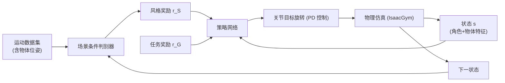

## 一句话总结

用对抗式模仿学习加强化学习训练物理仿真角色，让它们在无需人工标注运动数据的前提下，自然地完成坐下、躺下、搬运等与场景物体交互的任务。

## 研究背景

- 领域现状：机器学习驱动的角色动画进展显著，但多数系统只在简单、同质的环境里控制角色移动，与物体的交互很有限；不少人-场景交互方法还依赖大量人工标注训练数据。
- 核心痛点：传统运动混合/编辑需要大量人工调整；数据驱动的运动学模型在训练分布外场景会产生穿模、脚滑等非物理行为且难以泛化；基于跟踪的物理方法难以组合并在多种技能间平滑切换，无法应对场景交互所需的精细调整。
- 本文 idea：在 Adversarial Motion Priors（AMP）基础上扩展，让判别器和策略网络都以场景上下文（物体信息）为条件，从而在"场景语境"下评估动作真实性（例如只有存在椅子时坐的动作才算真实），并通过随机化物体形状、位置与物理属性让策略从极少的示范泛化到大量物体。

## 方法

整体框架沿用 AMP 的双组件结构：一个策略网络控制角色去最大化任务奖励，一个对抗判别器区分"策略生成的运动"与"运动数据集中的真实运动"，判别器给出的分数作为风格奖励反哺策略。与既有工作的关键区别在于——判别器同时观察角色和场景中的物体，使真实性判断建立在场景语境之上。

关键设计：

- **场景条件判别器**：判别器输入不仅含角色的状态转移，还包含物体的位置与朝向。它同时评估"动作是否像人"以及"动作相对于物体是否合理"。风格奖励定义为 $$r_S(\boldsymbol{s}_t, \boldsymbol{s}_{t+1}) = -\log(1 - D(\boldsymbol{s}_t, \boldsymbol{s}_{t+1}))$$，判别器训练目标沿用 AMP 的对抗损失加梯度惩罚正则项。
- **含物体的状态表示**：状态包含根高度/旋转/线速度与角速度、局部关节旋转与速度、四个关键关节（双手双脚）位置，以及物体位置与朝向；旋转采用 6D 法向-切向编码，物体特征在角色局部坐标系下表示。合计 114 维状态、28 维动作（各关节的指数映射目标旋转）。由于物体在交互中会移动，角色必须实时反应。
- **总奖励构成**：每步奖励为任务奖励与风格奖励的加权和 $$r_t = w_G\, r_G(\boldsymbol{s}_t, \boldsymbol{g}_t, \boldsymbol{s}_{t+1}) + w_S\, r_S(\boldsymbol{s}_t, \boldsymbol{s}_{t+1})$$，其中 $$r_G$$ 编码高层目标（坐到椅子上、把箱子搬到目标位置），$$r_S$$ 对所有任务保持一致。
- **物体随机化 + 参考状态初始化**：每个并行环境用来自 ShapeNet 的不同同类物体填充（约 350 个物体，7 个类别），并随机缩放尺寸、随机放置于 1~10 米范围、朝向在 $$[0, 2\pi]$$ 均匀采样；箱子还随机改变重量。参考状态初始化让角色有时靠近目标、有时远离，显著加速训练并提升自然度。这套随机化是"从少量示范泛化到大量物体"的核心。

## 实验结果

在坐下任务上与运动学模型 NSM、SAMP 以及基于物理的分层方法 Chao et al. 对比（成功以"接近物体时不穿模并完成任务"为准）：

| 方法 | 任务 | 成功率(%) | 执行时间(s) | 精度(m) |
|------|------|-----------|-------------|---------|
| NSM | Sit | 75.0 | 7.5 | 0.19 |
| SAMP | Sit | 75.0 | 7.2 | 0.06 |
| Chao et al. | Sit | 17 | - | - |
| 本文 | Sit | 93.7 | 3.7 | 0.09 |
| SAMP | Lie down | 50 | 9.5 | 0.05 |
| 本文 | Lie down | 80 | 6.9 | 0.3 |

本文在坐、躺任务的成功率显著超越先前方法；运动学模型常见脚滑/悬浮与物体穿透，Chao et al. 的物理方法接近物体时角色多半摔倒。在自身评测中（每任务 4096 次试验），坐/躺/搬运成功率均高于 90%（搬运 94.3%、带重量搬运 97.2%）。策略对外部扰动鲁棒：被 20 个 1.2kg 投射物击打或中途移动物体时，三项任务仍保持 82%~89% 的成功率。仅从 3 米内起步的参考片段，策略却能从 10 米外随机初始化完成任务。

## 亮点与局限

- 亮点：
  - 无需人工标注即可从大规模非结构化运动数据学习场景交互，避免了运动学方法对稀缺高质量人-场景数据的依赖。
  - 场景条件判别器是简洁而关键的创新：把"物体上下文"注入真实性判断，使坐/躺/搬运的语义得以正确约束。
  - 物体随机化带来出色泛化——从 7 个物体的示范推广到约 350 个训练物体并测试未见物体；从单个箱子的 5 分钟示范推广到不同尺寸重量的箱子；箱子非焊接在手上，而是靠接触力驱动，更接近真实操作。
- 局限：
  - 每个任务需单独训练策略，多任务 RL 仍是开放难题。
  - 只处理单物体环境，复杂多物体场景需扩展状态表示（作者设想加入"虚拟眼睛"感知）。
  - 泛化仅限于同类物体的尺寸/重量变化，超出训练分布过远时成功率会下降；也未涵盖跳跃等新技能的泛化。偶有角色停在物体旁或走次优路径而超时失败的情况。

## 延伸思考

- 场景条件判别器的思路可推广到更一般的"上下文条件模仿学习"：凡是动作真实性依赖于环境状态的任务（工具使用、双人交互、地形自适应运动），都可考虑把环境特征喂给判别器。
- 与后续可控角色工作（如同组的 CALM 等 latent 空间条件模型）结合，或许能在保留场景交互能力的同时实现指令式技能组合，缓解"每任务单独训练"的痛点。
- 加入视觉感知（虚拟眼睛/局部占据表示）以扩展到杂乱多物体场景，是把该框架推向实际游戏与仿真应用的关键一步；同时值得追问随机化范围与泛化边界之间的定量关系。
