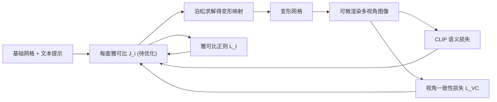

## 一句话总结
TextDeformer 仅凭一句文本提示，就能把一个输入三角网格自动变形成目标形状——通过优化每个三角面的雅可比矩阵（而非直接位移顶点），并借助可微渲染把几何连到 CLIP 这样的预训练图像编码器上，从而得到既有大尺度低频形变又有高频细节、且保持语义对应的高质量网格。

## 研究背景
- 领域现状：文本引导的图像、NeRF、网格生成近年借助 CLIP/扩散模型快速发展；网格变形则长期依赖控制柄、蒙皮、能量最小化等方法，只能覆盖一小部分低频"细节保持"形变，且需要用户手工介入。
- 核心痛点：一是缺乏配对"形状-文字"的大规模 3D 数据集，难以直接训练文本驱动的变形；二是若沿用"顶点直接位移 + 可微渲染"的朴素做法，CLIP 回传的梯度噪声大、局部最优多，常把网格翻面、产生大量自交与噪声法线；三是 CLIP 的逐像素特征是视角相关的，同一顶点在不同视角会收到互相冲突的梯度，导致不连贯的结果（比如把牛变象时长出多个鼻子）。
- 本文 idea：不去生成新几何，而是专注"变形已有网格"。用每面雅可比矩阵参数化变形，让梯度天然偏向平滑的大尺度形变并全局传播；再配一个视角一致性损失和一个恒等保持正则项，保证结果三维连贯且与源网格保持语义对应。

## 方法
整体框架：给定基础网格和文本提示，系统优化一组"每面雅可比矩阵"来定义变形——通过求解泊松方程从雅可比得到变形后的顶点，把变形网格送入可微渲染器得到多视角图像，再用三个损失联合驱动优化：CLIP 语义损失、视角一致性损失、雅可比正则项。

关键设计：

1. **用雅可比表示变形（是什么/为什么/怎么做）**：不直接优化顶点位移，而是为每个面 $$f_i$$ 维护一个矩阵 $$J_i \in \mathbb{R}^{3\times3}$$，初始化为单位阵（即恒等映射）。变形映射 $$\Phi^*$$ 由这组雅可比通过最小二乘泊松问题求得：
$$\Phi^* = \min_{\Phi} \sum_{f_i \in F} \lvert f_i \rvert \lVert \nabla_i(\Phi) - J_i \rVert_2^2$$
其中 $$\lvert f_i \rvert$$ 是面积。这么做的好处是：平滑的雅可比对应低频、大尺度形变；且泊松求解让每个雅可比都影响所有顶点、进而影响所有像素，于是 CLIP 的每个像素梯度都有全局效应，天然规避了局部噪声梯度。思路来自 Neural Jacobian Fields。

2. **语言引导（CLIP 语义损失）**：把变形网格渲染后嵌入 CLIP 得到 $$e_M = \mathrm{CLIP}(\Phi^*(M)) \in \mathbb{R}^{512}$$，把文本提示嵌入得 $$e_P$$，最大化二者余弦相似度。借鉴 StyleCLIP，还引入"方向性"损失：给定描述源网格的基准提示 $$P_0$$，用目标与基准的嵌入差 $$\Delta\mathrm{CLIP}(P,P_0)$$ 对齐形变方向，在优化景观不清晰时提供更强信号。

3. **视角一致性损失 $$L_{VC}$$**：利用 CLIP ViT 的 patch 级深度特征。对每个可见顶点 $$v$$ 在渲染图 $$r$$ 中定位所在像素、关联到最近的 patch 中心，取该 patch 的深度特征，鼓励同一顶点在不同视角下特征一致：
$$L_{VC}(v) = \sum_{i} \sum_{j \neq i} \mathrm{sim}\big(T_k(P_{(v,r_i)}), T_k(P_{(v,r_j)})\big)$$
用最后一个 transformer block 的 token 输出，并借助减小初始卷积步长得到重叠 patch、插值位置编码以获得更细的特征分辨率。这一项显著减少了"同一区域被不同视角拉向不同形变"造成的伪影。

4. **雅可比恒等正则 $$L_I$$**：惩罚雅可比偏离单位阵的程度，$$L_I = \frac{\alpha}{\lvert F \rvert} \sum_i \lVert J_i - I \rVert^2$$，超参 $$\alpha$$ 控制变形强度——越大越贴近源形状，越小变形越自由但可能出现伪影，中间值效果最好。

## 实验结果
主实验为定量评估：在 111 个"文本-源网格"对上生成变形网格，用 CLIP-L/14 做检索任务计算 R-Precision（越高越准），并统计自交面占比（越低几何越干净）。

| 方法 | R-Precision (L/14) ↑ | 自交比例 ↓ |
|------|----------------------|-----------|
| Ours | 55.2% | 3.2% |
| Ours-noVP（去视角一致性） | 51.5% | 3.3% |
| Ours-Verts（改用顶点位移） | 55.4% | 67.7% |
| CLIP-Mesh | 57.4% | 62.8% |
| Text2Mesh | 12.7% | 17.3% |

结论：本文方法与 CLIP-Mesh 的语义检索精度相当，但自交比例低了一个数量级（3.2% vs 62.8%），几何质量远胜；视角一致性损失能提升检索精度；改用顶点位移虽 R-Precision 略高，却带来 67.7% 的灾难性自交，印证了雅可比表示对几何质量的关键作用；所有方法在语义精度上都大幅超过更偏风格化的 Text2Mesh。定性比较中还显示本文结果比 CLIP-Mesh 更语义准确、表面更平滑，且相比 Stable Dreamfusion 更少出现"多面 Janus"伪影。每对形状约需 1.5 小时、5000 次迭代。

## 亮点与局限
- 亮点：
  - 零样本、无需任何 3D 数据集或标注，纯靠预训练视觉-语言模型驱动变形。
  - 雅可比参数化让梯度全局传播，同时覆盖低频大形变与高频细节，几何自交极少、表面平滑。
  - 视角一致性损失有效缓解多视角冲突与 Janus 效应；恒等正则项给用户提供可调的"变形强度"旋钮，并保持源到目标的语义对应（腿变腿、脸部器官对应）。
- 局限：
  - 每个"网格-提示"对需约 1.5 小时逐实例优化，无法即时生成。
  - 依赖 CLIP 梯度，本质是在改变已有拓扑的顶点位置，难以生成全新拓扑结构或大幅增删部件。
  - 结果受源网格结构强约束（这是设计取向，也意味着对某些目标形状表达力受限）；超参 $$\alpha$$、$$\beta$$ 需要人工调节。

## 延伸思考
论文在讨论里提出的自然延伸是：把"逐实例优化"升级为"学习提示驱动的变形空间"——由于雅可比可由一次前向传播预测，若在形状集合上训练，既能大幅提速，也可能通过神经正则进一步提升质量。另一方向是接入检索模块，构建让艺术家自由组合源网格与提示、探索结果的创作工具。更广地看，本工作与 Neural Jacobian Fields 一脉相承，说明"内在映射/雅可比"这类表示在把 2D 先验（CLIP、扩散模型）迁移到 3D 几何编辑时，是抑制噪声梯度、保证几何质量的有力工具，值得在后续文本到 3D、可微渲染优化中继续复用。
