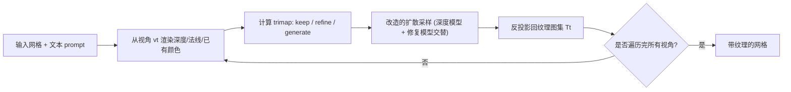

## 一句话总结

TEXTure 借助预训练的深度到图像扩散模型，对一个 3D 网格从多个视角迭代"上色"，并用一个动态的三分区（trimap）采样机制解决多视角贴图不一致与接缝问题，从而在几分钟内生成、迁移和编辑高质量纹理。

## 研究背景

- 领域现状：文本到图像扩散模型已能生成精细的 2D 图像，也出现了 DreamFusion、Latent-Paint 等把 2D 扩散先验用于 3D 生成的工作。
- 核心痛点：已有的 3D 纹理方法要么依赖 CLIP 相似度优化（Text2Mesh、CLIP-Mesh），要么用分数蒸馏（score distillation）间接调用扩散模型（Latent-Paint）。前者难以保证全局一致，后者收敛慢、丢失高频细节，整体质量都远不及 2D 图像生成。
- 本文 idea：不再间接蒸馏，而是直接在渲染图上跑完整的深度条件去噪流程；关键在于设计一套针对"哪些区域该画、哪些该保留、哪些该重绘"的采样策略，让不同视角的绘制结果无缝拼合。

## 方法

整体框架：给定一个网格，从固定的一组视角依次渲染，每次渲染出深度图与法线图，据此把当前视图划分为 keep / refine / generate 三类区域，喂入一个改造过的深度到图像扩散过程生成新图像，再把图像反投影回纹理图集（UV atlas），如此迭代直到覆盖整个物体。

关键设计：

- **动态三分区（Trimap）**：每次绘制前，用一张随迭代更新的元纹理图 $$\boldsymbol{N}$$ 记录每块区域"上次是从多大的入射角度上色的"（以相机坐标系下面法线的 $$z$$ 分量衡量三角面截面）。首次可见的区域标为 generate（需要新画）；已画但当前视角更佳的标为 refine（值得重绘）；否则标为 keep（保持不变以维持一致性）。

- **掩膜生成保留 keep 区**：深度到图像模型本是整图生成，为了固定 keep 区，借鉴 Blended Diffusion，在每一步去噪时把已有内容 $$\boldsymbol{Q}_t$$ 的加噪版本注入 keep 区。latent 更新写作 $$\boldsymbol{z}_i \leftarrow \boldsymbol{z}_i \odot \boldsymbol{m} + \boldsymbol{z}_{Q_t} \odot (1 - \boldsymbol{m})$$，keep 区被强制维持原值。

- **一致的 generate 区生成**：只固定 keep 区还不够，深入 generate 区后生成主要受采样噪声支配、与已画部分割裂。作者让深度条件模型 $$M_{\text{depth}}$$ 与专门训练做区域补全的修复模型 $$M_{\text{paint}}$$ 在采样早期交替使用（如前 10 步用深度模型、10–20 步用修复模型、之后再回到深度模型），兼顾几何贴合与全局连贯。

- **refine 区的棋盘掩膜重绘**：对需要重绘的区域，在采样前若干步（实验用前 25 步）施加交替的棋盘格掩膜，把噪声引导到与已有纹理局部对齐的取值上，从而在不丢弃原纹理信息的前提下改善分辨率。

- **纹理迁移与编辑扩展**：迁移时不需要显式的表面到表面映射，而是借鉴 Textual Inversion 与 DreamBooth，学习一个代表纹理的伪 token $$\langle S_{\text{texture}}\rangle$$ 和若干视角 token，并配合基于网格 Laplacian 谱的"谱增强"（对源网格做低频形变）来把纹理与具体几何解耦；纹理还可只从少量图像中学到。编辑时把目标区域标为 refine、其余标为 keep，即可用文本或用户涂鸦驱动局部修改。

## 实验结果

主实验是与两个代表性基线的用户研究（30 名受访者，1–5 分评分，运行时间越低越好）：

| 方法 | 整体质量↑ | 文本契合度↑ | 运行时间(分钟)↓ |
|------|-----------|-------------|------------------|
| Text2Mesh | 2.57 | 3.62 | 32 (6.4×) |
| Latent-Paint | 2.95 | 4.01 | 46 (9.2×) |
| TEXTure | 3.93 | 4.44 | 5 |

TEXTure 在整体质量与文本契合度上都显著领先，同时把生成时间从 19–45 分钟压缩到约 5 分钟（相对 Text2Mesh 提速 6.4×、相对 Latent-Paint 提速 9.2×）。另有一项相对排序实验也显示 TEXTure 的平均排名明显更优。定性上，它能处理海龟壳、大象、克莱因瓶等复杂几何，并保持局部与跨视角的一致性。

## 亮点与局限

- 亮点：
  - 直接在渲染图上跑完整去噪，绕开分数蒸馏的慢收敛与高频丢失，几分钟即可出高质量纹理。
  - trimap + 交替扩散模型 + 棋盘掩膜的组合，系统性地解决了多视角贴图的接缝与全局一致性问题。
  - 一套框架同时覆盖生成、迁移、文本/涂鸦编辑，迁移无需表面映射或显式重建。
- 局限：
  - 依赖固定视角序列，作者也指出视角顺序会影响结果，复杂或凹陷严重的几何可能仍有遮挡盲区。
  - 采样中交替使用修复模型可能偏离深度条件、引入不该有的几何变化，需要靠调度平衡。
  - 评测以用户主观打分为主，缺少大规模客观定量指标。

## 延伸思考

TEXTure 展示了"把 2D 扩散先验以完整去噪方式引导到 3D"这条路线相对分数蒸馏的效率优势，这一思路后续在 3D 生成与纹理领域被广泛借鉴。值得追问的是：固定视角迭代绘制的贪心性质是否会累积误差，能否用更全局的联合优化或多视角一致性约束（如后来的多视图扩散）替代；以及谱增强这种几何解耦技巧在更一般的概念学习中是否也有价值。
