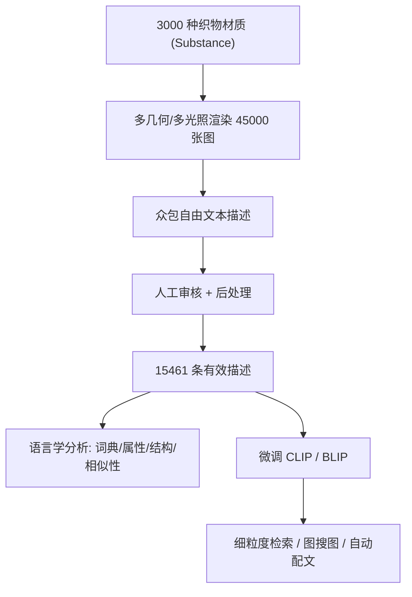

## 一句话总结

本文构建了 text2fabric 数据集——把 3000 种织物材质的 15000 余条自然语言描述与照片级渲染图配对，系统分析了人们如何用语言描述织物外观，并用它微调 CLIP/BLIP，显著提升细粒度检索与自动配文等应用。

## 研究背景

- 领域现状：多模态 NLP 与视觉-语言模型（CLIP、BLIP、扩散模型等）让图文交互成为可能，但它们训练于互联网上数亿条自然图像与泛化的粗粒度描述。
- 核心痛点：材质外观传统上靠标签/关键词描述，表达力有限、需预先掌握专业词汇，且描述体系割裂；而大模型对材质这类领域特定、细粒度概念的敏感度不足。
- 本文 idea：以"织物"这一人人熟悉、外观多样的材质类别为切入口，用自由文本代替标签来刻画外观；先采集并分析大规模图文配对数据，再用少量高质量数据把通用视觉-语言模型"专精化"到材质外观域。

## 方法

整体上分两大部分：一是通过众包+审核构建 text2fabric 数据集并做语言学分析，二是用该数据集微调 CLIP/BLIP 并落地检索与配文应用。

关键设计：

1. **数据采集与质量控制**：用 Substance Stager 对 3000 种织物（含程序化材质与高质量扫描）在统一基线几何+室内光照下渲染 4K 图，另用球/平面、悬垂/非悬垂等 4 种几何和室外/影棚 2 种光照追加 42000 张图以增强鲁棒性。描述由 122 名通过资格测试的英语母语者众包提供，限定 20–100 词，每张图至少 5 条描述，单人贡献不超过全量 9%；再经人工审计（四分类接受/拒绝 + 5 分评级），最终保留 15461 条有效描述（拒绝率约 19.3%）。

2. **语言的可压缩性分析**：对词元做词形还原后，用"平均缩减频率" $$\mathit{arf}(w)$$（在绝对频率基础上加入分散度）作为词的显著性排序。定义描述覆盖率 $$\mathit{cov}_k(d) = n_k(d) / n_{\text{tot}}(d)$$，其中 $$n_k$$ 是描述 $$d$$ 中属于最显著 $$k$$ 个词元子集的数量。结果显示 84 个词元即可覆盖 75\% 的描述，524 个词元覆盖 95\%——存在一套紧凑的共享词典。

3. **属性归纳与结构分析**：借助 ConceptNet Numberbatch 词嵌入 + 亲和传播聚类，把 524 词的词典归纳为 11 个关键属性（颜色、明度、金属感、图案、织物类型、缝纫、触感、重量、用途、做旧、军事风）；其中颜色、图案、触感、织物类型出现在 70\% 以上的描述里。再用秩积 $$\Psi(a) = \left( \prod_{i=1}^{D} r_{a,i} \right)^{1/D}$$ 衡量各属性在描述中出现的先后顺序，Kruskal-Wallis 检验证实顺序差异显著——人们描述织物时遵循一定结构（颜色最先，用途最后）。

4. **描述一致性**：用 sentence-T5 与 MPNet 句向量算余弦相似度，比较同图内（intra-image）与跨图（inter-image）描述相似度，并用 ANOSIM 做显著性检验，证明同一织物会引出彼此显著更相似的描述。

5. **视觉-语言模型微调**：以 CLIP ViT-B/16 为主干微调（数据按材质划分训练/测试以防泄漏，训练 12 epoch，学习率 $$1\text{e}{-6}$$，Adam，batch 128，单张 RTX3090 约 5 小时），并对比 BLIP、无预训练 BLIP 等，落地文本细粒度检索、图搜图和自动配文三类应用。

## 实验结果

主实验为基线几何上的文本→材质细粒度 Top-K 检索召回率（在全部 3000 种材质、测试集描述、训练未见的图文对上评估）：

| 方法 | Top-1↑ | Top-5↑ | Top-10↑ | Top-100↑ |
|------|--------|--------|---------|----------|
| Native CLIP | 2.94\% | 8.31\% | 12.59\% | 41.29\% |
| Native BLIP | 3.42\% | 9.94\% | 14.60\% | 34.26\% |
| BLIP (无预训练) | 1.60\% | 5.98\% | 10.64\% | 34.36\% |
| 本文 (微调 CLIP) | 13.81\% | 33.91\% | 46.76\% | 87.63\% |

微调后 Top-1 检索率相对原生 CLIP/BLIP 提升约 4.8/4 倍，各 Top-K 至少 2.12 倍。补充实验表明：在训练未见的悬垂平面几何上模型仍显著受益，且用 4 种几何训练比单一几何泛化更好；检索性能在前约 2000 条描述内快速增长后边际递减；"图多描述少"与"图少描述多"在等描述量下效果相当。无预训练 BLIP 明显更差，说明大规模先验与本文高质量数据的结合缺一不可。

## 亮点与局限

- 亮点：
  - 首个把细粒度材质外观与自由文本配对的大规模数据集，并附带对"人如何描述织物"的系统语言学分析（紧凑词典、11 属性、描述结构、一致性）。
  - 证明相对少量的高质量领域数据即可把通用视觉-语言模型专精化到材质域，检索与配文均大幅提升。
  - 采集与分析方法论具有向其他材质类别推广的潜力，数据与模型公开。
- 局限：
  - 聚焦织物单一类别，"军事风"等属性带有数据集偏置，未必泛化到其他材质。
  - 描述者限定为英语母语、熟悉时尚/设计的人群，可能引入语言与审美偏差。
  - 渲染均基于 Substance 素材与受控光照/几何，与真实照片仍存在域差异。

## 延伸思考

- 这类"高质量小数据专精大模型"的思路可延伸到 SVBRDF 估计、材质编辑与生成——用自然语言作为可控的外观编辑接口。
- 归纳出的属性词典与描述结构，可作为文本到材质生成/扩散模型的可解释条件或先验。
- 若能把方法推广到金属、木材、皮革等更多材质类别，并纳入多语言、多文化描述者，有望构建更通用的"材质外观语言"基础模型。
