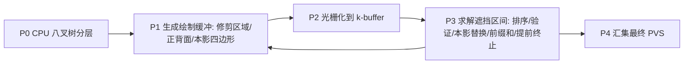

## 一句话总结

提出 trim region（修剪区域）方法，用纯光栅化管线在物体轮廓边缘做局部"啃削"来隐式实现遮挡体收缩定理，从而在任意 3D 场景上首次实现实时在线的 from-region 潜在可见集（PVS）计算，60 Hz 处理百万级三角形场景。

## 研究背景

- 领域现状：遮挡剔除普遍依赖潜在可见集（PVS，可见集合的一个保守超集）。from-point PVS 针对单个视点、每帧在线计算；from-region PVS 针对一个"视野胞元"（viewcell，即允许的相机位姿区域）内的任意视点都成立，但它本质是一个 4D 问题，计算代价极高，几乎总是离线预计算。
- 核心痛点：离线预计算把 PVS 限制在静态场景，且存储开销巨大（尤其需要细粒度区域时）；而流式渲染、云/边缘服务器向轻量客户端（如无线 VR 头显）推送几何等新场景，要求区域大小可配置的**在线** from-region PVS。此前唯一的在线尝试 Instant Visibility 只能处理 2.5D 城市场景，把建筑立面当作大凸遮挡体做 2D 收缩；推广到一般 3D 物体需要三维几何腐蚀，对任意网格和视野胞元很难解析求解。
- 本文 idea：与其对整个物体做 3D 腐蚀，不如只在物体**轮廓边缘**做局部修剪。作者观察到遮挡体收缩的效果只发生在轮廓处的去遮挡（disocclusion）区域，因此只需在屏幕空间沿轮廓边缘"啃"掉一小块（即 trim region），就能用光栅化管线等价地实现收缩定理，简单且高效。

## 方法

整体框架：方法建立在 Wonka 等人的遮挡体收缩定理和 Décoret 等人的腐蚀定理之上——从收缩后的遮挡体做 from-point 可见性测试，等价于对原遮挡体做 from-region 可见性测试。关键洞察是收缩只在轮廓处产生新的去遮挡，于是把"整体 3D 腐蚀"退化为"沿轮廓边缘在图像空间做局部修剪"。整个系统用一棵包裹场景的八叉树，运行时按视点从八叉树剥离出一层层互不遮挡的节点层（layer），逐层用五个阶段的 GPU 管线求解 PVS。

关键设计：

1. **遮挡区间与修剪区域**。沿一条视线，遮挡体的进入点 $$f$$ 与离开点 $$b$$ 之间构成一个遮挡区间。相机在半径 $$\lvert \Delta \rvert$$ 的视野胞元内平移会让轮廓 $$s$$ 处产生去遮挡：形成完全被遮的本影（umbra）$$U$$ 和被重新暴露的半影（penumbra）$$P$$。要模拟平移 $$\Delta$$ 造成的去遮挡，只需从遮挡体上移除由 $$f$$、$$b$$、$$s$$ 界定的那一小块 trim region $$R$$。实现上把轮廓边沿其图像空间法线的负方向 $$-n$$ 位移距离 $$d$$ 即可生成 trim region 四边形——沿边法线方向去遮挡速率最大，这个方向给出最保守（最大）的修剪。与原始收缩论文假设远平面在无穷远不同，本文使用有限远平面，把修剪量压到必要的最小值，得到更强的遮挡效果和更小的 PVS。

2. **视锥自适应与双锥视野胞元**。相机移动会改变视锥，原本被裁剪的几何在新位置可能进入视野。作者按 Wonka 的做法把视点沿光轴后移 $$z = \lvert \Delta \rvert / \tan\alpha$$（$$2\alpha$$ 为视锥张角）到 $$v^{*}$$，用一个覆盖胞元内所有视锥的统一视锥来计算。此时支持的视野胞元是一个双锥形（而非简单球体），以保证胞元内任何视点掠过轮廓 $$s$$ 的视线都不会误入本影 $$U$$。

3. **一条视线上的多个遮挡体（遮挡体融合与 occludee 收缩）**。对同一视线上更远的第二个物体 $$O'$$，先算它相对 $$v^{*}$$ 的 trim region $$R'^{*}$$，再按它与本影 $$U$$ 的关系分类：被 $$O^{*}$$ 完全遮挡则直接丢弃；完全不相交则 $$O'$$ 自己产生新本影；部分相交时只保留 $$R'^{*} \setminus U$$ 来修剪 $$O'$$。这正是 Décoret 提出的 occludee 收缩优化——本文是首个把它落地实现的工作，并对自遮挡也做了支持，显著提升 PVS 紧致度。

4. **八叉树分层剥离与遮挡区间求解**。由于修剪顺序会影响 trim region 形状，必须先建立深度序。八叉树按物体 AABB 细分并做邻居层级平衡（相邻节点层级差不超过 2）；分层算法只把"依赖已满足"的节点入队（改进了 Laine 的 FIFO 方法，避免节点被反复重访），在单 CPU 核上 <1 ms 完成。P3 阶段在每个像素上对正/背面 k-buffer 按深度排序，贪心找出简单遮挡区间 $$[f;b]$$ 并要求区间内至少含一个 trim region 片段 $$t$$（$$f \le t \le b$$）才算有效；随后用本影替换背面，对序列赋 $$+1$$（前面）/$$-1$$（本影），做前缀和判断哪些片段被本影覆盖可删除。若出现未被任何有效区间覆盖的"终结面"（terminator face），则该像素被标记 sealed，射线提前终止。排序采用混合策略：序列长度 <8 用单线程顺序排，否则写入"复杂像素"缓冲交给整组线程做双调排序。这套保守启发式刻意偏向"宁可多误报，绝不漏报"，以应对非流形、非水密的多边形汤。

## 实验结果

在 RTX 4090 上、1920×1080 分辨率、5 个场景（Viking village 3.5M、Robot lab 2.7M、Sponza 0.5M、Sun temple 0.6M、City 15.7M 三角形）上评测，与 from-region 方法 COS、SAS 及 from-viewpoint 的遮挡查询 OQ 对比。TR 整体在 50-60 Hz，视野胞元从 5 cm 增到 30 cm 时运行时间仅增 10-20%；P1 几何生成占 60-70% 时间。下表以 Robot lab 为例对比各方法核心表现：

| 方法 | 类型 | 运行时间 | PVS 大小(占全场景) | 假阴性 |
|------|------|---------|------------------|--------|
| TR（本文） | from-region | 50-60 Hz（最差 22.26 ms） | ~9% | 低（PSNR 63.3 dB） |
| COS | from-region | 显著更慢，随胞元增大急剧恶化 | ~17% | 几乎无（解析法） |
| SAS | 近似 from-region | 很快 | 大胞元漏 25-30% 可见图元 | 大胞元严重伪影 |
| OQ | from-viewpoint | 20-70 ms | 依赖八叉树深度 | 假正例是 TR 的 2-3 倍 |

其余结论以文字补充：TR 的 PVS 通常只占全场景 1-12%（Sponza 太小除外），比稠密采样得到的真值大 1.7-3 倍，预计能带来 1-2 个数量级的下游处理加速；假阴性像素在胞元 15-25 cm 内低于 0.005% 的可接受阈值，challenging 场景下 PSNR 达 58-63 dB（远高于流式渲染可接受的 20-25 dB）。内存主要由固定大小 k-buffer 决定，随活跃像素数线性增长，且平均 trim 序列长度对胞元大小不敏感（得益于提前终止与分治）。

## 亮点与局限

- 亮点：
  - 首个在非流形、非水密的一般 3D 场景上实时计算 from-region PVS 的系统，几乎不限制输入几何（支持多边形汤、实例化，只需能通过共享边识别三角形邻接）。
  - 把难解的 3D 几何腐蚀巧妙转化为屏幕空间的轮廓修剪，纯光栅化 + GPU-only 执行，回避了 CPU 光栅化吞吐低、CPU-GPU 同步延迟、回读带宽低等一系列老问题。
  - 首次实现 occludee 收缩并支持自遮挡，紧致度优于此前方法；八叉树分层剥离改进了最小分层算法。
  - 运行时间对胞元大小不敏感，非常契合流式/低延迟 VR 的"提前几帧预测 PVS"需求。

- 局限：
  - 去遮挡是基于局部识别的轮廓；相机偏移过大时会露出不同轮廓，需要新的 trim region，因此只在中等大小胞元内保证正确，胞元越大离群误差越多。
  - 保守启发式偏向多误报，PVS 比真值大 1.7-3 倍。
  - 依赖光栅化，极薄/极小三角形可能不占任何片段而漏进 PVS，残留假阴性多源于非水密/非流形模型或封闭物体内部的图元。
  - 相比解析的 COS 会额外承受所有光栅化方法固有的浮点/离散化误差。

## 延伸思考

- 作者指出的方向包括：把 trim region 扩展为粗到细的剔除（先以八叉树节点为包围体）、利用 GPU 多视口同时渲染扩展来细分视线空间以减小离散化误差、以及把可见性信息用于阴影或全局光照。
- 这条思路与后续同组的 NeuralPVS（SIGGRAPH Asia 2025，用神经网络在 froxel 表示上估计 from-region 可见性）形成有趣对照：本文是几何/光栅化的解析路线追求保守正确，后者是学习路线追求速度，二者对"在线可见性"这一难题给出了截然不同的答案。
- 值得追问：保守启发式带来的 1.7-3 倍膨胀在带宽极受限的流式场景下是否可接受？能否在假阴性可控的前提下引入少量非保守修剪来进一步压紧 PVS？
