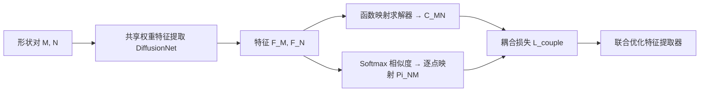

## 一句话总结

提出首个全无监督的谱形状匹配框架，用一个可微的"耦合损失"把函数映射（functional map）和逐点映射（point-wise map）绑在一起联合优化，无需任何后处理即可直接得到高质量的逐点对应，且在近等距、非等距、部分形状等多种困难场景下都超越了以往方法（甚至超过有监督方法）。

## 研究背景

- 领域现状：非刚性 3D 形状匹配长期依赖函数映射框架——把两形状之间的对应关系编码进一个小矩阵 $$C_{MN}$$。深度函数映射方法用神经网络（如 DiffusionNet）学习特征替代手工描述子，在近等距匹配上已接近完美。
- 核心痛点：现有深度方法几乎只优化函数映射本身，推理时再用现成的后处理（最近邻搜索、ZoomOut、PMF 等）把函数映射转成逐点映射。这种"先匹配、再精修"的两阶段流程在初始函数映射有误差时容易得到次优结果；同时无监督方法在非等距、部分形状等困难场景下与有监督方法差距很大，而有监督方法又容易过拟合。
- 本文 idea：受 Ren 等人公理化方法的启发——好的函数映射应当对应一个合法的逐点映射——作者把这一关系写成可微损失，在训练时就强制函数映射与逐点映射彼此关联并同时优化，从而在推理时直接产出逐点映射，彻底摆脱后处理。

## 方法

整体框架是一个孪生（共享权重）特征提取网络：一对形状 $$M$$ 和 $$N$$ 各自经 DiffusionNet 提取逐顶点特征 $$F_M$$、$$F_N$$；一路用可微的函数映射求解器算出 $$C_{MN}$$，另一路直接由特征相似度算出逐点映射 $$\Pi_{NM}$$；最后用耦合损失把两者约束到一致。整个过程全无监督。

关键设计：

1. **可微逐点映射计算**：理论上逐点映射应是（部分）置换矩阵，但离散置换不可导。作者用带温度的 softmax 把特征相似度转成软对应矩阵，逐行归一化保证非负且行和为一：
   $$\Pi_{NM} = \mathrm{Softmax}(F_N F_M^\top / \tau)$$
   软对应把匹配解释成对所有顶点的概率分布，而不是被死死限制的顶点到顶点匹配。这一点对离散化不一致（网格疏密不同）的形状对尤其重要——目标点可以落在三角形内部，是三个顶点的凸组合。

2. **耦合损失**：把函数映射与由逐点映射诱导出的函数映射之差作为损失，强制二者一致：
   $$L_{\text{couple}} = \lVert C_{MN} - \phi_N^\dagger \Pi_{NM} \phi_M \rVert_F^2$$
   其中 $$\phi$$ 是拉普拉斯特征函数，$$\dagger$$ 为 Moore-Penrose 伪逆。相比公理化方法把该关系当成硬约束、并交替更新两者，这里是软约束下的同时优化。总损失为结构正则（双射性 + 正交性）加耦合损失的加权和：
   $$L_{\text{total}} = L_{\text{fmap}} + \lambda_{\text{couple}} L_{\text{couple}}$$

3. **测试时自适应（test-time adaptation）**：推理阶段对每个测试形状对单独迭代优化特征提取器（15 步），因为函数映射和逐点映射都来自同一份特征，更新特征即可让两者同步精修。这是一种可微的精修，天然融入学习范式，替代了传统后处理。

4. **非等距的平滑约束**：针对非等距匹配，引入基于 Dirichlet 能量的平滑惩罚，鼓励 $$M$$ 上相邻顶点被匹配到 $$N$$ 上相邻顶点：
   $$L_{\text{dirichlet}} = \lVert \Pi_{NM} X_M \rVert_{L_N}^2$$
   该项仅在测试时自适应阶段启用，以避免训练时退化为"所有顶点匹配到同一点"的平凡解。近等距场景下推理时还会先把逐点映射转成函数映射再转回，相当于在谱域做低通滤波，抑制错配。

## 实验结果

在近等距基准（FAUST / SCAPE / SHREC'19）上以平均测地误差（×100，越低越好）评估，重点看跨数据集泛化（训练与测试不同）。下表节选代表性基线：

| 方法 (训练集→测试集) | FAUST→SCAPE | FAUST→SHREC'19 | SCAPE→SHREC'19 |
|------|------|------|------|
| GeomFMaps（有监督）| 3.4 | 9.9 | 12.2 |
| Deep Shells（无监督）| 5.4 | 27.4 | 23.4 |
| DUO-FMNet（无监督）| 4.2 | 6.4 | 8.4 |
| AttentiveFMaps（无监督）| 2.6 | 6.4 | 9.9 |
| 本文（无监督）| **2.2** | **5.7** | **6.7** |

在同数据集训练/测试时本文也普遍最优（如 FAUST 上 1.6、SCAPE 上 1.9），且无需任何后处理。跨数据集列的优势尤其明显，说明泛化能力更强。论文进一步在各向异性网格、拓扑噪声、非等距（DT4D-H、SMAL）以及部分形状（SHREC'16 CUTS/HOLES）等九个数据集上验证，均取得当时最先进的结果。

## 亮点与局限

- 亮点：
  - 首个能统一覆盖近等距、非等距、部分形状的全无监督谱匹配框架；耦合损失把函数映射与逐点映射的关系显式建模，思路简洁且可微。
  - 推理直接输出逐点映射、无需后处理，还对谱分辨率（特征函数数量）的选择更鲁棒。
  - 全部实验共用同一套超参数，说明方法泛化性好、调参负担小；模型仅约 51 万参数，很轻量。
- 局限：
  - 依赖谱嵌入与拉普拉斯特征函数，对严重拓扑噪声/非流形网格的鲁棒性仍受基函数质量制约。
  - 测试时自适应对每个形状对单独迭代优化，会增加推理开销。
  - 软对应经 softmax 得到，温度等超参对结果有影响；部分匹配仍需借助函数映射的斜对角结构等先验。

## 延伸思考

- 耦合损失本质是"让两种表示互相监督"的自洽性约束，这一思路可迁移到其它"隐式表示 + 显式输出"的配对问题（如隐式场与显式网格、隐空间与像素空间）。
- 测试时自适应把精修变成可微优化，和近年 test-time training / 每实例过拟合的趋势一致，值得思考如何在保持精度的同时降低单对推理成本。
- 方法目前面向成对匹配，扩展到形状集合的循环一致多形状匹配、或与生成式形变模型结合做形变迁移，是自然的后续方向。
