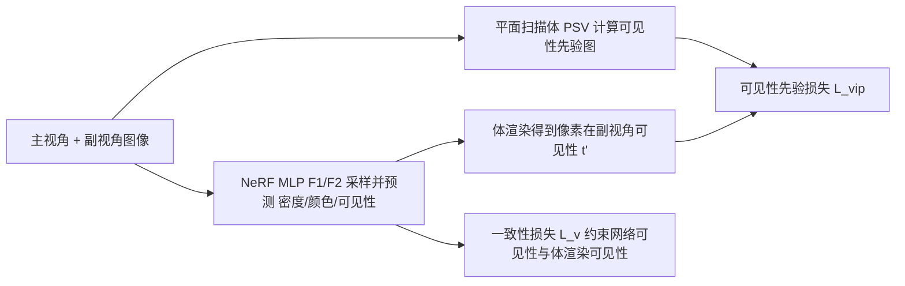

## 一句话总结

ViP-NeRF 用平面扫描体（PSV）无需任何预训练地估计出稠密的"像素可见性先验"，并以此正则化稀疏输入下的 NeRF 训练，同时把 NeRF 改造成直接输出可见性以压缩训练开销，在少视角新视角合成上超过了包括依赖学习先验在内的现有方法。

## 研究背景

- 领域现状：NeRF 通过隐式表示与体渲染在新视角合成上取得了出色效果，但通常需要每个场景数百张图像。面向 VR/AR、机器人、自动驾驶等只有极少输入视角的"稀疏输入 NeRF"问题成为研究热点。
- 核心痛点：稀疏视角下体渲染方程欠约束，模型过拟合输入视角、学到错误的场景深度，导致新视角出现模糊、鬼影、漂浮物等失真。已有正则化方法多依赖预训练网络补全稠密深度（如 DDP-NeRF），但这类深度先验存在泛化误差，可能反而损害性能。
- 本文 idea：作者提出一个假设——在稀疏视角下，估计像素在不同视角间的"相对可见性"要比估计"绝对深度"更可靠。因此改用一个稠密可见性先验来约束 NeRF，且该先验用给定的稀疏输入视角即可算出，不需要在大数据集上预训练。

## 方法

整体上，ViP-NeRF 在标准 NeRF 训练之上叠加了一个跨视角的可见性正则项：从一对输入视角（主视角 primary / 副视角 secondary）用平面扫描体算出一张二值可见性先验图，用它监督 NeRF 预测的"某主视角像素在副视角是否可见"。为避免朴素计算带来的 $$N^2$$ 次 MLP 查询开销，作者把 NeRF 改写为直接输出视角相关的可见性。

关键设计：

1. **可见性先验的计算（PSV + 阈值）**：把副视角图像按不同深度平面（在逆深度上均匀采样 $$D$$ 个）warp 到主视角，得到一组扭曲图像即平面扫描体。在每个平面 $$k$$ 计算与主视角图像的逐像素 L1 误差图 $$E_k = \lVert I^{(1)} - I^{(2)}_k \rVert_1$$，取跨平面最小误差 $$e(q)=\min_k E_k(q)$$，再阈值化得到二值先验 $$\tau'(q)=\mathbf{1}\{\exp(-e(q)/\gamma)>0.5\}$$。直觉是：某像素若在任一平面找到低误差匹配，说明它在副视角也可见；反之可能是被遮挡，也可能是强镜面物体。

2. **只在"可见"处施加约束**：由于 $$\tau'=0$$ 的像素既可能是遮挡也可能是镜面反射导致颜色跨视角剧变，先验在此处不可靠。因此损失设计为单边形式，只惩罚"先验说可见、网络却认为不可见"的情况：$$L_{vip}(q)=\max(\tau'(q)-t'(q),\,0)$$，其中 $$t'(q)=\sum_i w_i T'_i$$ 是体渲染得到的像素副视角可见性。这一约束跨视角对成立，比只在单视角内正则化更充分。

3. **高效预测可见性**：朴素做法需为每个 3D 点沿副视角射线再采样求 $$T'_i$$，总计约 $$N^2$$ 次查询。作者让颜色 MLP $$F2$$ 额外输出视角相关可见性：$$c_i,\hat{T}_i=F2(h_i,v)$$ 与 $$c'_i,\hat{T}'_i=F2(h_i,v'_i)$$，复用 $$F1$$ 的隐特征 $$h_i$$，把开销降回 $$N$$ 次查询。

4. **一致性损失**：为使网络直接输出的 $$\hat{T}_i$$ 与体渲染得到的 $$T_i$$ 保持一致，引入带停梯度的双向损失 $$L_v=\sum_i \big(\mathrm{SG}(T_i)-\hat{T}_i\big)^2+\big(T_i-\mathrm{SG}(\hat{T}_i)\big)^2$$，让先验带来的更新更高效地回传到 $$F1$$。总损失为 MSE、稀疏深度（沿用 DS-NeRF 的 SfM 稀疏深度）、可见性先验、一致性四项的线性组合。

## 实验结果

在 RealEstate-10K 与 NeRF-LLFF 两个数据集上评测 2/3/4 视角的稀疏设定。下表取 RealEstate-10K 上 2 视角这一主设定与代表性基线对比（↓越低越好，↑越高越好）：

| 方法 | 是否用学习先验 | LPIPS ↓ | SSIM ↑ | PSNR ↑ |
|------|------|--------|--------|--------|
| InfoNeRF | 否 | 0.6796 | 0.4653 | 12.30 |
| DietNeRF | 是 | 0.5730 | 0.6131 | 15.90 |
| RegNeRF | 否 | 0.5307 | 0.5709 | 16.14 |
| DS-NeRF | 否 | 0.4273 | 0.7223 | 21.40 |
| DDP-NeRF | 是 | 0.2527 | 0.7890 | 21.44 |
| ViP-NeRF | 否 | **0.1704** | **0.8087** | **24.48** |

在 RealEstate-10K 上 ViP-NeRF 各视角设定全面领先。NeRF-LLFF 上则与 RegNeRF/DS-NeRF 互有胜负、总体相当（LPIPS 略优，SSIM/PSNR 与最强基线接近）。此外，作者以稠密视角训练的 NeRF 作为参考，验证了可见性先验的可靠性（ViP-NeRF 的可见性 F1 达 0.89 / 0.83，显著高于 DDP-NeRF 的 0.66 / 0.47），并显示其估计深度的 RMSE 与 SROCC 也优于 DDP-NeRF。

## 亮点与局限

- 亮点：
  - 提出"可见性比绝对深度更易可靠估计"的洞见，并用无需预训练的 PSV 落地为稠密先验，避免了学习型深度先验的泛化误差问题。
  - 单边损失设计巧妙地规避了遮挡/镜面导致的先验不可靠区域。
  - 通过让 MLP 直接输出可见性，把跨视角约束的开销从 $$N^2$$ 降到 $$N$$，使正则化在计算上可行。
- 局限：
  - 可见性先验建立在"跨视角像素强度基本不变"的假设上，对强镜面/反射区域先验失效，只能靠视角增多缓解。
  - 仍依赖 DS-NeRF 式的 SfM 稀疏深度监督，属组合式方案而非完全自足。
  - 在 NeRF-LLFF 这类前向场景上相对优势不明显，提升主要体现在 RealEstate-10K。

## 延伸思考

可见性先验本质上是一种"多视角一致性"的显式约束，思路与后续以几何一致性、单目深度、扩散先验正则稀疏 NeRF 的工作相通，也可能迁移到稀疏视角的 3D Gaussian Splatting——在点/高斯层面注入跨视角可见性约束或许同样能抑制漂浮物。另一个值得追问的点是先验的二值阈值 $$\gamma$$ 与深度平面数 $$D$$ 对镜面场景的敏感性，以及能否用软可见性（连续值）替代硬阈值以更平滑地处理半遮挡与反射区域。
