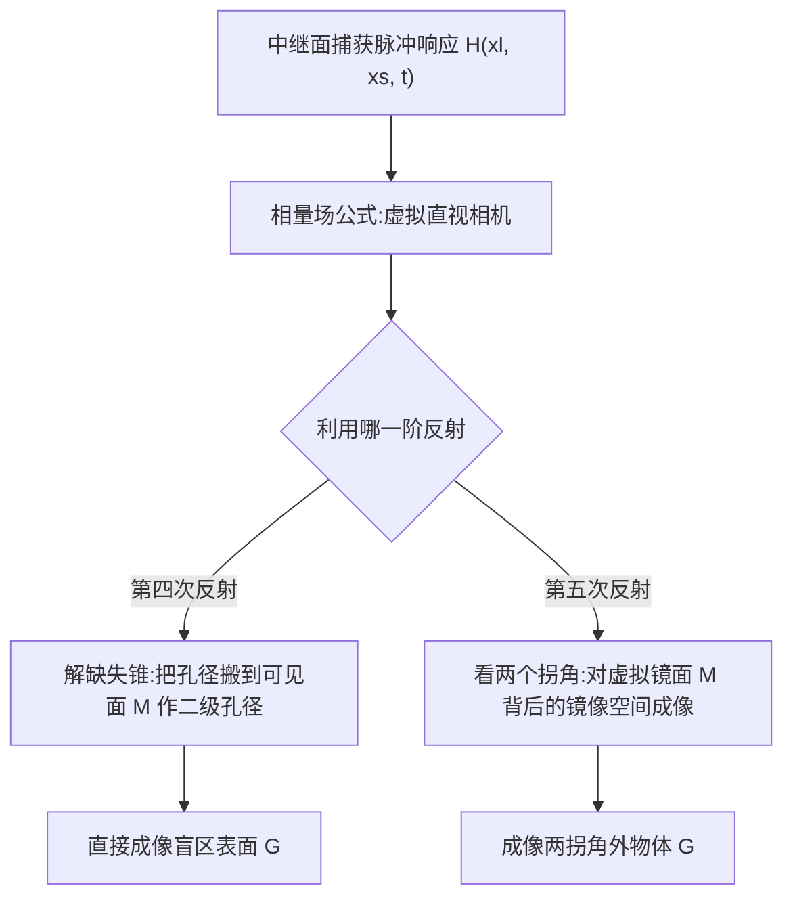

## 一句话总结

本文发现"漫反射平面在计算波成像域中表现得像镜子"（称之为虚拟镜面），并利用第四、第五次反射的高阶光照，突破了非视距（NLOS）成像只用第三次反射的限制，实现了对"盲区表面"的成像以及"隔着两个拐角"物体的成像。

## 研究背景

- 领域现状：非视距成像利用间接光照重建观察者看不见的隐藏场景。主流的时间门控方法（如椭球反投影、共聚焦反卷积、相量场 phasor-field 公式）都依赖飞行时间三角测量，把可见的中继面（relay surface）当作一台虚拟的直视相机去"看"隐藏场景。
- 核心痛点：这些方法都假设**只有第三次反射**（激光点 → 隐藏物 → 中继面），更高阶的反射反而被当作噪声。这带来两个长期难题：其一是"缺失锥"（missing-cone）问题——某些位置和朝向的表面落入"零重建空间"，无论用什么算法都无法重建；其二是只能看**单个拐角**背后的物体，两个拐角之外的物体无法成像。
- 本文 idea：作者把惠更斯原理和相量场公式联系起来，指出一个关键事实：对可见光而言漫反射的平面，在 NLOS 成像所用的厘米级计算波长下，其"被调制"的频率分量（$$\Omega > 0$$）会沿镜面反射方向传播——也就是说，它在计算域里像一面镜子。利用这个"虚拟镜面"，第四、五次反射就不再是噪声，而是编码了盲区信息的有用信号。

## 方法

整体思路：先在数学上说明漫反射面为何在计算波域中呈镜面行为，再据此设计两套成像流程——用第四次反射把成像孔径"搬"到别的可见表面上，从而看到零重建空间里的表面；用第五次反射对虚拟镜面背后的镜像空间成像，从而看到两个拐角之后的物体。

关键设计：

1. **漫反射面为何是"虚拟镜面"**：把中继面测得的时间分辨光照做傅里叶变换，得到复值相量场 $$\widehat{P}(\mathbf{x}, \Omega)$$。当波从一点传到另一点时，相位随 Rayleigh-Sommerfeld 衍射算子偏移与衰减：$$\widehat{P}(\mathbf{x}_b, \Omega) = \widehat{P}(\mathbf{x}_a, \Omega)\,\frac{e^{ik\lVert \mathbf{x}_b - \mathbf{x}_a \rVert}}{\lVert \mathbf{x}_b - \mathbf{x}_a \rVert}$$，其中 $$k = 2\pi\Omega/c$$。对一块相对波长足够平整的漫反射面 $$M$$，各点次级球面波叠加后，被调制分量恰好沿镜面方向相干叠加——这正是惠更斯原理预言的镜面反射。注意它只在计算域里是镜面，真实采集到的仍是漫反射光。

2. **两种相机模型**：全部基于相量场的通用成像算子。**瞬态相机** $$f_{tc}$$ 只在传感孔径 $$S$$ 处放一个计算透镜，用来观察场景中已知元素（如被照点）的镜像；**共聚焦相机** $$f_{cc}$$ 在照明孔径和传感孔径处各放一个透镜、聚焦到同一点，其 $$t=0$$ 帧等价于现有绝大多数三次反射 NLOS 方法。计算波长由高斯脉冲的中心波长 $$\lambda_c$$ 和标准差 $$\sigma$$ 控制（实验用 3~14 cm），存在"波长越小细节越好但噪声越多"的权衡。

3. **解缺失锥（第四次反射）**：目标面 $$G$$ 落在从 $$S$$ 出发的零重建空间里，但存在三次反射路径 $$\mathbf{x}_l \to G \to M$$ 能到达另一可见面 $$M$$。于是把成像系统从 $$S$$ "搬"到 $$M$$：先用瞬态相机在 $$M$$ 上算出相量场 $$\widehat{f}_{tc}(\mathbf{x}_m, \Omega)$$，再以 $$M$$ 为二级孔径实现共聚焦相机 $$f_{ccM}$$，用四次反射路径 $$\mathbf{x}_l \to G \to M \to S$$ 直接成像 $$G$$。此外还可由被照点 $$\mathbf{x}_l$$ 及其镜像 $$\mathbf{x}_l^{G}$$ 推断 $$G$$ 的位置与朝向：$$\mathbf{c}_G = \frac{\mathbf{x}_l^{M} + \mathbf{x}_l^{MG}}{2}$$，$$\mathbf{n}_G = \frac{\mathbf{x}_l^{M} - \mathbf{x}_l^{MG}}{\lVert \mathbf{x}_l^{M} - \mathbf{x}_l^{MG} \rVert}$$（推断有歧义，故更推荐直接成像）。

4. **看两个拐角（第五次反射）**：把漫反射面 $$M$$ 摆成让 $$S$$ 与目标 $$G$$ 互处 $$M$$ 的镜面方向，形成五次反射路径 $$\mathbf{x}_l \to M \to G \to M \to S$$。此时只需用普通共聚焦相机，但把成像体积挪到 $$M$$ 背后镜像应当形成的位置，$$t=0$$ 帧就能拍到隐藏在两拐角外物体的镜像。即便 $$M$$ 本身处于三次反射方法的零重建空间，五次反射路径仍能到达 $$S$$。

## 实验结果

作者用真实硬件（16×16 SPAD 阵列、515 nm/35 ps 激光、双镜振镜扫描约 1.9×1.9 m 中继面，全部场景为无回射性的漫反射泡沫与石膏板）验证了缺失锥场景中对盲区平面 $$G$$ 的位置/朝向推断。下表为三种朝向下真实捕获的推断精度：

| G 的朝向 | 位置误差 | 法向朝向误差 |
|----------|----------|--------------|
| 90° | 6 cm | 0.3° |
| 100° | 4 cm | 2.8° |
| 80° | 5 cm | 0.1° |

其中 $$G$$ 在所有三种朝向下都无法被现有 NLOS 算法成像。两拐角实验中，对多种 T 形/隐藏几何体均能清晰辨认其形状、位置与朝向，只是因镜面行为并非完美 delta 且使用了更大波长而略显模糊。噪声方面，五次反射设置捕获的总光子数（约 $$10^9$$）反而比对应三次反射设置（约 $$10^8$$）高一个量级，说明主要限制因素是表面尺寸与反射率而非采集噪声。

## 亮点与局限

- 亮点：
  - 提出了一个直观又深刻的物理洞察——漫反射面在计算波域中是镜面，把过去被丢弃的高阶反射变成可用信息。
  - 首次在真实硬件上实现绕两个拐角的成像，且完全不依赖任何真实镜面。
  - 方法建立在通用的相量场成像算子上，原则上可推广到其他单拐角 NLOS 方法。

- 局限：
  - 只有部分 $$G$$ 能被四次反射覆盖，其余部分仍落在四次反射方法的零重建空间里；高阶方法的可见性还依赖其他隐藏元素，缺乏像三次反射那样的完整覆盖分析。
  - 成像质量受衍射限制，因为所用表面尺寸相对计算波长不够大，镜面反射并非理想 delta，两拐角结果偏模糊。
  - 需要场景中恰好存在合适位置/朝向的辅助平面作虚拟镜面，成功与否依赖几何配置。

## 延伸思考

- 该工作把"高阶反射=可用信号"这一思路系统化，自然引出问题：能否级联更多虚拟镜面，用第六、第七次反射逐层向更深的隐藏空间推进？作者也把这列为未来方向。
- 缺失锥覆盖的理论刻画是个开放难点——高阶方法的零重建空间不再只由中继面位置决定，而与场景其他表面耦合，这为可见性分析提出了新的数学问题。
- 若能系统研究成像波长、表面尺寸与反射率之间的关系，或许能在杂乱真实场景中让不同平面间的镜面反射自然扩展 NLOS 的覆盖范围，向"任意多拐角"成像迈进。
