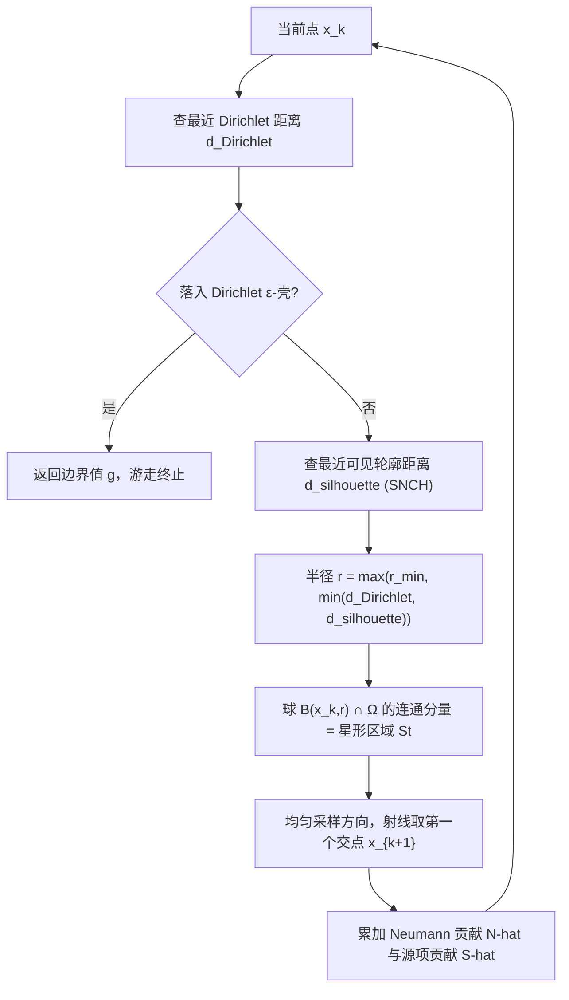

## 一句话总结

把经典的"球上随机游走"（Walk on Spheres, WoS）推广到能处理 Neumann（以及混合）边界条件：用"星形区域"代替球，从而在无需网格化、无需求解全局线性系统的前提下，求解带反射边界的线性椭圆型偏微分方程（PDE）。

## 研究背景

- 领域现状：无网格蒙特卡洛方法（以 WoS 为代表）像光线追踪一样，只需对几何做"最近点查询"这类逐点访问，就能求解 Poisson 这类 PDE，天然规避了网格生成的种种痛苦，还带来渐进式预览、平凡并行、对几何细节亚线性伸缩等好处。
- 核心痛点：自 1950 年代提出以来，WoS 基本只能处理 Dirichlet（给定值，吸收型）边界。而 Neumann（给定法向导数，反射型）边界几乎是所有真实物理模型的基本组成部分。已有把 Neumann 塞进 WoS 的做法要么靠有限差分近似（在边界附近球越缩越小，游走"粘"在边界上，既慢又有偏），要么靠 SDE 离散积分（固定步长导致要么极慢要么偏差大），要么只对凸的 Neumann 边界成立。
- 本文 idea：反射型布朗运动在半空间里等价于"取某坐标方向布朗运动的绝对值"。与其用只能贴着一个边界面的小球去模拟这种反射，不如在当前点周围找一块**关于该点星形**的较大区域——它可以把一段 Neumann 边界整个包进去，于是游走可以像在内部一样迈大步，而不被边界拖住。

## 方法

整体框架：WoSt 是求解 PDE 边界积分方程（BIE）的单样本递归蒙特卡洛估计器。每一步在当前点 $$x_k$$ 周围构造一块星形区域 $$\mathrm{St}(x_k, r)$$，沿均匀随机方向投射一条射线取第一个交点作为下一步位置 $$x_{k+1}$$，沿途累加 Neumann 数据 $$h$$ 与源项 $$f$$ 的贡献；游走在 Dirichlet 边界的 $$\varepsilon$$ 壳层里终止并取边界值 $$g$$。纯 Dirichlet 时它退化为标准 WoS。

关键设计：

1. **用星形区域取代球**。给定两个集合作为积分域与核域，BIE 允许在任意子域上用"球的 Green 函数/Poisson 核"这类闭式核。WoSt 取 $$A=\mathrm{St}$$、$$C=B$$，把区域边界拆成 Neumann 部分 $$\partial \mathrm{St}_N$$（法向导数已知，等于 $$h$$）和球面部分 $$\partial \mathrm{St}_B$$（该处 Green 函数为 0）。这样方程里唯一未知量只剩解值 $$u$$，估计器无需分叉。区域是关于 $$x_k$$ 星形的——从 $$x_k$$ 射出的任意射线只与区域边界相交一次，这正是避免"多交点估计"爆炸的关键。

2. **靠可见轮廓确定星形半径**。半径取 $$r=\min(d_{\text{Dirichlet}}, d_{\text{silhouette}})$$，其中 $$d_{\text{silhouette}}$$ 是到 Neumann 边界**可见轮廓**最近点的距离；再取 $$B(x_k,r)\cap\Omega$$ 中含 $$x_k$$ 的连通分量。这一构造对非凸域也成立，突破了以往方法只能处理凸 Neumann 边界的限制。在凹区域附近 $$d_{\text{silhouette}}$$ 会趋于 0 使游走停滞，于是引入下限 $$r_{\text{min}}$$：此时只对 $$x_k$$ 可见的那部分边界采样、隐式假设其余处解为零，带来可控的小偏差。

3. **把轮廓查询嵌进加速结构**。WoSt 需要四类几何查询：到 Dirichlet 的最近点、到 Neumann 的最近可见轮廓点、对 Neumann 的射线求交、在 Neumann 上采点。核心新增是"最近可见轮廓点查询"——通过给标准包围体层次（BVH）的每个节点附加**法锥**信息（即 Johnson 与 Cohen 的 spatialized normal cone hierarchy, SNCH），用"视锥与法锥是否含一对相互正交方向"来判断整块几何是否全为正面/背面朝向，从而整体剪枝，得到相对几何细节的亚线性伸缩。这些查询不要求边界水密，允许裂缝、孔洞、自交。

4. **重要性采样与无偏性处理**。下一步位置按球的 Poisson 核（等于 $$\partial \mathrm{St}$$ 对 $$x_k$$ 张成的有符号立体角）重要性采样，等价于沿均匀方向投射射线取首个交点。当 $$x_k$$ 落在 Neumann 边界上时，从以内法线为轴的半球采样（布朗运动的反射原理），其 $$1/2$$ 因子恰好抵消积分方程里 $$\alpha(x_k)=1/2$$，避免每次触边就乘 2。纯 Neumann 问题的解只定到一个可加常数，用 Tikhonov 正则化（加小吸收项变成屏蔽 Poisson 方程）使解唯一，且只对超过给定长度的游走施加正则、以兼顾噪声与偏差。

## 实验结果

论文以合成算例验证收敛性、并与既有 Neumann 处理方法在同等参数下做对比（多为 RMSE-时间曲线，非固定基准表）。下表汇总相同混合边界问题下各方法的定性/定量表现，参数设置为 WoSt 的 $$r_{\text{min}}=0.001$$、WoS 反射偏移 $$\zeta=0.01$$、SDE 步长 $$l=0.0001$$：

| 方法 | 适用域 | Neumann 边界附近步长 | 偏差来源 | 相对表现 |
|------|--------|--------------------|---------|---------|
| WoSt（本文） | 任意非凸域 | 大（星形区域） | 仅凹处 $$r_{\text{min}}$$ 小偏差 | 更快且更准 |
| WoS + 有限差分反射 | 混合边界 | 小（球缩到单面） | 反射离散 + 长游走累积 | 慢、偏差大 |
| SDE 积分（Euler-Maruyama） | 混合边界 | 固定小步长 | 边界 + 内部离散 | 最差 |
| 单随机交点朴素估计 | 非凸域 | — | 核变号抵消致高方差 | 随 Neumann 占比增大而发散 |
| Simonov / Ermakov-Sipin | 仅凸 Neumann | 大 | — | 不适用非凸 |

WoSt 表现出蒙特卡洛估计器预期的 $$O(1/\sqrt{N})$$ 收敛率。几何伸缩上：烤面包算例的边界为 390 万个边界元的 CT 扫描，在约 200 万个边界点上求解，平均每点每次游走 0.166 毫秒；蜥蜴受热算例混用 120 万元三角网格与隐式 SDF，无需统一网格化；肺部氧气扩散算例中 FEM 光是生成能还原细节的网格就要一整天，而 WoSt 在 512×512 切片上即时给出输出敏感的结果（平均每点每次游走 0.021 毫秒）。

## 亮点与局限

- 亮点：
  - 用一个"球换星形"的小改动，把 WoS 的适用范围从纯 Dirichlet 扩展到任意混合/Neumann 边界，且保留了无网格方法的全部优点（渐进预览、平凡并行、对残缺几何鲁棒、输出敏感、亚线性伸缩）。
  - 突破了以往 Neumann 蒙特卡洛只能处理凸边界的限制，首个在一般非凸域上达到与经典 WoS 相当"速度-偏差"折中的估计器。
  - 工程落地友好：对已有 WoS 实现改动很小，几何查询靠给 BVH 加法锥（SNCH）即可，直接复用渲染社区成熟的轮廓查询/多光源采样等技术。

- 局限：
  - Neumann 占主导时游走很长（类比 albedo 为 1 的"全镜面房间"），只能在 Dirichlet 边界终止，效率受限；纯 Neumann 在现实中也少见（对应理想绝热体）。
  - 仍局限于与 WoS 相同的线性椭圆型 PDE 类别；更实用的 Robin 边界条件尚未支持。
  - 凹 Neumann 边界处依赖 $$r_{\text{min}}$$ 截断带来偏差；主导开销仍是几何查询（尤其最近可见轮廓点查询）。

## 延伸思考

- 论文自身多处以"渲染 ↔ 求解 PDE"作类比：Neumann 主导的长游走对应弱吸收场景的长光路，因此渲染里的下一事件估计（NEE）、双向路径、路径空间 MCMC、样本复用（VPL/ReSTIR/光子映射）、去噪等技术，几乎都能平移过来加速 WoSt——这为后续工作指出了一条清晰的"借渲染之力"路线。
- 支持 Robin 边界（同时反射与吸收）既能提升建模真实感，又能让更多游走提前终止而提速，是最值得优先补上的方向。
- 作者的并行工作（边界值缓存 BVC、可微分 WoS）与本文互补，暗示无网格蒙特卡洛正逐步长成一个能与光线追踪并列的"仿真求解生态"，把光传输与热/扩散等物理过程统一在同一套逐点几何查询框架下。
