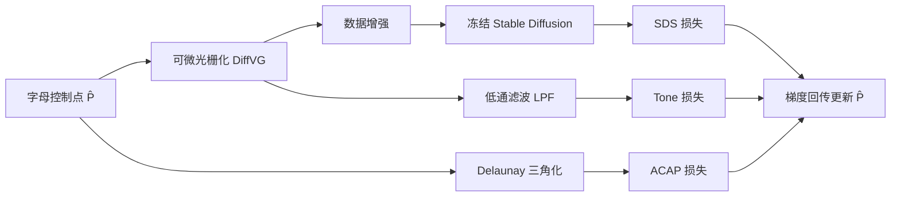

## 一句话总结

本文提出一种全自动方法，仅通过形变字母的矢量轮廓，就能让单词"变成"它所表达的语义图像（word-as-image），同时保持文字可读性与字体风格。

## 研究背景

- 领域现状：语义排版（semantic typography）中的 word-as-image 是一种把单词含义融进字母图形的设计技巧，长期以来只能靠设计师手工完成，因为它同时要求语义理解、创意构图和可读性把控。已有的文字风格化工作大多在栅格域操作、依赖预定义的风格图或直接把现成图标贴到字母上。
- 核心痛点：既有方法要么改变颜色/纹理、要么把整词强行变形成目标形状（牺牲可读性），要么只能替换成数据集里已有的图标类别，无法针对任意概念自动生成、又保留字体矢量特性。
- 本文 idea：借助预训练 Stable Diffusion 的强语义先验，用 Score Distillation Sampling（SDS）驱动字母轮廓形变去表达概念，并额外引入两项约束损失来守住字形结构与字体风格，从而在纯黑白、可无损缩放的矢量表示上实现语义排版。

## 方法

整体框架：给定单词 $$W=\{l_1,\dots,l_n\}$$，方法对每个字母独立处理。把字母轮廓提取为一组三次 Bézier 控制点 $$P$$，初始化待优化控制点 $$\hat P = P$$，经可微光栅化器渲染成图像后送入冻结的 Stable Diffusion，用 SDS 损失推动字形表达目标概念；同时用两项损失约束形变，最后把梯度回传更新 $$\hat P$$。单个字母优化 500 步，在 RTX 2080 上约 5 分钟。

关键设计：

1. **字母表示与控制点细分**。用 FreeType 提取轮廓并统一转成三次 Bézier 曲线。作者发现初始控制点数量显著影响形变自由度：点太少变化不足，点太多又易偏离原字形。因此对控制点偏少的字母做细分——每轮找出弧长最长的 Bézier 段一分为二，直到达到该字母预设的目标点数（跨字体共享）。

2. **SDS 语义损失**。沿用 VectorFusion 的做法，把增强后的光栅字母编码进 Stable Diffusion 的隐空间，施加 SDS 损失：

$$\nabla_{\theta}\mathcal{L}_{LSDS}=\mathbb{E}_{t,\epsilon}\left[w(t)\left(\hat\epsilon_{\phi}(\alpha_t z_t+\sigma_t\epsilon,\,y)-\epsilon\right)\frac{\partial z}{\partial z_{aug}}\frac{\partial x_{aug}}{\partial\theta}\right]$$

它直接用扩散损失的梯度驱动字形去贴合文本提示，无需真正采样图像。

3. **As-Conformal-As-Possible（ACAP）形变损失**。对字形内部做约束 Delaunay 三角化，约束优化前后每个控制点处对应角度尽量不变（隐式地保住字母骨架）：

$$\mathcal{L}_{acap}(P,\hat P)=\frac{1}{k}\sum_{j=1}^{k}\left(\sum_{i=1}^{m_j}\left(\alpha_j^{i}-\hat\alpha_j^{i}\right)^2\right)$$

其中 $$k=\lvert P\rvert$$。

4. **Tone 保持损失**。对形变前后的光栅字母各做低通滤波再比 L2 距离，约束局部"黑白比例"（tone）不要偏离太多，从而守住字体风格与整体结构：

$$\mathcal{L}_{tone}=\left\lVert LPF(\mathcal{R}(P))-LPF(\mathcal{R}(\hat P))\right\rVert_2^2$$

最终目标是三项加权和，$$\alpha=0.5$$，而 tone 权重 $$\beta_t$$ 随步数 $$t$$ 呈高斯型变化（$$a=100,b=300,c=30$$），让 tone 约束在语义形变初步发生后才"介入"，避免一开始就压死形变。

## 实验结果

作者在 5 类概念（动物、水果、植物、运动、职业）各随机取 10 词共 50 个单词、4 种风格各异的字体上验证。核心的定量评估是一项 40 人参与的感知实验，从三个目标衡量单字母插画——语义可识别性、可读性、字体风格匹配度，并与去掉两项结构/风格损失的"Only SDS"消融对比：

| 方法 | 语义↑ | 可读性↑ | 字体匹配↑ |
|------|-------|---------|-----------|
| 本文 | 0.80 | 0.90 | 0.51 |
| Only SDS | 0.88 | 0.53 | 0.33 |

字体匹配的随机基线为 25%，本文的 51% 远高于随机。对比可见：去掉 ACAP 与 tone 损失后，字母虽然语义识别率略升（0.88），但可读性（0.53）和字体保持（0.33）明显下降，说明两项约束在牺牲少量语义强度的前提下换来了显著更好的可读性与风格保真。

此外与多种大模型基线（Stable Diffusion、SDEdit、DallE2、DallE2+letter、CLIPDraw）的定性对比显示：SD 常无法生成清晰文字；SDEdit 保住了可读性却常常表达不出概念且在栅格域堆细节；DallE2 能体现概念但文字多不可读、且无法指定字体/位置；CLIPDraw 语义尚可但结果不平滑、丢失字体特征。

## 亮点与局限

- 亮点：
  - 全自动、无需任何风格图或图标库，即可对任意概念生成语义字形。
  - 直接在矢量轮廓上优化，输出可无损缩放、便于后续上色与再设计。
  - 一套超参对不同单词、字母、字体通用，且用巧妙的时间调度权重平衡"形变"与"守形"两股竞争力。

- 局限：
  - 逐字母独立处理，无法对整词做协同形变。
  - 对具体可视化的概念效果最好，抽象概念容易失败。
  - 字母间的版式布局尚未自动化，仍需人工挑选替换哪些字母。

## 延伸思考

方法本质是把 text-to-3D 里的 SDS 蒸馏范式迁移到矢量字形域，再用可微光栅化打通"栅格损失→矢量参数"的梯度通路——这条"预训练大模型 + 可微渲染 + 领域专属正则"的思路对 sketch、图标、logo 等矢量创作类任务有普适参考价值。值得追问的是：能否把 ACAP/tone 这类硬编码的几何正则替换成可学习的可读性/风格判别器，以摆脱手工调参？以及作者提到的方向——联合优化多个字母、甚至自动决定"用哪个概念形变哪个字母"，有望把它从单字母工具推向真正的整词版式生成系统。
