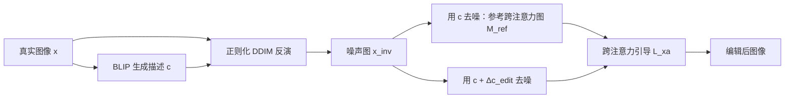

## 一句话总结

pix2pix-zero 让用户只需给出一个"源域→目标域"的编辑方向（如 cat→dog），就能在预训练的 Stable Diffusion 上完成真实图像编辑，且无需为每张图写文本提示、无需为每种编辑微调模型，同时保留原图结构。

## 研究背景

- 领域现状：DALL·E 2、Imagen、Stable Diffusion 等大规模文本到图像扩散模型已能合成高质量、多样化图像，但把它们直接拿来编辑真实图像仍然困难。
- 核心痛点：一是真实图像没有天然的文本描述，让用户写一句精确刻画所有纹理、光照、形状细节的提示词既繁琐又不现实；二是即便给了源、目标提示词，现有模型往往会生成全新内容，无法维持输入图像的布局、形状与物体姿态——因为改提示词只说明了"要改什么"，却没传达"要保留什么"；三是用户希望在各种真实图像上做各种编辑，为每张图、每种编辑都微调大模型的成本无法承受。
- 本文 idea：提出一个既免训练（training-free）又免提示（prompt-free）的图像到图像翻译方法。核心两点是：在文本嵌入空间中自动发现通用的编辑方向；以及提出跨注意力引导（cross-attention guidance），在扩散采样过程中约束编辑前后的跨注意力图保持一致，从而保留原图结构。

## 方法

整体框架分三步：先用确定性 DDIM 反演把真实输入图像映射回噪声图；再在文本嵌入空间自动计算"源→目标"的编辑方向；最后用跨注意力引导的采样过程施加编辑，同时把结构锁定在原图上。为了让反演出的噪声更"可编辑"，还引入自相关正则化。

关键设计：

1. **确定性反演 + 自相关正则化**。用 BLIP 为输入图自动生成一句描述 $$c$$，再用确定性 DDIM 反演（而非随机 DDPM 过程）把潜码逐步加噪到 $$x_{inv}$$，以获得可忠实重建的噪声图。作者观察到 DDIM 反演得到的中间噪声常常偏离高斯白噪声，从而损害可编辑性。为此引入自相关正则化 $$L_{auto} = L_{pair} + \lambda L_{KL}$$：$$L_{pair}$$ 在多尺度金字塔上惩罚不同偏移处的自相关系数，逼近"任意两点不相关"；$$L_{KL}$$ 以软约束（借鉴 VAE）逼近零均值单位方差，避免强制归一化导致去噪发散。相比前人只用固定偏移 $$\delta=1$$，这里每次迭代随机采样偏移，更高效地传播长程信息。

2. **自动发现编辑方向**。用户只给源词 $$s$$ 和目标词 $$t$$（如 cat、dog）。方法用 GPT-3 分别为源、目标生成一大批多样句子，计算它们 CLIP 嵌入的均值差，得到编辑方向 $$\Delta c_{edit}$$。相比只在两个单词之间求方向，基于多句子的方向更稳健。这一步只需约 5 秒且可离线预计算一次。编辑时把该方向加到文本嵌入上：$$c_{edit} = c + \Delta c_{edit}$$。

3. **跨注意力引导保结构**。去噪 UNet 通过跨注意力层注入文本条件，注意力图 $$M = \mathrm{Softmax}(QK^{T}/\sqrt{d})$$ 中每个元素 $$M_{i,j}$$ 表示第 $$j$$ 个文本 token 对第 $$i$$ 个空间位置的贡献，被观察到与图像结构紧密相关。若直接用 $$c_{edit}$$ 采样，注意力图会漂移、结构随之被破坏。方法采用两阶段：先用原始 $$c$$ 去噪得到参考注意力图 $$M^{ref}_{t}$$；再用 $$c_{edit}$$ 去噪，并在每个时间步对 $$x_t$$ 取梯度，最小化 $$L_{xa} = \lVert M^{edit}_{t} - M^{ref}_{t} \rVert^{2}$$，把编辑后的注意力图往参考图拉。这是"软引导"（损失项）而非硬替换，因此既保结构、又给编辑留出调整余地。

4. **条件 GAN 蒸馏加速（可选）**。扩散反演与采样步数多、速度慢。作者用扩散模型生成"输入-编辑"配对数据，蒸馏出一个成对图像条件 GAN（Co-Mod-GAN），实现实时推理。

## 实验结果

在 LAION-5B 取图，做四类编辑任务，与 SDEdit+词替换、DDIM+词替换、并行工作 prompt-to-prompt 对比。三项指标：CLIP-Acc（编辑是否成功施加，越高越好）、Structure Dist（结构一致性，越低越好）、BG LPIPS（背景保持，越低越好，仅适用于只改前景的任务）。

| 方法 | cat→dog CLIP-Acc↑ | cat→dog Struct↓ | cat→dog BG LPIPS↓ | horse→zebra CLIP-Acc↑ | sketch→oil CLIP-Acc↑ |
|------|------|------|------|------|------|
| SDEdit + word swap | 71.2% | 0.081 | 0.327 | 92.2% | 21.2% |
| DDIM + word swap | 72.0% | 0.087 | 0.279 | 94.0% | 32.4% |
| prompt-to-prompt | 66.0% | 0.080 | 0.269 | 18.4% | 10.8% |
| pix2pix-zero (ours) | 92.4% | 0.044 | 0.182 | 75.2% | 75.2% |

pix2pix-zero 在 cat→dog、cat→cat w/ glasses、sketch→oil pastel 上都取得最高 CLIP-Acc，同时 Structure Dist 与 BG LPIPS 显著低于基线：SDEdit 和 DDIM+词替换保不住结构与背景；prompt-to-prompt 用硬约束保住了结构却常常做不出编辑（CLIP-Acc 偏低）。在 horse→zebra 上本方法 CLIP-Acc 略逊于两个词替换基线，但结构与背景保持大幅领先。

消融显示：随机 DDPM 反演（config A）保结构最差；换成确定性 DDIM（B）改善结构与背景；加自相关正则化（C）与句子级编辑方向（D）提升编辑成功率；最终加入跨注意力引导（E）显著改善结构与背景保持。蒸馏出的条件 GAN 每张图仅需 0.018 秒，较扩散模型约 3800 倍加速，结果可比。

## 亮点与局限

- 亮点：
  - 免训练、免逐图提示，用户只需给"源→目标"方向即可即时编辑，交互门槛极低。
  - 编辑方向基于多句子 CLIP 均值差，比单词方向更稳健，且可离线预计算、约 5 秒。
  - 跨注意力"软引导"平衡了"保结构"与"能编辑"，优于 prompt-to-prompt 的硬约束。
  - 可蒸馏成条件 GAN 实现近实时编辑，同时扩散模型充当高质量配对数据生成器。

- 局限：
  - 结构引导受跨注意力图分辨率限制（Stable Diffusion 为 64×64），对腿、尾等精细空间细节控制不足。
  - 物体处于非典型姿态的困难样本上会失败。

## 延伸思考

- 跨注意力图的低分辨率是结构保持的瓶颈，若底座模型（或更高分辨率的注意力层、SDXL 类模型）提供更精细的注意力，方法可直接受益，这也提示"结构信号来自注意力"这一思路的上限与基座强相关。
- "把编辑写成对参考注意力图的损失、在采样时做梯度引导"是一种通用的免训练可控生成范式，可推广到深度图、分割图等其他结构线索的引导。
- 用大扩散模型自动合成配对数据、再蒸馏到轻量条件 GAN，是"慢而强的教师 + 快而专的学生"的实用路径，适合把昂贵的扩散能力落到实时应用。
