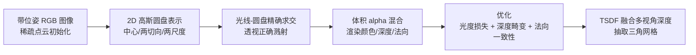

## 一句话总结

把 3D 高斯体塌缩成一组带朝向的 2D 平面高斯圆盘（2DGS），用光线-圆盘精确求交实现透视正确的溅射，再配合深度畸变与法向一致性两项正则，在保持 3DGS 快速训练与实时渲染的同时，重建出无噪、细节丰富、几何精确的表面。

## 研究背景

3D Gaussian Splatting（3DGS）用一组显式的各向异性 3D 高斯体表示场景，凭借实时、高分辨率的照片级新视角合成迅速流行，并被扩展到抗锯齿、材质建模、动态场景、可驱动化身等多个方向。但它在几何重建上有本质缺陷：

- 体积与表面的矛盾：3D 高斯建模的是完整的角度辐射体积，与表面"薄"的本质相冲突，难以贴紧真实表面。
- 缺乏法向：3DGS 不原生建模表面法向，而法向是高质量重建的关键。
- 多视角不一致：3DGS 在不同视角下用不同的相交平面求值，导致渲染深度随视角变化而不一致；且用仿射矩阵把 3D 高斯投影到光线空间只在中心附近精确，边缘处透视误差增大。

另一条脉络是 surfel（面元）表示，能有效近似复杂几何，但传统方法通常依赖真值几何、深度传感器或已知光照。本文受两者启发，提出 2DGS：用 2D 高斯基元表示场景，既保留 3DGS 基于梯度、可从稀疏点云优化的灵活性，又借助面元天然的表面对齐与法向定义解决几何精度问题。

## 方法

### 整体框架

输入一组带位姿的图像与稀疏标定点云，输出一组紧贴表面的 2D 高斯圆盘，最终抽取网格。

### 关键设计

2D 高斯建模。每个基元是一个带朝向的椭圆圆盘，由中心 $\mathbf{p}_k$、两个主切向量 $\mathbf{t}_u$、$\mathbf{t}_v$ 与控制方差的尺度 $(s_u, s_v)$ 描述，法向由两切向叉积给出 $\mathbf{t}_w = \mathbf{t}_u \times \mathbf{t}_v$。圆盘所在的局部切平面在世界空间参数化为：

$$P(u, v) = \mathbf{p}_k + s_u \mathbf{t}_u u + s_v \mathbf{t}_v v = H\,(u, v, 1, 1)^\top$$

其中 $H$ 是 $4\times 4$ 齐次变换矩阵，由旋转 $R=[\mathbf{t}_u, \mathbf{t}_v, \mathbf{t}_w]$ 与末位为零的尺度对角阵 $S$ 组成。局部 $uv$ 处的高斯值按标准形式求值：

$$G(\mathbf{u}) = \exp\!\left(-\frac{u^2 + v^2}{2}\right)$$

每个基元还带不透明度 $\alpha$ 与球谐参数化的视相关颜色。相比 3DGS 把角度辐射塞进一个"团块"，塌缩成平面圆盘让基元把密度分布在圆盘内、法向定义为密度变化最陡方向，天然贴合薄表面。

光线-圆盘精确求交。传统基于仿射近似的投影只在中心精确，且矩阵求逆在圆盘退化成线段（侧视）时数值不稳定。作者改用显式求交：把像素光线表示为 $x$-平面 $\mathbf{h}_x=(-1,0,0,x)^\top$ 与 $y$-平面 $\mathbf{h}_y=(0,-1,0,y)^\top$ 的交线，利用"用变换矩阵变换平面等价于用其逆转置变换平面参数"这一性质，将两平面变换到高斯局部 $uv$ 坐标系：

$$\mathbf{h}_u = (WH)^\top \mathbf{h}_x \qquad \mathbf{h}_v = (WH)^\top \mathbf{h}_y$$

由交点须同时落在两个平面上（$\mathbf{h}_u\cdot(u,v,1,1)^\top = \mathbf{h}_v\cdot(u,v,1,1)^\top = 0$），可解出闭式交点 $\mathbf{u}(x)$，从而避免显式求逆、实现透视正确的多视角一致求值。为防止侧视退化圆盘在光栅化中被漏掉，还引入物体空间低通滤波，用一个固定屏幕空间高斯做下界：

$$\hat{G}(x) = \max\!\left\{G(\mathbf{u}(x)),\; G\!\left(\frac{x-c}{\sigma}\right)\right\}$$

随后按 3DGS 的分块排序流程做前到后的体积 alpha 混合积分颜色、深度与法向。

两项正则。仅用光度损失优化会产生噪声，作者引入两个正则项。深度畸变损失通过最小化光线上各交点深度间距，把权重集中到一小段，弥补溅射忽略高斯间距离的缺陷：

$$\mathcal{L}_d = \sum_{i,j} \omega_i \omega_j \lvert z_i - z_j \rvert$$

其中 $\omega_i$ 是第 $i$ 个交点的混合权重。法向一致性损失让圆盘法向与由渲染深度梯度估计的表面法向对齐（表面取累计不透明度达 0.5 的中值交点）：

$$\mathcal{L}_n = \sum_i \omega_i\,(1 - \mathbf{n}_i^\top N)$$

总损失为 $\mathcal{L} = \mathcal{L}_c + \alpha \mathcal{L}_d + \beta \mathcal{L}_n$，其中 $\mathcal{L}_c$ 为 $L_1$ 加 D-SSIM 的光度损失；有界场景取 $\alpha=1000$、无界场景 $\alpha=100$、$\beta=0.05$。

网格抽取。渲染训练视角的深度图，用截断符号距离融合（TSDF，体素 0.004、截断阈 0.02，基于 Open3D）融合得到网格；中值深度比期望深度更抗离群点。

## 实验结果

在 DTU 上以 Chamfer 距离（越低越好）评估几何重建，2DGS 在精度与速度上均领先显式方法，并逼近隐式 SDF 方法而快约 100 倍：

| 方法 | 类型 | CD 均值 | 时间 |
|------|------|---------|------|
| NeuS | 隐式 | 0.84 | > 12h |
| VolSDF | 隐式 | 0.86 | > 12h |
| 3DGS | 显式 | 1.96 | 11.2 m |
| SuGaR | 显式 | 1.33 | ∼1 h |
| 2DGS-30k（本文） | 显式 | 0.80 | 10.9 m |

在 Tanks and Temples 上以 F1 分数评估，2DGS 均值 0.32，显著优于 3DGS（0.09）与 SuGaR（0.19），与 NeuS（0.38）、Geo-Neus（0.35）相当，而训练仅需约 15.5 分钟（对比 SDF 方法的 24 小时以上）。在 Mip-NeRF360 上的新视角合成，2DGS 与 3DGS 质量相当（室外 PSNR 24.34 对 24.64，室内 30.40 对 30.41），且模型仅 52 MB，远小于 SuGaR 的 1247 MB。消融显示：去掉法向一致性会导致法向朝向错乱（平均 CD 从 0.83 恶化到 1.24），去掉深度畸变则表面变噪（0.88）；TSDF 中值深度优于期望深度与屏蔽泊松重建。

## 亮点与局限

亮点：

- 从表示层面把 3D 高斯塌缩为 2D 圆盘，天然解决多视角深度不一致与法向缺失两大痛点，且思路简洁、无需额外网格精修（对比 SuGaR）或联合 SDF 网络（对比 NeuSG）。
- 光线-圆盘显式求交实现透视正确溅射，规避了仿射近似的边缘误差与矩阵求逆的数值不稳定。
- 深度畸变与法向一致性两项正则针对性强，在保持 3DGS 速度与紧凑模型（52 MB）的同时大幅提升几何质量。

局限：

- 假设表面全不透明并从多视角深度抽网格，难以处理玻璃等半透明表面。
- 稠密化策略偏向纹理丰富区而非几何丰富区，对精细几何结构的表达偶有不足。
- 正则化在图像质量与几何精度之间存在权衡。

## 延伸思考

2DGS 把"事后正则约束 3D 高斯"推进为"表示本身即为面元"，与同期的 Gaussian Surfels 思路殊途同归，共同构成点基表面重建从体积表示走向表面对齐表示的关键节点。其显式光线-圆盘求交范式，为后续在 2D 高斯上做逆渲染、动态重建、SLAM 等提供了几何一致的基础；而对半透明表面与几何主导稠密化的局限，也指向了把不透明度、基元尺寸更充分地纳入网格抽取，以及设计几何感知稠密化策略的改进空间。
