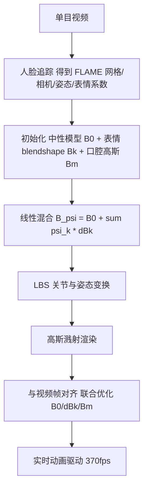

## 一句话总结

把经典网格 blendshape 的思想搬到 3D 高斯上，用一个中性基模型加一组表情 blendshape（都由 3D 高斯表示），通过与表情系数线性混合即可实时（370fps）合成照片级头部化身动画，画质与速度都超越此前的 NeRF 与点云方法。

## 研究背景

重建并驱动 3D 人头是图形学与视觉的长期问题，广泛用于远程呈现、虚拟现实与影视。近年基于神经辐射场（NeRF）的头部化身能合成照片级图像，通常靠把 NeRF 条件化到参数化头模或表情编码上来做动画，也有工作构造一组 NeRF blendshape 再线性混合来驱动。

blendshape 模型是化身动画的经典表示：一组对应基础表情的 3D 网格，任意表情的脸形可由基础网格与表情系数线性组合高效算出。它易于控制、效率高，是专业动画制作与消费级化身应用（如 iPhone Memoji）里最流行的表示。

作者把这一思想建立在 3D 高斯溅射（3DGS）之上：3DGS 用一组 3D 高斯表示静态场景辐射场，在新视角合成上兼具高质量与高速度。此前把 3D 高斯用于头部化身的并发工作大多要配合神经网络（MLP 解码动态几何与辐射参数、把高斯挂在网格上学偏移等），而作者提出的高斯 blendshape 只需对高斯做线性混合就能构造任意表情的化身，这在训练与运行时都带来显著优势。

## 方法

整体框架：输入单目视频，学习一套高斯 blendshape 表示，包含中性基模型 $$B_0$$、一组表情 blendshape $$\{B_1,B_2,...,B_K\}$$，以及一个单独的口腔内部模型 $$B_m$$，全部由 3D 高斯表示。任意表情和姿态的化身可由表情系数做线性混合、再用关节与姿态参数做线性混合蒙皮（LBS）得到，最后用高斯溅射实时渲染成高保真图像。

关键设计：

- 高斯 blendshape 表示：每个高斯带位置 $$x$$、不透明度 $$\alpha$$、旋转 $$q$$、尺度 $$s$$、球谐系数 $$SH$$（同 3DGS），$$B_0$$ 的每个高斯还带一组用于关节与姿态控制的蒙皮权重 $$w$$。$$B_0$$ 与每个 $$B_k$$ 的高斯一一对应，blendshape 相对基模型的偏差定义为 $$\Delta B_k=B_k-B_0$$。任意表情化身为
$$B_\psi=B_0+\sum_{k=1}^{K}\psi_k\Delta B_k$$
其中 $$\{\psi_k\}$$ 为表情系数。作者采用基于 PCA 的 FLAME 作为 blendshape 模型（也可用 FaceWarehouse 等 FACS 模型），并用 FLAME 的关节与姿态参数 $$\Theta$$ 经 LBS 变换高斯：$$B_\psi^*=\mathrm{LBS}\lvert B_\psi,\Theta\rvert$$。
- 口腔内部高斯：口腔内部与头发的运动通常不受表情影响，也不在 FLAME 网格里。作者发现训练出的 blendshape 高斯能较好建模头发，但口腔效果不佳，于是单独定义一组随下颌关节运动的口腔高斯 $$B_m$$，其属性不随表情变化，只随下颌关节变换：$$B_m^*=\mathrm{LBS}\lvert B_m,\Theta\rvert$$。用两块预定义广告牌表示上下牙，Poisson 盘采样成高斯，上牙刚性绑到头后部，下牙绑到对下颌关节蒙皮权重最大的顶点。
- 初始化：$$B_0$$ 用 Poisson 盘采样在中性 FLAME 网格 $$M_0$$ 上布点作为高斯位置，并由最近三角形顶点插值得到 LBS 蒙皮权重；$$B_k$$ 用从 $$M_0$$ 到表情网格 $$M_k$$ 的形变梯度提取旋转分量，作用到 $$B_0$$ 每个高斯的位置、旋转与球谐系数上得到（尺度近似刚性故忽略，尺度与不透明度保持不变）。
- blendshape 一致性（核心）：由于高斯 blendshape 与网格 blendshape 用同一套追踪表情系数混合，必须保证 $$\Delta B_k$$ 与网格差 $$\Delta M_k$$ 语义一致——网格顶点位移大的区域，高斯差异也应大。直接优化 $$\{\Delta B_k\}$$ 会过拟合，在训练未见的新表情上产生明显瑕疵。作者引入中间变量 $$\Delta\hat G_{i,k}$$ 来表达每个高斯的差异：
$$\Delta G_{i,k}=\Delta G_{i,k}^{init}+\max(f(d_{i,k}),0)\,\Delta\hat G_{i,k}$$
其中 $$\Delta G_{i,k}^{init}$$ 是初始化阶段算得的常量，$$d_{i,k}$$ 是离该高斯最近的表面点从 $$M_0$$ 到 $$M_k$$ 的位移幅值，线性函数 $$f(x)=(x-\epsilon)/(\tilde d-\epsilon)$$ 把最大位移幅值归一到 1、阈值 $$\epsilon=0.00001$$ 归零。训练时直接优化初值为 0 的 $$\Delta\hat G_{i,k}$$，使高斯差异按网格位移幅值成比例更新，从而隐式满足一致性。
- 损失函数：图像损失（$$L_1$$ 加 D-SSIM，$$\lambda=0.2$$）、约束高斯留在头部区域的 alpha 损失（累积不透明度图与前景头部掩膜比较）、约束口腔高斯留在预定义圆柱体积内的正则损失（对超出体积的高斯施加 SDF 的 $$L_2$$ 惩罚），合为
$$L=\lambda_1 L_{rgb}+\lambda_2 L_\alpha+\lambda_3 L_{reg}$$
默认 $$\lambda_1=1,\lambda_2=10,\lambda_3=100$$。
- 实现：PyTorch + Adam，中性模型初始采样 50k 高斯、口腔 14k；训练在 A800、测试在 RTX 4090；用 $$256\times256\times256$$ 网格预存蒙皮权重与最近点位移以在优化中高效更新。

## 实验结果

与 NeRF 类的 INSTA、点云类的 PointAvatar 在 INSTA 数据集与自采数据集上对比，并与 NeRFBlendShape 在其公开数据集上对比，指标为 PSNR、SSIM、LPIPS。下表摘自与 INSTA、PointAvatar 的对比（部分被试）：

| 被试 | 方法 | PSNR↑ | SSIM↑ | LPIPS↓ |
| --- | --- | --- | --- | --- |
| bala | INSTA | 28.66 | 0.9130 | 0.0817 |
| bala | PointAvatar | 29.60 | 0.9099 | 0.0821 |
| bala | Ours | 33.34 | 0.9490 | 0.0772 |
| nf_03 | INSTA | 26.10 | 0.9129 | 0.1137 |
| nf_03 | PointAvatar | 29.82 | 0.9208 | 0.1221 |
| nf_03 | Ours | 28.62 | 0.9381 | 0.0965 |
| subject4 | INSTA | 30.83 | 0.9445 | 0.1144 |
| subject4 | PointAvatar | 32.57 | 0.9433 | 0.1285 |
| subject4 | Ours | 34.03 | 0.9646 | 0.1075 |

SSIM 在所有被试上一致更优，多数被试 PSNR 与 LPIPS 也领先。与 NeRFBlendShape 对比时 PSNR、SSIM 全面胜出，加入权重 0.05 的 LPIPS 损失后 LPIPS 也更好。性能上（$$512\times512$$，含动画与渲染）：本方法训练 25 分钟、运行 370fps；INSTA 训练 10 分钟、70fps；NeRFBlendShape 训练 20 分钟、26fps；PointAvatar 训练 3.5 小时、5fps。即约为 INSTA 的 5 倍、NeRFBlendShape 的 14 倍速度。消融显示：去掉 blendshape 一致性会在新表情下出现脏色与错位瑕疵；仅在位置上加一致性也不够；固定 $$\{\Delta B_k\}$$ 初值不再优化会丢失面部细节；去掉口腔高斯会使牙齿模糊或出现重影。

## 亮点与局限

亮点：首次提出高斯 blendshape 表示，与经典网格 blendshape 语义对应、可直接沿用现成人脸追踪的表情系数驱动；任意表情只需高斯线性混合，训练与运行都极快（70k 高斯下 370fps）；用中间变量策略隐式约束高斯差异与网格位移成比例，有效避免过拟合；单独的口腔高斯解决了牙齿建模难题。

局限：若训练数据不含侧视图，侧视渲染会出现明显瑕疵（NeRF 类与并发高斯方法也有此问题）；线性混合的本质限制了外插能力，对训练未见的夸张表情可能失败；无法表示可形变的头发。作者也明确反对将该技术用于制造虚假信息或损害他人名誉的深度伪造。

## 延伸思考

这项工作的巧劲在于把「参数化脸模的线性可控性」和「3DGS 的高质高速渲染」干净地缝合起来：不引入运行时神经网络，仅靠线性混合就完成动画，这正是它相对同期高斯化身方法在速度上碾压的根源。真正决定成败的是 blendshape 一致性——直接优化各属性差异会让每个 blendshape 各自过拟合训练帧，混合到新表情时崩坏；作者用「差异幅值随网格位移成比例」的中间变量把先验注入优化，是一种轻量而有效的正则思路，对其他需要与参数化模型语义对齐的显式表示（如可驱动身体、手部高斯）都有借鉴意义。局限也提示了显式线性表示的天花板：几何外插与可形变头发仍需非线性或物理先验补足，这也是后续「高斯 blendshape + 生成/形变场」类工作的切入口。
