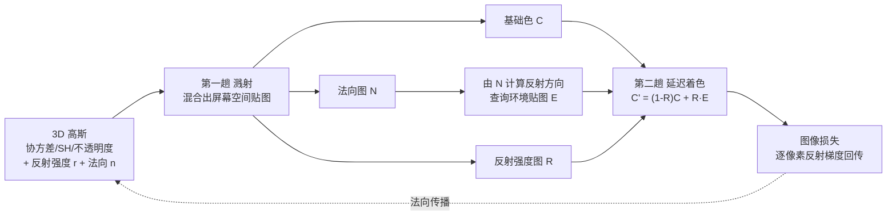

## 一句话总结

给每个高斯附加一个标量反射强度、并把其最短轴当作法向，用"延迟着色"两趟渲染在屏幕空间逐像素查询环境贴图算镜面反射，借由逐像素反射梯度在相邻高斯间架起桥梁，让近似正确的法向从少数反射高斯逐步扩散到整个反射表面，在几乎与原版 3DGS 相同的帧率下渲染出高质量镜面反射。

## 研究背景

基于神经场（NeRF）与高斯溅射（3DGS）的辐射场方法在新视角合成上取得了巨大成功，但镜面反射始终是难点：反射造成的辐射场在视角维度上是高频信号，难以稳定、准确地拟合。

3DGS 虽然用每个高斯的球谐（SH）函数提供视相关着色，但其方向频率太低，无法表达镜面反射。训练过程转而"幻想"出一批额外高斯去显式地拼出反射图像，而对非平面反射体，这些高斯没有明确的空间位置，结果既模拟不好镜面效果，又连带损害几何质量。

问题的核心矛盾在于环境贴图反射模型：它作为高频查找表，一方面对计算反射方向所需的法向精度要求极高，另一方面又几乎不提供有用的梯度来修正法向（法向梯度只能来自双线性纹理滤波涉及的四个纹素），使得只有已经接近正确的法向才能得到有意义的梯度。再叠加上高斯本身是一锅表面定义松散的半透明"汤"，法向估计陷入僵局。本文用延迟着色破解这一僵局。

## 方法

### 整体框架

输入多视角图像，输出一组带反射强度与法向的高斯，以及一张学习得到的环境贴图。渲染分两趟：先溅射烘焙屏幕空间的基础色、法向、反射强度图；再逐像素做延迟反射着色合成最终颜色。

### 关键设计

延迟渲染模型。第一趟沿用 3DGS 溅射流程算出像素颜色，由于混合权重 $G$ 已在最细粒度上算好且排好序，额外附带混合别的逐高斯量几乎零成本。于是把法向 $n_i$（取高斯椭球最短轴，必要时翻转朝向相机）与反射强度标量 $r_i$ 一并溅射：

$$C(\mathbf{v}) = \sum_i c_i(\mathbf{v})\,G(\Theta_i, \mathbf{v})$$

$$N(\mathbf{v}) = \sum_i n_i\,G(\Theta_i, \mathbf{v}), \qquad R(\mathbf{v}) = \sum_i r_i\,G(\Theta_i, \mathbf{v})$$

第二趟延迟反射着色，用法向算反射方向查环境贴图 $E$，再按反射强度把基础色与反射色加权合成，且这一步与高斯 $G$ 解耦（detached）：

$$C'(\mathbf{v}) = \bigl(1 - R(\mathbf{v})\bigr)C(\mathbf{v}) + R(\mathbf{v})\,E\!\left(\frac{2\,\mathbf{v}\cdot N(\mathbf{v})\,N(\mathbf{v})}{\lVert N(\mathbf{v})\rVert} - \mathbf{v}\right)$$

其中 $E$ 用双线性滤波查询、完全由最终一趟从图像损失中学习。损失沿用 3DGS 的 $L_1$ 与 D-SSIM 组合，$\mathcal{L} = (1-\lambda)\mathcal{L}_1 + \lambda\mathcal{L}_{D\text{-}SSIM}$，$\lambda = 0.2$，不加额外正则。

法向梯度与传播。延迟着色是训练成功的关键：逐像素查询环境贴图，使得每个高斯只需覆盖少数几个已有近似正确法向的像素，就能收到有意义的法向梯度。相比之下前向（逐高斯）着色里，不同高斯各自独立地拿到法向梯度、无法互相影响。作者观察到反射强度较大（$r_i > 0.1$）的高斯往往法向接近正确，于是设计法向传播：当一个法向近似正确的高斯与另一个法向不对的高斯在某些像素上重叠时，共享像素的近似正确法向会把有意义的梯度回传给后者。为促进这种传播，周期性地把所有高斯不透明度抬到至少 0.9、反射强度抬到至少 0.001，并把反射高斯最长的两条轴放大 1.5 倍（保留用作法向的最短轴不变），让几乎每个反射高斯都与邻居重叠，从而使正确法向像涟漪一样从零星正确点逐步铺满整个反射面。

训练流程。先做几千步"视角无关"的自举阶段：关闭视相关颜色与反射优化，$r_i$ 初始化为 0，SH 仅保留 0 阶常数项，等价于原版 3DGS。随后开启反射强度与环境贴图优化并施加法向传播。为防止已被自举优化过的漫反射色过拟合、妨碍反射面被发现，对尚未反射（$r_i \le 0.1$）的高斯颜色施加 $\pm 10\%$ 噪声，称为颜色破坏（color sabotage）。由于周期性抬不透明度与原版 3DGS 的周期性不透明度钳制（钳到不超过 0.01）冲突，作者让二者交错进行、互不同时施加。当 $r_i > 0.1$ 的高斯数量在固定迭代内不再增长（表示找不到更多镜面），即终止法向传播与颜色破坏，并在此之后才开始优化高阶 SH 系数，避免其干扰反射训练。

## 实验结果

在 Shiny Blender、Glossy Synthetic 与 Ref-NeRF 真实数据集上评测（PSNR / SSIM / LPIPS），延迟着色版在合成场景上明显领先，真实场景相当。下表取 Shiny Blender 的 ball 场景与部分方法为例：

| 方法 | PSNR ↑ | SSIM ↑ | LPIPS ↓ |
|------|--------|--------|---------|
| 3DGS | 27.65 | 0.937 | 0.162 |
| GShader | 30.99 | 0.966 | 0.121 |
| Ref-NeRF | 33.16 | 0.971 | 0.166 |
| 本文（前向着色） | 27.64 | 0.939 | 0.156 |
| 本文（延迟着色） | 33.66 | 0.979 | 0.098 |

法向与环境贴图重建（Shiny Blender 平均）：法向平均角误差 4.871 度，与最好的 SDF 方法 ENVIDR（4.618 度）相当，远优于 GShader（22.31 度）；环境贴图 LPIPS 0.511，优于所有对比方法。效率上（Shiny Blender）训练约 16 分钟、251 FPS，与原版 3DGS（6 分钟、277 FPS）同量级，而 Ref-NeRF 需 19 小时、0.06 FPS。因延迟着色无需为满足着色频率而分裂高斯，本文用的高斯数显著更少（如 ball 场景 27.2k，3DGS 为 199k）。消融显示：去掉法向传播 PSNR 从 33.66 跌到 27.85（法向图几乎全程不变）；去掉颜色破坏跌到 30.00（传播明显变慢、过早收敛）。在非镜面 NeRF Synthetic 上做回归测试，质量与原版 3DGS 几乎无差别，反射强度能正确估计为零。

## 亮点与局限

亮点：

- 把经典延迟着色引入高斯溅射，将反射计算从"逐高斯"移到"逐像素"，同等渲染成本下产生更多反射采样，平滑梯度、稳定反射强度与环境贴图训练，并消除高斯边界处颜色不连续导致的插值伪影。
- 法向传播机制巧妙利用逐像素梯度在重叠高斯间的桥接，把近似正确法向从少数点逐步铺满整个反射面，破解了环境贴图"要求高精度法向却几乎不给法向梯度"的死结。
- 在几乎不损失 3DGS 训练与渲染效率、且用更少高斯的前提下，大幅提升镜面反射质量与法向、环境贴图精度；对非镜面场景无退化。

局限：

- 继承传统延迟着色的限制，每像素最多处理一层反射材质；对透明物体（如车窗）会出现前窗收敛为纯反射、侧窗收敛为纯透明的不一致行为，根治需要在初始化阶段可靠地在透明面上生成高斯。
- 法向传播在凹形场景（如 bell）上效率较低，训练仍能收敛但耗时明显增加。
- 只分离处理镜面反射，把粗糙反射、各向异性/分层材质与全局光照留给基础 SH 颜色，不提供用于逆渲染或重光照的完整几何-光照-材质分解。

## 延伸思考

这篇工作的价值在于把"延迟着色"这一经典实时渲染范式与可微高斯溅射优化联系起来：延迟着色带来的逐像素梯度，恰好为高斯这种松散、半透明表示提供了一条跨基元传播几何信息（法向）的通道，这正是纯逐高斯前向着色做不到的。它揭示了一个更普遍的思路——渲染方程在高斯溅射语境下的"拆分方式"本身就是可设计的优化对象，把哪些量放到逐像素、哪些留在逐高斯，会显著改变梯度的流动与训练的可解性。沿此方向，可以把环境贴图替换为更高质量的反射算法、把单层反射扩展到多层与透明介质，或与显式几何/材质分解结合，走向既高效又可重光照的高斯逆渲染。
