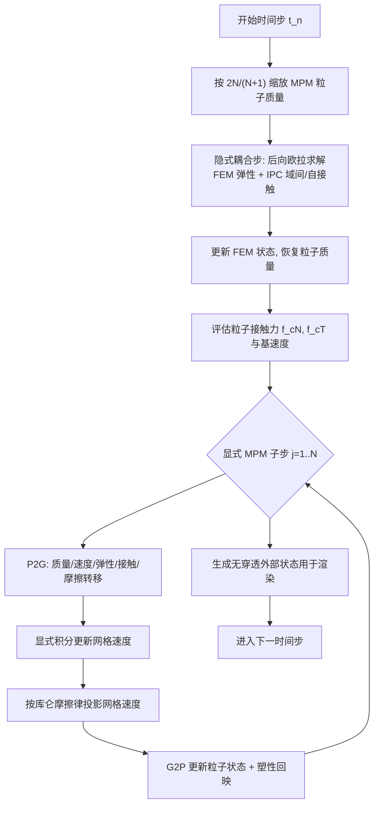

## 一句话总结

提出 Dynamic Duo 框架，用一套混合隐式-显式（IMEX）异步时间分裂方案，把隐式 FEM 与显式 MPM 以显著不同的时间步长耦合在一起，并借助 IPC 定义两种材料之间的变分摩擦接触，实现稳定的双向耦合多材料仿真。

## 研究背景

FEM 擅长模拟弹性固体（软体、薄壳、杆、刚体），精度高、可用自适应网格，但因其总拉格朗日特性，在剧烈变形下系统病态，且处理塑性引发的拓扑变化需要复杂的重网格化。MPM 采用基于粒子的空间离散，天然处理拓扑变化，其更新拉格朗日特性带来自动重网格效果，在大变形下仍保持良好条件，并且支持"即插即用"的塑性模型（雪、沙、泡沫、断裂）；但要表达精细几何需要超高粒子分辨率，模拟纯弹性物体效率不如 FEM。

因此把二者耦合能兼得 FEM 的几何与弹性精度和 MPM 处理拓扑变化与塑性的鲁棒性。难点在于：FEM 偏好隐式积分以获得稳定性和大时间步，而 MPM 偏好显式积分（便于实现塑性、且矩阵向量乘代价与显式步相当），两者所需时间步常相差几个数量级，需要异步耦合；同时两域之间的接触力建模是双向耦合的关键。此前工程界的耦合多依赖显式积分需极小步长，或用隐式-隐式单体耦合但受限于弹性物体且受隐式 MPM 效率瓶颈制约。

## 方法

### 整体框架

核心是把连续体拆成两个不相交部分：用 FEM 网格离散的 $\Omega_A$ 与用 MPM 粒子离散的 $\Omega_B$。对动量守恒做时间分裂——FEM 弹性力用后向欧拉（隐式），MPM 弹塑性力用前向欧拉（显式），而域间摩擦接触力 $F_{AB}$ 为稳定性考虑与 FEM 隐式积分捆绑求解：

$$
\rho_0(\hat{v}^{n+1} - v^{n}) = h\,(\hat{F}^{n+1}_{A} + \hat{F}^{n+1}_{AB}) \quad \text{(后向欧拉)}
$$

$$
\rho_0(v^{n+1} - \hat{v}^{n+1}) = h\,F^{n}_{B} \quad \text{(前向欧拉)}
$$

由于显式积分需要更小步长，把 $\Omega_B$ 上的前向欧拉进一步分解成 $N$ 个子步，得到异步时间分裂：隐式耦合步用大时间步 $h$ 求解 FEM 弹性与域间接触，得到的接触力 $\hat{F}^{n+1}_{AB}$ 随后作为常值拉格朗日外力，施加在 MPM 粒子上，跨越 $N$ 个显式 MPM 子步（子步长 $h_m = h/N$）。

### 关键设计

隐式耦合步：把 MPM 粒子视为半径 $r=\Delta x/\sqrt[3]{\text{PPC}}$ 的离散刚性球（不计其自接触），用 IPC 在 FEM 表面三角形与 MPM 粒子间定义摩擦接触。后向欧拉离散后转化为关于节点位置的优化问题：

$$
\hat{x}^{n+1} = \arg\min_{x}\ \tfrac{1}{2}\lVert x - \tilde{x}^{n+1}\rVert^2_{M} + h^2\,(\Psi(x_A) + B(x) - x^{\top}Mg)
$$

其中 $\Psi$ 为 FEM 弹性势，$B$ 为摩擦接触势。用带回溯线搜索的牛顿法求解，线搜索初始步长由连续碰撞检测（CCD）保证无穿透，局部 Hessian 投影为半正定。

加速手段：（1）非碰撞粒子过滤——大量粒子在一步内不与 FEM 碰撞，其无穿透状态可解析确定，用轨迹包围盒重叠检测过滤掉这些自由度；（2）两阶段牛顿法——先解到 FEM 自由度残差达标，再冻结 FEM，此时问题退化为每个粒子独立的子问题，系统矩阵变为 $3\times3$ 块对角，可逐块求逆、逐粒子做 CCD 与线搜索并冻结已收敛粒子。

显式 MPM 步：遵循 MLS-MPM，接触法向力 $F_{cN}$ 作为常值外力施加，塑性通过每子步末的回映 $F^E \leftarrow Z(F^E)$ 实现，支持各种塑性模型。摩擦力需特殊处理：直接把切向摩擦力当外力会导致本应静止物体高频振动，因此把 FEM 表面速度作为"基速度"转移到网格，定义切向相对速度并按库仑摩擦律做投影裁剪，保证摩擦始终反向且不改变相对速度方向。

减少分裂穿透：一阶格式下位置积分随步长不一致会导致 MPM 粒子穿入 FEM。作者提出质量缩放机制——求解隐式耦合时把粒子质量按 $\tfrac{2N}{N+1}$ 缩放（利用"平衡态接触力近似正比于质量"的观察），MPM 步再恢复原质量，从而增大两域间隙、减少穿透；此外还维护一个仅用于渲染的无穿透外部状态，通过冻结 FEM 并做逐粒子 CCD 找到最近无穿透位置。

## 实验结果

在配备 NVIDIA RTX 6000 Ada GPU 的工作站上实现。消融与单元测试验证了：无摩擦无外力时系统线动量守恒；质量缩放和减小时间步都能有效降低穿透（穿透随步长细化以约 $O(h^2)$ 收敛）；网格摩擦投影消除了静止物体的振动；斜面传送带实验中动摩擦加速度与解析解 $g(\sin\theta^* - \mu\cos\theta^*)$ 吻合，并能捕捉动静摩擦转换；CCD 边界处理让粘性流体能挂附在细金属丝网上，而传统 MPM 失败。

多材料仿真的主要统计如下（每步平均耗时，#P 为粒子数、#V 为顶点数）：

| 场景 | $h$ (s) | $h_m$ (s) | s/step | #P (×10⁶) | #V (×10³) |
|------|---------|-----------|--------|-----------|-----------|
| Boat | 2e-3 | 5e-5 | 3.81 | 3.12 | 10.2 |
| Ruts | 2e-3 | 2e-5 | 3.70 | 2.80 | 38.0 |
| Dough | 2e-5 | 2e-5 | 0.67 | 0.727 | 10.7 |
| Snowball | 5e-3 | 5e-5 | 2.22 | 2.14 | 2.66 |
| Honey | 2e-3 | 1e-5 | 1.72 | 1.19 | 29.2 |
| Colored Sand | 2e-3 | 2e-5 | 11.7 | 5.57 | 38.4 |
| Debris Flow | 5e-3 | 5e-5 | 6.71 | 1.47 | 236 |

场景覆盖刚体船在 MPM 流体中航行、火星车轮在 Drucker-Prager 沙土上压出车辙、擀面杖压 von Mises 塑性面团、雪球（Cam-Clay 塑性）砸软体蘑菇、蜂蜜在不同摩擦系数布料上形成不同屈曲纹理、布料兜起彩色沙、以及大规模泥石流灾害。计时剖析显示在雪球场景中 MPM 时间积分（尤其 P2G 占 67.3%）主导开销，接触处理相对温和。

## 亮点与局限

亮点：首次在图形学中用异步 IMEX 时间分裂把隐式 FEM 与显式 MPM 以相差数个数量级的步长稳定双向耦合；用 IPC 统一处理 FEM 自接触与 FEM-MPM 域间摩擦接触，保证无穿透；显式 MPM 侧保留了"即插即用"塑性的灵活性，可支持流体、沙、雪、泥石流等多种材料；非碰撞粒子过滤与两阶段牛顿法针对 GPU 大规模粒子做了有效加速。

局限：摩擦裁剪机制会低估 MPM 物体上的摩擦力并导致线动量不守恒（后向欧拉也使角动量不守恒）；分裂带来的穿透只能减小而无法高效彻底消除；耦合步的 Hessian 组装与线性求解仍有优化空间。作者提出可探索追踪动量损失并向 FEM 施加修正冲量、交替 FEM/MPM 积分以增量消除残余穿透等方向。

## 延伸思考

该框架把"隐式求稳定、显式求灵活"通过时间分裂解耦，本质上是一种算子分裂（operator splitting）思想在异构离散化上的落地，值得思考它与其他物理场耦合（如流固、多相流）的推广边界。IPC 作为统一的接触抽象在这里承担了跨离散化的桥梁角色，把"粒子当刚性球"这一近似是精度与鲁棒性的折中，未来若结合可微物理，Dynamic Duo 在形状优化、机器人学习、灾害预测等逆问题中的潜力值得关注；同时质量缩放这类"以偏差换稳定"的工程技巧提示：视觉仿真中物理守恒与稳定性之间的取舍往往可以显式设计。
